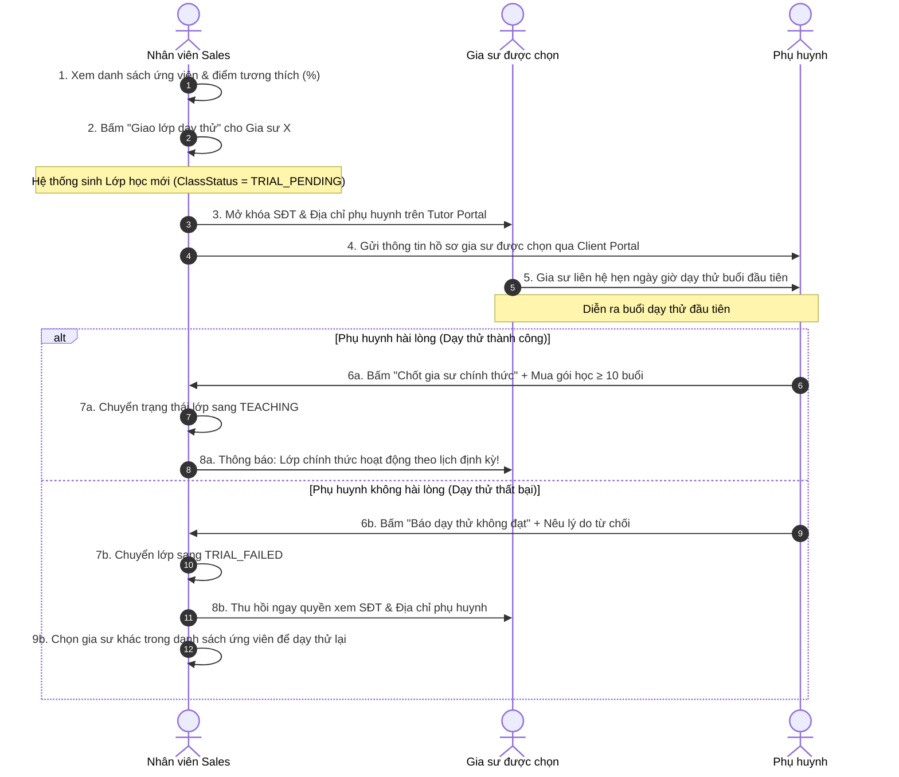

# ĐẶC TẢ NGHIỆP VỤ: KHỚP LỚP & ĐIỀU PHỐI DẠY THỬ (ADMIN CRM)

> **Mã phân hệ:** CRM-03 / MAT-01  
> **Đối tượng sử dụng:** Tư vấn viên (Sales), Quản trị viên (Admin)  
> **Cổng truy cập:** `http://localhost:5173/admin-crm` (Tab Khớp lớp & Điều phối)

---

## 1. Mục Tiêu Nghiệp Vụ
Trước khi có hệ thống, nhân viên trung tâm mất trung bình **3 ngày** để đọc hồ sơ giấy, gọi điện từng gia sư hỏi lịch rảnh và ghép lớp thủ công. 

Tính năng Khớp lớp tự động (Matching Engine) giúp:
* Rút ngắn thời gian Time-to-Match xuống **dưới 24 giờ**.
* Tự động tính toán điểm tương thích (%) theo đa tiêu chí.
* Hỗ trợ điều phối vòng dạy thử an toàn, bảo vệ thông tin hai bên.

---

## 2. Thuật Toán Gợi Ý Khớp Lớp (Matching Engine Algorithm)

Khi mở một yêu cầu tìm gia sư (`tutor_requests`), hệ thống tự động quét toàn bộ hồ sơ gia sư `ACTIVE` và tính điểm tương thích:

$$\text{Tổng điểm Match (\%)} = S_{\text{môn}} (40\%) + S_{\text{khu vực}} (30\%) + S_{\text{lịch rảnh}} (20\%) + S_{\text{kinh nghiệm}} (10\%)$$

| Tiêu chí | Trọng số | Quy tắc tính điểm |
| :--- | :---: | :--- |
| **Chuyên môn ($S_{\text{môn}}$)** | 40% | Khớp chính xác môn học và cấp lớp được duyệt trong `tutor_subjects` $\rightarrow$ Đạt 100 điểm. Không khớp $\rightarrow$ 0 điểm (loại ngay). |
| **Khu vực ($S_{\text{khu vực}}$)** | 30% | Cùng Quận/Huyện $\rightarrow$ 100 điểm. Quận liền kề $\rightarrow$ 60 điểm. Khác quận xa $\rightarrow$ 0 điểm. |
| **Lịch rảnh ($S_{\text{lịch rảnh}}$)** | 20% | Lịch rảnh gia sư khớp 100% các thứ và giờ phụ huynh yêu cầu $\rightarrow$ 100 điểm. Khớp 1 phần $\rightarrow$ 50 điểm. Trùng lịch bận $\rightarrow$ Loại. |
| **Đánh giá & Uy tín ($S_{\text{kinh nghiệm}}$)**| 10% | Đánh giá $\ge 4.8$ sao $\rightarrow$ 100 điểm. 4.0 - 4.7 sao $\rightarrow$ 70 điểm. Gia sư mới $\rightarrow$ 50 điểm. |

---

## 3. Quy Trình Giao Dạy Thử & Điều Phối (Trial Workflow)

---

## 4. Biên Lợi Nhuận Của Trung Tâm (Financial Margin)

Khi điều phối sinh lớp học, nhân viên thiết lập 2 thông số giá:
* **`hourly_rate` (Đơn giá Phụ huynh trả)**: Ví dụ $300,000$ VNĐ / buổi.
* **`tutor_wage_rate` (Thù lao trả Gia sư)**: Ví dụ $240,000$ VNĐ / buổi.
* **Biên lợi nhuận của trung tâm**:
  $$\text{Lợi nhuận trung tâm / buổi} = \text{hourly\_rate} - \text{tutor\_wage\_rate} = 300,000 - 240,000 = 60,000 \text{ VNĐ}$$
* Tỷ lệ chia thường dao động từ **15% đến 25%** giá trị buổi học để trang trải chi phí vận hành, bảo hiểm rủi ro và chăm sóc khách hàng.

---

## 5. Danh Sách Mã Lỗi Phục Vụ Dev & QA

| Mã lỗi (Error Code) | HTTP Status | Nguyên nhân | Hướng xử lý |
| :--- | :---: | :--- | :--- |
| `CLASS_ALREADY_EXISTS` | 409 | Yêu cầu này đã được giao dạy thử và tạo lớp rồi. | Không giao trùng 2 lần cho cùng 1 yêu cầu. |
| `TUTOR_SCHEDULE_CONFLICT` | 400 | Gia sư được chọn bị trùng giờ với một lớp khác vừa mới nhận. | Chọn gia sư khác trong danh sách đề xuất. |
| `TRIAL_ALREADY_RESOLVED` | 400 | Kết quả dạy thử của lớp này đã được giải quyết rồi. | Tải lại trang. |
| `MAX_TRIALS_EXCEEDED` | 400 | Lớp đã đổi quá 3 gia sư dạy thử thất bại liên tiếp. | Chuyển Học vụ can thiệp khảo sát lại nhu cầu. |
