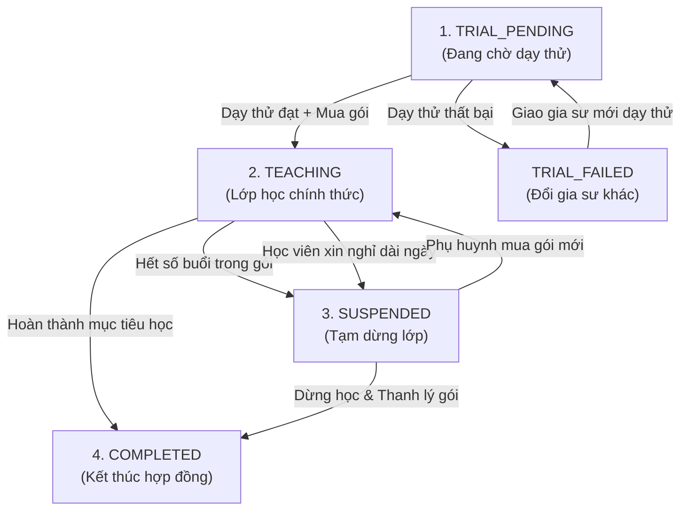
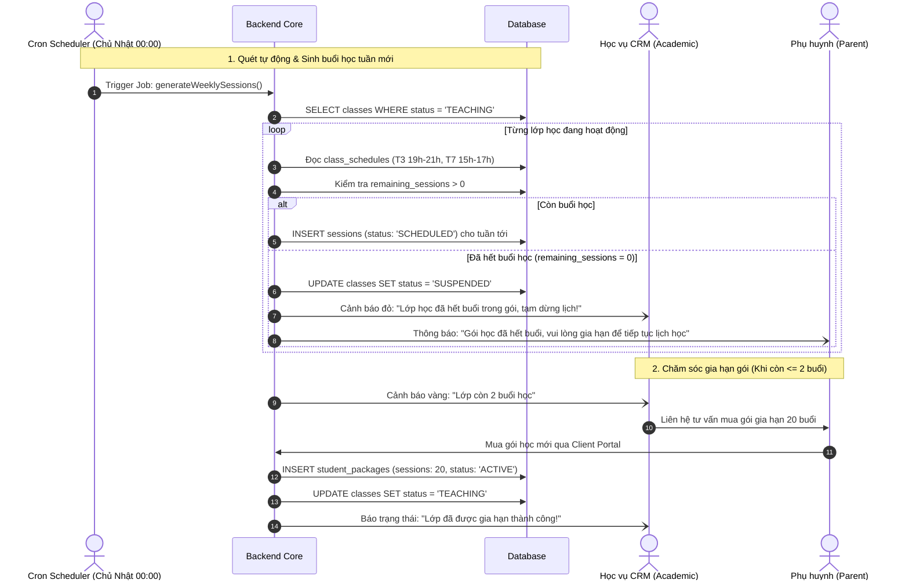

# ĐẶC TẢ NGHIỆP VỤ: QUẢN LÝ LỚP HỌC & TIẾN ĐỘ GÓI HỌC PHÍ (ADMIN CRM)

> **Mã phân hệ:** CRM-04 / CLASS-01  
> **Đối tượng sử dụng:** Nhân viên Học vụ (Academic), Kế toán (Accountant), Sales  
> **Cổng truy cập:** `http://localhost:5173/admin-crm` (Tab Quản lý Lớp học)

---

## 1. Mục Tiêu Nghiệp Vụ
Sau khi lớp học được tạo và vượt qua vòng dạy thử, việc quản lý vòng đời lớp học, lịch học định kỳ và kiểm soát số buổi còn lại trong gói là nhiệm vụ trung tâm của Nhân viên Học vụ nhằm đảm bảo trải nghiệm học tập không bị gián đoạn.

---

## 2. Vòng Đời Lớp Học (Class State Machine)

### 2.1. Sơ đồ tuần tự: Sinh lịch định kỳ & Tạm dừng khi hết gói (Sequence Diagram)

---

## 3. Quản Lý Lịch Học Định Kỳ (`class_schedules`) & Sinh Buổi Học

### 3.1. Thiết lập lịch định kỳ
* Mỗi lớp học có một hoặc nhiều khung giờ định kỳ trong tuần (ví dụ: Thứ Ba 19h00-21h00 và Thứ Bảy 15h00-17h00).
* Lịch này được lưu trong bảng `class_schedules`.

### 3.2. Cơ chế sinh buổi học tự động (`sessions`)
* **Job sinh lịch tự động (Session Generator)**: Định kỳ vào Chủ Nhật hàng tuần, hệ thống tự động quét các lớp ở trạng thái `TEACHING` và sinh trước danh sách các buổi học (`sessions`) cho tuần kế tiếp ở trạng thái `SCHEDULED`.
* **Thông tin buổi học sinh ra**:
  * Mã lớp `class_id`.
  * Thời gian bắt đầu và kết thúc dự kiến.
  * Trạng thái mặc định: `SCHEDULED`.
* **Đổi lịch định kỳ**: Mọi thay đổi lịch học định kỳ chỉ có hiệu lực từ tuần tiếp theo, không áp dụng hồi tố cho các buổi học đã diễn ra.

---

## 4. Kiểm Soát Tiến Độ Gói Học Phí (Package Consumption Monitoring)

Nhân viên Học vụ theo dõi tiến độ của từng lớp thông qua bảng chỉ số:
* `total_sessions`: Tổng số buổi phụ huynh đã mua (lũy kế tất cả các gói `ACTIVE`).
* `used_sessions`: Số buổi đã học và được xác nhận (`CONFIRMED`).
* `remaining_sessions`: Số buổi còn lại trong hợp đồng (`total_sessions - used_sessions`).

### 4.1. Quy trình xử lý khi lớp còn $\le 2$ buổi:
1. Hệ thống tự động đẩy cảnh báo màu vàng lên Dashboard Học vụ: *"Lớp [Mã lớp] còn 2 buổi học"*.
2. Học vụ chủ động nhắn tin / gọi điện chăm sóc phụ huynh:
   * Khảo sát mức độ hài lòng về gia sư trong đợt học vừa qua.
   * Tư vấn phụ huynh nạp thêm tiền và mua gói học phí đợt tiếp theo.
3. Nếu phụ huynh mua gói mới: Lớp duy trì `TEACHING` liên tục.
4. Nếu phụ huynh chưa mua khi hết buổi: Lớp tự động chuyển sang `SUSPENDED` (Tạm dừng). Gia sư tạm thời không đến dạy cho đến khi có gói mới.

---

## 5. Kết Thúc Lớp Học & Thanh Lý Hợp Đồng (`COMPLETED`)

* **Trường hợp kết thúc tự nhiên**: Học sinh thi đỗ kỳ thi mục tiêu (vào lớp 10, đỗ đại học) hoặc hoàn thành mục tiêu khóa học.
* **Quy trình đóng lớp**:
  1. Học vụ kiểm tra đối soát: Đảm bảo toàn bộ các buổi học đã diễn ra đều ở trạng thái `CONFIRMED`.
  2. Không còn khiếu nại (`DISPUTED`) nào đang treo.
  3. Lớp chuyển sang `COMPLETED`.
  4. Nếu còn buổi học thừa trong gói: Kế toán thực hiện thủ tục hoàn tiền (`REFUND`) cho phụ huynh theo đúng quy chế tài chính.

---

## 6. Danh Sách Mã Lỗi Phục Vụ Dev & QA

| Mã lỗi (Error Code) | HTTP Status | Nguyên nhân | Hướng xử lý |
| :--- | :---: | :--- | :--- |
| `CLASS_NOT_FOUND` | 404 | Lớp học không tồn tại trên hệ thống. | Kiểm tra lại mã lớp. |
| `CLASS_NOT_IN_TEACHING` | 400 | Thao tác chỉ cho phép khi lớp đang ở trạng thái `TEACHING`. | Kiểm tra trạng thái lớp hiện tại. |
| `SCHEDULE_SLOT_EMPTY` | 422 | Lớp học chưa được thiết lập bất kỳ khung giờ định kỳ nào trong tuần. | Thêm ít nhất 1 buổi/tuần vào lịch định kỳ. |
| `CANNOT_COMPLETE_PENDING_DISPUTE` | 400 | Không thể đóng lớp khi vẫn còn buổi học đang bị khiếu nại chưa xử lý xong. | Phán quyết khiếu nại trước khi hoàn tất lớp. |
