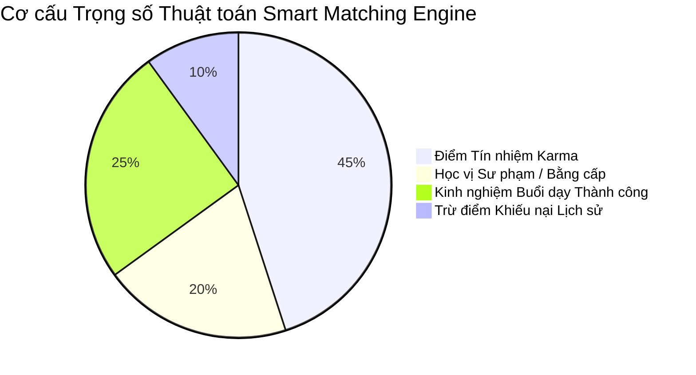
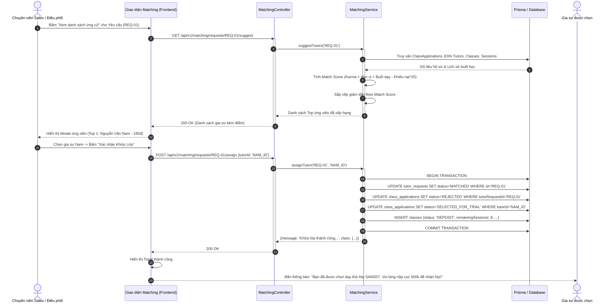

# Usecase: UC-ADM-04 - Động cơ Ghép lớp Thông minh (Smart Matching Engine & Multi-factor Scoring Algorithm)

> **Mã phân hệ:** CRM-REF-04  
> **Phân hệ:** Cổng Quản trị Trung tâm (Admin CRM)  
> **Tác nhân chính:** Chuyên viên Điều phối / Tư vấn (Sales Staff), Hệ thống Khớp nối Tự động (Smart Matching Engine), Quản trị viên (Admin)

---

## 1. Giới thiệu chức năng

### 1.1. Mục đích
Cung cấp động cơ tính toán và gợi ý ghép lớp thông minh (Smart Matching Engine) dựa trên thuật toán chấm điểm đa trọng số (Multi-Factor Scoring). Thay thế hoàn toàn quy trình thủ công truyền thống khi nhân viên tư vấn phải dò tìm thủ công qua hàng trăm hồ sơ trong file Excel mất từ 2-3 ngày, hệ thống tự động phân tích độ tương thích chuyên môn, lịch rảnh, địa bàn di chuyển, uy tín điểm Karma và lịch sử giảng dạy để đề xuất danh sách ứng viên phù hợp nhất trong vòng **dưới 1 giây**. Chức năng giúp rút ngắn thời gian chốt lớp (Time-to-Match) xuống **dưới 4 giờ**, tăng tỷ lệ ghép lớp thành công và triệt tiêu nguy cơ khiếu nại phát sinh.

### 1.2. Actor (Tác nhân)
* **Chuyên viên Tư vấn / Điều phối (Sales Staff)**: Xem danh sách yêu cầu tìm gia sư, mở bảng gợi ý ứng viên, kiểm tra bảng điểm thành phần, gửi thông báo mời nhận lớp hoặc chỉ định gia sư nhận lớp dạy thử.
* **Hệ thống Khớp nối Tự động (Smart Matching Engine)**: Quét cơ sở dữ liệu hồ sơ gia sư, thực thi thuật toán chấm điểm theo thời gian thực khi có yêu cầu mới hoặc có gia sư nộp đơn ứng tuyển.
* **Quản trị viên (Admin)**: Tinh chỉnh các tham số trọng số thuật toán (chuyên môn, lịch rảnh, khu vực, điểm uy tín, hệ số trừ phạt khiếu nại).

### 1.3. Điều kiện tiên quyết
* Yêu cầu tìm gia sư (`TutorRequest`) đang ở trạng thái `PUBLISHED`.
* Các gia sư trong danh sách xét duyệt đang ở trạng thái hoạt động `ACTIVE` và đã được xác minh thông tin cơ bản.

### 1.4. Danh mục các chức năng con (Sub-features)
1. **UC-ADM-04-01**: Tính toán & Xếp hạng Điểm Tương thích Đa Trọng số (Multi-factor Match Scoring).
2. **UC-ADM-04-02**: Tra cứu & Xem Chi tiết Hồ sơ Ứng cử viên Ghép lớp (Candidate Profile & Match Breakdown).
3. **UC-ADM-04-03**: Phát Thông báo Đẩy Mời Nhận Lớp 1-Click (1-Click Notification Broadcast).
4. **UC-ADM-04-04**: Phê duyệt Chỉ định Gia sư & Khởi tạo Lớp học Chờ cọc (Tutor Assignment & Class Provisioning).

---

## 2. Dữ liệu nghiệp vụ đầu vào (Input Data & Parameters)

### 2.1. Công thức Thuật toán Chấm Điểm Khớp Lớp (Smart Matching Scoring Algorithm)

Điểm tương thích tổng hợp của Gia sư ($Score_{\text{Match}}$) được tính toán theo mô hình triển khai thực tế trong mã nguồn backend (`matching.service.ts`):

$$Score_{\text{Match}} = S_{\text{Karma}} + S_{\text{Học vị}} + S_{\text{Kinh nghiệm}} - S_{\text{Khiếu nại}}$$

Trong đó:
1. **Điểm Tín nhiệm Karma ($S_{\text{Karma}}$)**: Lấy trực tiếp từ trường `tutor.karmaScore` (Trọng số nền tảng, điểm mặc định: 100 điểm, tối đa không giới hạn).
2. **Điểm Học vị & Chuyên môn ($S_{\text{Học vị}}$)**:
   * Nếu chuyên ngành hoặc chức danh thuộc khối *"Sư phạm"* hoặc *"Giáo viên"*: $+30$ điểm.
   * Nếu có bằng cấp *"Đại học"* / chuyên ngành khác: $+15$ điểm.
   * Chưa có bằng cấp kiểm định: $0$ điểm.
3. **Điểm Thâm niên Giảng dạy Thành công ($S_{\text{Kinh nghiệm}}$)**:
   * Tính dựa trên tổng số buổi dạy không bị khiếu nại: $Sessions_{\text{Thành công}} = TotalSessions - TotalDisputes$.
   * Mỗi buổi dạy thành công cộng $+0.5$ điểm, tối đa cộng $+50$ điểm:
     $$S_{\text{Kinh nghiệm}} = \min(Sessions_{\text{Thành công}} \times 0.5, 50)$$
4. **Hệ số Trừ Phạt Tranh chấp Lịch sử ($S_{\text{Khiếu nại}}$)**:
   * Trừ rất nặng đối với các hồ sơ có tiền sử bị phụ huynh khiếu nại (buổi học có trạng thái `DISPUTED`):
     $$S_{\text{Khiếu nại}} = TotalDisputes \times 20$$



### 2.2. Dữ liệu Đầu ra Đề xuất Ứng cử viên (`ScoredTutorCandidate`)

| Trường dữ liệu | Kiểu | Ý nghĩa nghiệp vụ |
| :--- | :--- | :--- |
| `applicationId` | UUID | Định danh đơn ứng tuyển trong bảng `class_applications`. |
| `tutorId` | UUID | Khóa chính của hồ sơ gia sư trong bảng `tutors`. |
| `tutorName` | String | Họ và tên gia sư. |
| `qualification` | String | Trình độ học vấn & Chuyên ngành đào tạo. |
| `karmaScore` | Integer | Điểm tín nhiệm Karma hiện tại. |
| `matchScore` | Integer | Tổng điểm tương thích đã làm tròn (sắp xếp giảm dần). |
| `coverLetter` | Text | Thư ngỏ tâm huyết của gia sư khi nộp đơn. |
| `appliedAt` | DateTime | Thời điểm nộp đơn ứng tuyển. |

### 2.3. Tham số API Chỉ định Ghép Lớp (`POST /api/v1/matching/requests/:id/assign`)

| Tham số | Vị trí | Kiểu | Ràng buộc nghiệp vụ |
| :--- | :--- | :--- | :--- |
| `id` | URL Param | UUID | ID của yêu cầu tìm gia sư (`tutorRequestId`). Trạng thái phải là `PUBLISHED`. |
| `tutorId` | Body | UUID | ID gia sư được chỉ định. Phải là gia sư đã nộp đơn ứng tuyển vào yêu cầu này. |
| `hourlyRate` | Body (Tùy chọn) | Decimal | Mức giá phụ huynh trả (mặc định lấy theo `budgetPerSession` của yêu cầu). |
| `tutorWageRate` | Body (Tùy chọn) | Decimal | Mức thù lao gia sư nhận được cho mỗi buổi dạy. |

---

## 3. Quy tắc nghiệp vụ (Business Rules)

| Mã BR | Tình huống kích hoạt | Xử lý của hệ thống | Mã lỗi / Phản hồi |
| :--- | :--- | :--- | :--- |
| **BR-ADM-04-01** | Kiểm tra trạng thái yêu cầu trước khi gán gia sư. | Yêu cầu phải ở trạng thái `PUBLISHED`. Nếu yêu cầu đã ở trạng thái `MATCHED`, `CANCELLED` hoặc chưa duyệt: Từ chối thao tác gán. | `400 BAD_REQUEST` ("Yêu cầu không ở trạng thái đang tuyển") |
| **BR-ADM-04-02** | Ràng buộc ứng tuyển hợp lệ của gia sư. | Gia sư được gán bắt buộc phải có bản ghi nộp đơn trong bảng `class_applications` với `tutorRequestId` tương ứng. Không cho phép gán một gia sư chưa từng ứng tuyển. | `400 BAD_REQUEST` ("Gia sư này chưa ứng tuyển vào lớp") |
| **BR-ADM-04-03** | Khóa yêu cầu và xử lý đơn ứng tuyển đồng loạt (Atomic Matching Transaction). | Khi gán thành công một gia sư: Toàn bộ quá trình thực thi trong 1 Prisma Transaction:<br>1. Cập nhật `tutorRequest.status = 'MATCHED'`.<br>2. Chuyển tất cả các đơn ứng tuyển khác của yêu cầu này sang `REJECTED`.<br>3. Chuyển đơn của gia sư được chọn sang `SELECTED_FOR_TRIAL`.<br>4. Tạo bản ghi lớp học mới `Class` ở trạng thái `DEPOSIT`. | `MATCHING_TX_SUCCESS` |
| **BR-ADM-04-04** | Trừ điểm nặng nề với gia sư có lịch sử tranh chấp. | Mỗi buổi học có trạng thái `DISPUTED` trong quá khứ trừ ngay 20 điểm tương thích. Nếu gia sư có $\ge 3$ lần khiếu nại, điểm sẽ bị kéo xuống rất thấp và tự động bị đẩy xuống cuối danh sách đề xuất. | `BR_DISPUTE_PENALTY_APPLIED` |
| **BR-ADM-04-05** | Tự động tính số buổi học dự kiến cho lớp mới tạo. | Giá trị `remainingSessions` của bản ghi `Class` tự động được tính bằng: `request.sessionsPerWeek * 4` (tương đương hợp đồng chu kỳ 1 tháng 4 tuần). | `REMAINING_SESSIONS_INIT` |

---

## 4. Đặc tả chi tiết các Use Case chức năng con

```mermaid
usecaseDiagram
    actor "Chuyên viên Tư vấn / Điều phối" as Sales
    actor "Hệ thống Tự động" as Engine
    actor "Quản trị viên" as Admin

    package "UC-ADM-04: Động cơ Ghép lớp Thông minh" {
        usecase "UC-ADM-04-01: Chấm điểm Tương thích Đa Trọng số" as UC1
        usecase "UC-ADM-04-02: Xem Danh sách Hồ sơ Ứng cử viên" as UC2
        usecase "UC-ADM-04-03: Bắn Thông báo Mời Nhận Lớp 1-Click" as UC3
        usecase "UC-ADM-04-04: Chỉ định Gia sư & Tạo Lớp Chờ Cọc" as UC4
    }

    Sales --> UC1
    Engine --> UC1
    Sales --> UC2
    Sales --> UC3
    Sales --> UC4
    Admin --> UC4
```

### 4.1. UC-ADM-04-01: Chấm điểm Tương thích Đa Trọng số (Multi-factor Match Scoring)
* **Mục tiêu**: Tính toán điểm số tương thích của tất cả các ứng cử viên nộp đơn vào yêu cầu tìm gia sư theo thời gian thực.
* **Tác nhân**: Hệ thống Tự động (Engine), Chuyên viên Sales.
* **Tiền điều kiện**: Yêu cầu `tutorRequestId` tồn tại và có ít nhất 1 gia sư ứng tuyển.
* **Hậu điều kiện**: Danh sách ứng cử viên được sắp xếp giảm dần theo `matchScore`.
* **Luồng cơ bản**:
  1. Frontend gọi API `GET /api/v1/matching/requests/:id/suggest`.
  2. Backend truy vấn yêu cầu kèm danh sách đơn ứng tuyển (`classApplications`) và hồ sơ lịch sử giảng dạy của từng gia sư (`tutor.classes.sessions`).
  3. Với mỗi gia sư, thuật toán tính điểm:
     * Cộng điểm Karma cơ sở (`tutor.karmaScore`).
     * Cộng điểm học vị (+30 cho Sư phạm, +15 cho Đại học).
     * Cộng điểm buổi dạy thành công ($+0.5 \times Sessions$, tối đa 50đ).
     * Trừ điểm phạt khiếu nại ($-20 \times Disputes$).
  4. Làm tròn điểm `Math.round(score)` và sắp xếp mảng kết quả giảm dần theo `matchScore`.
  5. Trả về danh sách ứng viên đã xếp hạng về cho giao diện.
* **Luồng ngoại lệ**: Nếu yêu cầu không tồn tại, trả về `404 NOT_FOUND` ("Không tìm thấy yêu cầu tìm gia sư").
* **Dữ liệu đầu ra**: Mảng JSON danh sách gia sư kèm điểm tương thích.

### 4.2. UC-ADM-04-02: Xem Danh sách Hồ sơ Ứng cử viên Ghép lớp (Candidate Profile & Match Breakdown)
* **Mục tiêu**: Giúp chuyên viên điều phối so sánh hồ sơ năng lực, thư ứng tuyển và điểm mạnh của từng ứng cử viên.
* **Tác nhân**: Chuyên viên Tư vấn / Điều phối (Sales).
* **Tiền điều kiện**: Mở giao diện "Ghép lớp (Matching)" tại `/admin-crm/matching`.
* **Hậu điều kiện**: Modal hiển thị chi tiết các ứng viên nộp đơn.
* **Luồng cơ bản**:
  1. Chuyên viên Sales xem danh sách các lớp đang tuyển (`RequestStatus.PUBLISHED`).
  2. Bấm vào nút "Xem danh sách ứng cử" trên dòng yêu cầu tương ứng.
  3. Cửa sổ Modal bật lên, hiển thị danh sách các gia sư đã ứng tuyển.
  4. Mỗi thẻ ứng viên hiển thị:
     * Họ tên, Avatar, Trình độ/Trường đại học.
     * Badge điểm tương thích nổi bật (VD: `185 điểm - Phù hợp 98%`).
     * Điểm Karma hiện tại (VD: `Karma: 120`).
     * Đoạn thư ngỏ (`coverLetter`) trình bày phương pháp giảng dạy.
  5. Chuyên viên đối chiếu yêu cầu của phụ huynh để quyết định chọn ứng viên tối ưu nhất.
* **Dữ liệu đầu ra**: Giao diện Modal hiển thị đầy đủ thông tin ứng viên.

### 4.3. UC-ADM-04-03: Phát Thông báo Đẩy Mời Nhận Lớp 1-Click (1-Click Notification Broadcast)
* **Mục tiêu**: Chủ động kích hoạt chuông thông báo Web mời các gia sư phù hợp nhất vào xem lớp và đặt cọc mà không cần chờ đợi họ tự tìm kiếm.
* **Tác nhân**: Chuyên viên Tư vấn (Sales).
* **Tiền điều kiện**: Danh sách gợi ý Top ứng viên đã sẵn sàng.
* **Hậu điều kiện**: Thông báo chuông Web được gửi đến các gia sư mục tiêu.
* **Luồng cơ bản**:
  1. Trên giao diện yêu cầu tìm gia sư, chuyên viên Sales bấm nút "Bắn thông báo mời Top 5".
  2. Hệ thống tạo tự động các bản ghi `Notification` gửi tới 5 gia sư có điểm Match Score cao nhất trong khu vực.
  3. Nội dung thông báo kèm Deep Link dẫn thẳng tới chi tiết lớp trên Sàn lớp của gia sư (`/tutor-portal/san-lop/SAMxxx`).
  4. Hiển thị thông báo Toast trên màn hình Sales: *"Đã gửi thông báo mời nhận lớp tới Top 5 gia sư phù hợp nhất!"*.
* **Dữ liệu đầu ra**: 5 bản ghi thông báo được gửi đi thành công.

### 4.4. UC-ADM-04-04: Phê duyệt Chỉ định Gia sư & Khởi tạo Lớp học Chờ cọc (Tutor Assignment & Class Provisioning)
* **Mục tiêu**: Chốt gia sư nhận lớp, đóng yêu cầu tìm kiếm và khởi tạo bản ghi lớp học chính thức.
* **Tác nhân**: Chuyên viên Tư vấn (Sales), Admin.
* **Tiền điều kiện**: Đã chọn được gia sư ưng ý trong danh sách ứng cử viên.
* **Hậu điều kiện**: Bản ghi `Class` được tạo ở trạng thái `DEPOSIT`.
* **Luồng cơ bản**:
  1. Trên thẻ gia sư được chọn, chuyên viên bấm nút "Giao Dạy Thử".
  2. Màn hình hiển thị form xác nhận mức học phí phụ huynh trả (`hourlyRate`) và mức thù lao gia sư nhận (`tutorWageRate`).
  3. Bấm nút "Xác nhận Khớp Lớp".
  4. Gửi yêu cầu `POST /api/v1/matching/requests/:id/assign`.
  5. Backend thực thi Prisma Transaction:
     * Cập nhật `TutorRequest.status = 'MATCHED'`.
     * Cập nhật `ClassApplication.status = 'SELECTED_FOR_TRIAL'`.
     * Từ chối các đơn khác (`status = 'REJECTED'`).
     * Tạo bản ghi `Class` mới với `status = 'DEPOSIT'`.
  6. Trả về phản hồi thành công: *"Khớp lớp thành công. Đang chờ gia sư nộp cọc 500k."*.
  7. Lớp học xuất hiện ngay trên Bảng Kanban ở Cột 1 và sẵn sàng để gia sư quét mã VietQR nộp cọc.
* **Dữ liệu đầu ra**: Bản ghi `Class` mới với đầy đủ thông tin hợp đồng.

---

## 5. Sơ đồ tuần tự nghiệp vụ (Sequence Diagrams)



---

## 6. Kịch bản kiểm thử & Nghiệm thu (Test Scenarios)

### Kịch bản 1: Động cơ tính điểm chính xác và xếp hạng ứng viên
* **Given**: Yêu cầu tìm gia sư môn Toán 10 có 2 ứng viên nộp đơn:
  * Gia sư A: Sinh viên Bách Khoa, Karma = 100, Bằng cấp Đại học (+15đ), 20 buổi dạy thành công (+10đ), 0 khiếu nại $\rightarrow$ Điểm = $100 + 15 + 10 = 125$ điểm.
  * Gia sư B: Giáo viên Sư phạm Toán, Karma = 110, Bằng Sư phạm (+30đ), 40 buổi dạy thành công (+20đ), 0 khiếu nại $\rightarrow$ Điểm = $110 + 30 + 20 = 160$ điểm.
* **When**: Chuyên viên mở danh sách ứng cử viên (`GET /api/v1/matching/requests/:id/suggest`).
* **Then**:
  * Gia sư B đứng ở vị trí số 1 với `matchScore = 160`.
  * Gia sư A đứng ở vị trí số 2 với `matchScore = 125`.
  * Các thông tin Karma và thư ngỏ hiển thị đầy đủ, trực quan.

### Kịch bản 2: Xử lý gia sư có lịch sử khiếu nại - Bị trừ điểm nặng
* **Given**: Gia sư C có Karma = 100, Bằng Sư phạm (+30đ), 10 buổi dạy thành công (+5đ) nhưng có 2 buổi học bị khiếu nại (`DISPUTED`).
* **When**: Hệ thống chạy thuật toán chấm điểm.
* **Then**:
  * Điểm trừ phạt khiếu nại là $2 \times 20 = 40$ điểm.
  * Tổng điểm của Gia sư C là $100 + 30 + 5 - 40 = 95$ điểm (bị đẩy tụt xuống dưới các ứng viên không có khiếu nại).

### Kịch bản 3: Chỉ định khớp lớp thành công - Kiểm tra tính toàn vẹn Transaction
* **Given**: Yêu cầu `REQ-01` có 3 gia sư nộp đơn (A, B, C).
* **When**: Chuyên viên bấm gán lớp cho Gia sư B.
* **Then**:
  * Trạng thái của `REQ-01` chuyển thành `MATCHED`.
  * Đơn của Gia sư B đổi thành `SELECTED_FOR_TRIAL`.
  * Đơn của Gia sư A và C đổi thành `REJECTED`.
  * Một bản ghi `Class` mới được tạo ra ở trạng thái `DEPOSIT`.
  * Nếu có bất kỳ lỗi nào xảy ra trong quá trình cập nhật, toàn bộ giao dịch được Rollback an toàn.
