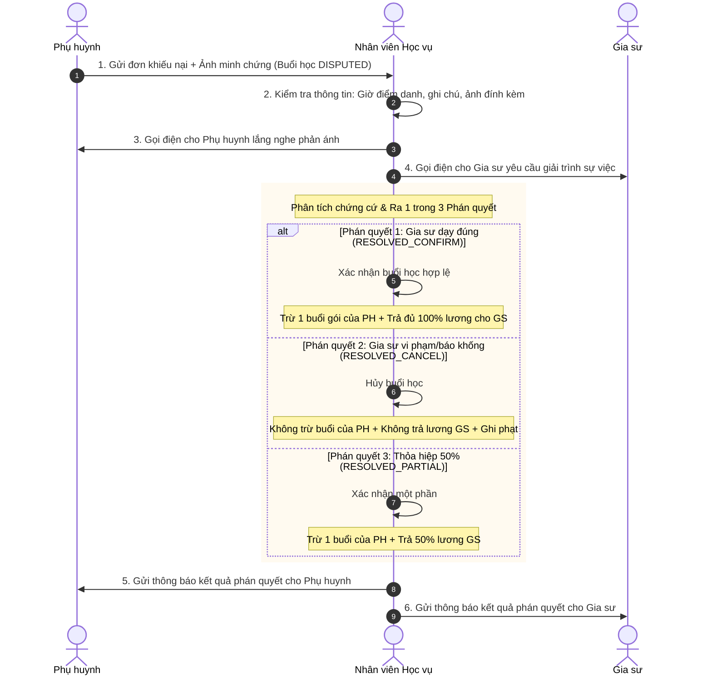

# ĐẶC TẢ NGHIỆP VỤ: GIẢI QUYẾT KHIẾU NẠI ĐIỂM DANH (ADMIN CRM)

> **Mã phân hệ:** CRM-05 / DISPUTE-01  
> **Đối tượng sử dụng:** Nhân viên Học vụ (Academic), Quản trị viên (Admin)  
> **Cổng truy cập:** `http://localhost:5173/admin-crm` (Tab Khiếu nại / Disputes)

---

## 1. Bản Chất Nghiệp Vụ & Cam Kết SLA
Khi phụ huynh từ chối phê duyệt một buổi điểm danh và gửi đơn khiếu nại, buổi học đó chuyển sang trạng thái `DISPUTED`. Để bảo vệ quyền lợi của cả hai bên và duy trì sự hòa thuận, bộ phận Học vụ đóng vai trò là **Trọng tài độc lập**:
* **Cam kết SLA (Service Level Agreement)**: Toàn bộ khiếu nại phải được thụ lý và ra phán quyết trong vòng tối đa **48 giờ**.
* **Cảnh báo quá hạn SLA**: Nếu sau 36 giờ chưa được xử lý, hệ thống đổi màu cảnh báo sang **Đỏ nhấp nháy** và gửi email báo cáo khẩn cấp lên Giám đốc trung tâm (Admin).

---

## 2. Quy Trình Điều Tra & Thu Thập Chứng Cứ

---

## 3. Ba Kết Quả Phán Quyết Chính Thức (`DisputeResolution`)

### 3.1. `RESOLVED_CONFIRM` (Xác nhận buổi học hợp lệ)
* **Tình huống**: Phụ huynh khiếu nại nhầm (ví dụ: mẹ ở cơ quan tưởng con chưa học, nhưng con đã học xong với bố ở nhà) hoặc gia sư chứng minh được đã hoàn thành đủ giờ dạy bằng camera/phiếu bài tập.
* **Thực thi hệ thống**:
  * Trạng thái buổi học chuyển sang `CONFIRMED`.
  * Trừ 1 buổi học trong gói của phụ huynh (FIFO).
  * Chuyển đủ **100% lương buổi dạy** vào ví thu nhập của gia sư.

### 3.2. `RESOLVED_CANCEL` (Hủy bỏ buổi học do lỗi gia sư)
* **Tình huống**: Gia sư không đến dạy nhưng vẫn bấm điểm danh báo có mặt, gia sư đến muộn về sớm quá 50% thời lượng, hoặc thái độ giảng dạy không thể chấp nhận được.
* **Thực thi hệ thống**:
  * Trạng thái buổi học chuyển sang `CANCELLED_BY_TUTOR`.
  * **Phụ huynh hoàn toàn không bị trừ buổi học**.
  * **Gia sư không nhận được bất kỳ khoản thù lao nào**.
  * Hệ thống tự động ghi nhận **1 lỗi vi phạm kỷ luật nghiêm trọng** vào hồ sơ gia sư và trừ 0.5 điểm uy tín.

### 3.3. `RESOLVED_PARTIAL` (Thỏa hiệp hỗ trợ 50%)
* **Tình huống**: Có sự cố ngoài ý muốn từ cả 2 phía (ví dụ: học sinh học được 60 phút thì bị ốm đau phải nghỉ giữa chừng, hoặc gia sư có việc khẩn cấp xin về sớm nhưng đã dạy được hơn 50% thời lượng).
* **Thực thi hệ thống**:
  * Trạng thái buổi học chuyển sang `CONFIRMED`.
  * Phụ huynh bị trừ 1 buổi học trong gói.
  * Gia sư nhận **50% mức thù lao** của buổi dạy đó vào ví lương để hỗ trợ công sức di chuyển.
  * Trung tâm bảo lưu 50% còn lại để bù giờ cho học sinh trong các buổi học sau.

---

## 4. Kiểm Soát Truy Vết & Báo Cáo Khiếu Nại

* Mọi phán quyết của Học vụ bắt buộc phải nhập **Ghi chú giải trình phán quyết (Resolution Notes)** tối thiểu 20 ký tự.
* Toàn bộ phán quyết và biến động tài chính được lưu vĩnh viễn trong bảng `audit_logs` để Admin có thể hậu kiểm bất cứ lúc nào.

---

## 5. Danh Sách Mã Lỗi Phục Vụ Dev & QA

| Mã lỗi (Error Code) | HTTP Status | Nguyên nhân | Hướng xử lý |
| :--- | :---: | :--- | :--- |
| `DISPUTE_NOT_FOUND` | 404 | Khiếu nại không tồn tại hoặc đã được giải quyết xong trước đó. | Tải lại danh sách khiếu nại. |
| `RESOLUTION_NOTE_REQUIRED` | 422 | Ra phán quyết nhưng không nhập lý do/căn cứ giải trình. | Nhập biên bản kết luận phán quyết. |
| `INVALID_RESOLUTION_TYPE` | 400 | Loại phán quyết không nằm trong 3 kiểu hợp lệ của hệ thống. | Chọn đúng enum quy định. |
