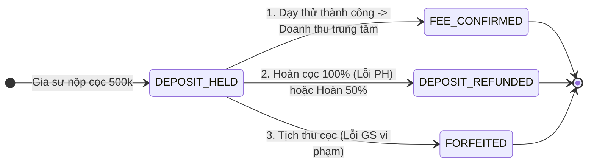
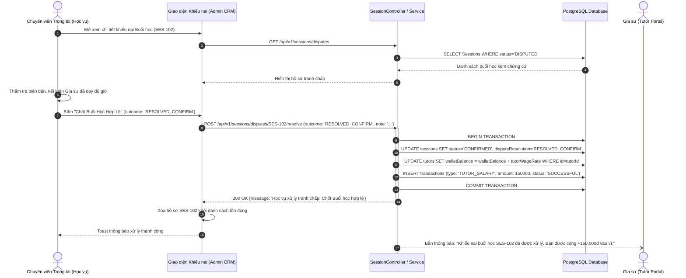

# Usecase: UC-ADM-05 - Trọng tài Khiếu nại Buổi học & Đối soát Tiền cọc (Academic Dispute Arbitration & Deposit Settlement)

> **Mã phân hệ:** CRM-REF-05  
> **Phân hệ:** Cổng Quản trị Trung tâm (Admin CRM)  
> **Tác nhân chính:** Chuyên viên Học vụ / Trọng tài (Academic Arbitrator), Kế toán (Accountant), Quản trị viên (Admin)

---

## 1. Giới thiệu chức năng

### 1.1. Mục đích
Cung cấp giải pháp trọng tài và giải quyết tranh chấp buổi học (Dispute Arbitration) kết hợp đối soát dòng tiền cọc và thù lao gia sư (Deposit & Salary Settlement). Trong môi trường đào tạo gia sư, các bất đồng thực tế thường xuyên nảy sinh (phụ huynh phản ánh gia sư đi muộn, chất lượng giảng dạy không đúng cam kết, trong khi gia sư giải trình buổi học diễn ra đúng giờ). Hệ thống cung cấp cơ chế phân xử 2 chiều độc lập, thẩm tra bằng chứng số (Dispute Evidence), phân định rõ trách nhiệm và tự động hóa điều chuyển tài chính (kết chuyển doanh thu phí, hoàn trả tiền cọc hoặc thanh toán thù lao vào ví gia sư) với đầy đủ lưu vết kiểm toán (Audit Trail) chống gian lận nội bộ.

### 1.2. Actor (Tác nhân)
* **Chuyên viên Học vụ / Trọng tài (Academic Arbitrator)**: Thẩm định hồ sơ khiếu nại, xem xét bằng chứng ảnh chụp/video/biên bản buổi học, liên hệ xác minh hai bên và ra phán quyết phân xử (`RESOLVED_CONFIRM` hoặc `RESOLVED_CANCEL`).
* **Kế toán (Accountant)**: Theo dõi danh sách đối soát tài chính, thực hiện lệnh duyệt hoàn cọc hoặc quyết toán chuyển khoản thù lao từ ví gia sư về tài khoản ngân hàng chính thức (`payoutTutor`).
* **Quản trị viên (Admin)**: Toàn quyền can thiệp vào các phán quyết tranh chấp đặc biệt, phê duyệt chính sách hoàn cọc linh hoạt hoặc xử phạt đóng băng tài khoản gia sư vi phạm nghiêm trọng.

### 1.3. Điều kiện tiên quyết
* Người dùng đăng nhập hệ thống CRM với vai trò `ADMIN`, `ACADEMIC` hoặc `ACCOUNTANT`.
* Buổi học phát sinh tranh chấp đang ở trạng thái `DISPUTED` trong bảng `sessions`, hoặc lớp học dạy thử kết thúc cần đối soát cọc trong bảng `classes`.

### 1.4. Danh mục các chức năng con (Sub-features)
1. **UC-ADM-05-01**: Tiếp nhận & Thẩm định Hồ sơ Tranh chấp Buổi học (Dispute Dossier Review).
2. **UC-ADM-05-02**: Ra Phán quyết Trọng tài & Kết chuyển Thù lao Tự động (Arbitration Ruling & Wage Disbursement).
3. **UC-ADM-05-03**: Đối soát Quyết toán Tiền cọc Dạy thử (Trial Deposit Reconciliation).
4. **UC-ADM-05-04**: Quyết toán Ví Thù lao & Xuất Lệnh Chuyển khoản Rút tiền (Tutor Wallet Payout Execution).

---

## 2. Dữ liệu nghiệp vụ đầu vào (Input Data & Parameters)

### 2.1. Cấu trúc Bản ghi Khiếu nại Buổi học (`Session` Disputed Data)

| Trường thông tin | Kiểu dữ liệu | Ý nghĩa nghiệp vụ |
| :--- | :--- | :--- |
| `sessionId` | UUID | Khóa chính của buổi học bị phụ huynh hoặc gia sư khiếu nại. |
| `classId` | UUID | Mã lớp học liên kết. |
| `scheduledTime` | DateTime | Thời gian dự kiến buổi học theo thời khóa biểu. |
| `actualStart` / `actualEnd`| DateTime | Thời gian bắt đầu và kết thúc thực tế theo GPS / Check-in của gia sư. |
| `status` | String | Trạng thái hiện tại: `DISPUTED`. |
| `disputeReason` | Text | Lý do chi tiết do bên khiếu nại cung cấp (VD: "Gia sư đến muộn 45 phút, dạy hời hợt"). |
| `disputeEvidences` | Array | Danh sách file ảnh/biên bản đính kèm minh chứng (`fileUrl`, `uploadedBy`). |

### 2.2. Tham số Đầu vào API Phán quyết Tranh chấp (`POST /api/v1/sessions/disputes/:id/resolve`)

| Tham số | Vị trí | Kiểu | Giá trị hợp lệ & Mô tả |
| :--- | :--- | :--- | :--- |
| `id` | URL Param | UUID | ID của buổi học tranh chấp (`sessionId`). |
| `outcome` | Body | String | • `RESOLVED_CONFIRM`: Phán quyết buổi học hợp lệ, bảo vệ gia sư.<br>• `RESOLVED_CANCEL`: Phán quyết hủy buổi học, bảo vệ phụ huynh. |
| `note` | Body | String | Ghi chú lập luận và căn cứ phân xử của Học vụ/Trọng tài. |

### 2.3. Các Trạng thái Quyết toán Tiền Cọc (`TransactionType` Enums)



---

## 3. Quy tắc nghiệp vụ (Business Rules)

| Mã BR | Tình huống kích hoạt | Xử lý của hệ thống | Mã lỗi / Phản hồi |
| :--- | :--- | :--- | :--- |
| **BR-ADM-05-01** | Phán quyết buổi học hợp lệ (`RESOLVED_CONFIRM`). | Hệ thống thực thi trong Prisma Transaction:<br>1. Cập nhật `session.status = 'CONFIRMED'`.<br>2. Lưu `disputeResolution = 'RESOLVED_CONFIRM'`.<br>3. Tự động cộng thù lao buổi học (`class.tutorWageRate`) vào ví gia sư (`tutor.walletBalance`).<br>4. Tạo bản ghi giao dịch `Transaction` loại `TUTOR_SALARY` trạng thái `SUCCESSFUL`. | `200 OK` ("Xử lý khiếu nại thành công: Buổi học hợp lệ") |
| **BR-ADM-05-02** | Phán quyết hủy buổi học (`RESOLVED_CANCEL`). | Cập nhật `session.status = 'CANCELLED_BY_STUDENT'`, lưu `disputeResolution = 'RESOLVED_CANCEL'`, không cộng tiền vào ví gia sư. Buổi học này không tính vào học phí phụ huynh phải trả cuối tháng. | `200 OK` ("Xử lý khiếu nại thành công: Đã hủy buổi học") |
| **BR-ADM-05-03** | Quyết toán cọc khi phụ huynh chốt hợp đồng (`SUCCESS`). | Toàn bộ 500,000 VNĐ tiền cọc chuyển hóa thành Phí Dịch vụ / Doanh thu Trung tâm (`FEE_CONFIRMED`). Thưởng $+15$ điểm tín nhiệm Karma cho gia sư vì đã chốt lớp thành công. | `FEE_CONFIRMED_SUCCESS` |
| **BR-ADM-05-04** | Quyết toán hoàn cọc do lỗi từ phía Phụ huynh (`FAIL_REFUND`). | Nếu phụ huynh hủy lớp vì lý do chủ quan (đổi ý, con đổi lịch học ở trường): Tạo giao dịch `DEPOSIT_REFUNDED` hoàn trả 100% (500,000 VNĐ) về STK ngân hàng của gia sư trong 24h. Bảo toàn nguyên vẹn điểm Karma cho gia sư. | `DEPOSIT_REFUNDED_SUCCESS` |
| **BR-ADM-05-05** | Tịch thu tiền cọc do lỗi Gia sư vi phạm (`FORFEITED`). | Nếu gia sư tự ý bùng lớp, không đến dạy, hoặc có hành vi phi sư phạm: Cập nhật cọc sang `FORFEITED` (kết chuyển vào quỹ xử lý bồi thường vận hành), trừ $-30$ đến $-50$ điểm Karma của gia sư, kích hoạt quy trình điều phối gia sư mới thay thế cho phụ huynh. | `DEPOSIT_FORFEITED_PENALTY` |
| **BR-ADM-05-06** | Quyết toán rút tiền ví gia sư về tài khoản ngân hàng (`payoutTutor`). | Kiểm tra `tutor.walletBalance`. Nếu $> 0$: Đưa số dư về `0.00`, tạo bản ghi `Transaction` loại `SALARY_WITHDRAWAL` kèm mã bút toán kế toán. Nếu số dư bằng 0: Chặn thao tác báo không cần thanh toán. | `200 OK` ("Quyết toán lương gia sư thành công") |

---

## 4. Đặc tả chi tiết các Use Case chức năng con

```mermaid
usecaseDiagram
    actor "Chuyên viên Học vụ" as Academic
    actor "Kế toán" as Accountant
    actor "Quản trị viên" as Admin

    package "UC-ADM-05: Trọng tài & Đối soát Cọc" {
        usecase "UC-ADM-05-01: Tiếp nhận Hồ sơ Tranh chấp" as UC1
        usecase "UC-ADM-05-02: Phán quyết Trọng tài & Xuất Lương" as UC2
        usecase "UC-ADM-05-03: Đối soát Cọc Dạy thử" as UC3
        usecase "UC-ADM-05-04: Quyết toán Rút Ví Gia sư" as UC4
    }

    Academic --> UC1
    Academic --> UC2
    Admin --> UC2

    Accountant --> UC3
    Academic --> UC3

    Accountant --> UC4
    Admin --> UC4
```

### 4.1. UC-ADM-05-01: Tiếp nhận & Thẩm định Hồ sơ Tranh chấp Buổi học (Dispute Dossier Review)
* **Mục tiêu**: Tập hợp danh sách các buổi học bị khiếu nại kèm đầy đủ chứng cứ để phục vụ thẩm tra khách quan.
* **Tác nhân**: Chuyên viên Học vụ / Trọng tài.
* **Tiền điều kiện**: Có ít nhất một buổi học bị gắn cờ `status = 'DISPUTED'`.
* **Hậu điều kiện**: Toàn bộ dữ liệu tranh chấp được kết xuất trực quan.
* **Luồng cơ bản**:
  1. Chuyên viên truy cập vào "Giải quyết khiếu nại" tại `/admin-crm/disputes`.
  2. Frontend gọi API `GET /api/v1/sessions/disputes`.
  3. Hệ thống trả về danh sách các buổi học đang có tranh chấp kèm thông tin liên đới: Tên học sinh, Phụ huynh (SĐT), Gia sư (SĐT), Thời gian học dự kiến, Lý do tranh chấp (`disputeReason`).
  4. Chuyên viên xem xét nội dung tường trình và các file bằng chứng (ảnh chụp vở ghi bài, màn hình tin nhắn thỏa thuận).
  5. Nếu cần thiết, chuyên viên gọi điện trực tiếp cho cả hai bên qua số điện thoại trên giao diện để đối chất.
* **Dữ liệu đầu ra**: Danh sách hồ sơ tranh chấp hiển thị rõ ràng trên giao diện.

### 4.2. UC-ADM-05-02: Ra Phán quyết Trọng tài & Kết chuyển Thù lao Tự động (Arbitration Ruling & Wage Disbursement)
* **Mục tiêu**: Đóng tranh chấp bằng phán quyết công bằng, tự động xử lý tài chính theo kết quả phân xử.
* **Tác nhân**: Chuyên viên Học vụ / Trọng tài, Admin.
* **Tiền điều kiện**: Hồ sơ tranh chấp đã được thẩm tra đầy đủ căn cứ.
* **Hậu điều kiện**: Buổi học được cập nhật trạng thái kết thúc (`CONFIRMED` hoặc `CANCELLED_BY_STUDENT`).
* **Luồng cơ bản**:
  1. Trên thẻ buổi học tranh chấp, Chuyên viên bấm một trong 2 nút phán quyết:
     * **"Chốt Buổi Học Hợp Lệ"**: Nếu xác minh gia sư đã dạy đủ giờ, phản ánh của phụ huynh không đúng sự thật.
     * **"Huỷ Buổi Học"**: Nếu gia sư vi phạm giờ giấc, dạy thiếu thời lượng hoặc không đạt yêu cầu.
  2. Popup xác nhận yêu cầu nhập ghi chú căn cứ phân xử (`note`).
  3. Bấm "Xác nhận Phán quyết".
  4. Gửi `POST /api/v1/sessions/disputes/:id/resolve` kèm `outcome` và `note`.
  5. Backend thực thi Prisma Transaction:
     * Cập nhật `Session` theo phán quyết.
     * Nếu chọn `RESOLVED_CONFIRM`: Tự động cộng tiền thù lao (`tutorWageRate`) vào trường `walletBalance` của gia sư và sinh giao dịch `TUTOR_SALARY`.
  6. Toast notification hiển thị: *"Học vụ xử lý tranh chấp: Chốt Buổi học hợp lệ thành công!"*. Hồ sơ tự động biến mất khỏi danh sách tranh chấp tồn đọng.
* **Dữ liệu đầu ra**: Buổi học được giải quyết dứt điểm, số dư ví gia sư được cộng chuẩn xác.

### 4.3. UC-ADM-05-03: Đối soát Quyết toán Tiền cọc Dạy thử (Trial Deposit Reconciliation)
* **Mục tiêu**: Quản lý dòng tiền đặt cọc 500,000 VNĐ của gia sư sau giai đoạn dạy thử.
* **Tác nhân**: Kế toán, Chuyên viên Học vụ.
* **Tiền điều kiện**: Lớp học đã hoàn thành đợt dạy thử.
* **Hậu điều kiện**: Giao dịch chuyển tiền cọc được lưu vết kế toán.
* **Luồng cơ bản**:
  1. Kế toán truy cập tab "Đối soát Kế toán" (`/admin-crm` -> Tab `payouts`).
  2. Xem danh sách các khoản cọc đang giữ (`DEPOSIT_HELD`).
  3. Đối chiếu kết quả phụ huynh chốt trên Client Portal:
     * Nếu phụ huynh ký hợp đồng tiếp tục học: Bấm **"Duyệt Doanh Thu"** $\rightarrow$ Kết chuyển 500,000 VNĐ vào doanh thu công ty (`FEE_CONFIRMED`).
     * Nếu phụ huynh đổi ý không thuê: Bấm **"Duyệt Hoàn 100% Cọc"** $\rightarrow$ Tạo lệnh hoàn trả 500,000 VNĐ (`DEPOSIT_REFUNDED`), nhập mã FT ngân hàng.
     * Nếu hai bên thỏa thuận giảm số buổi học: Bấm **"Hoàn Cọc 50%"** $\rightarrow$ Hoàn 250,000 VNĐ và giữ 250,000 VNĐ làm phí.
  4. Hệ thống ghi nhận giao dịch vào bảng `transactions`.
* **Dữ liệu đầu ra**: Bút toán tài chính được hoàn tất và đối chiếu số dư sổ sách.

### 4.4. UC-ADM-05-04: Quyết toán Ví Thù lao & Xuất Lệnh Chuyển khoản Rút tiền (Tutor Wallet Payout Execution)
* **Mục tiêu**: Thực hiện thanh toán tiền thù lao dạy kèm từ ví điện tử của gia sư về tài khoản ngân hàng thực tế.
* **Tác nhân**: Kế toán (Accountant), Admin.
* **Tiền điều kiện**: Gia sư có `walletBalance > 0` và đã đăng ký tài khoản ngân hàng chính chủ.
* **Hậu điều kiện**: Ví gia sư về 0 VNĐ, tiền được chuyển thành công qua Napas/VietQR.
* **Luồng cơ bản**:
  1. Trong màn hình Đối soát, kế toán lọc danh sách các gia sư có số dư ví khả dụng (`walletBalance > 0`).
  2. Bấm nút **"Quyết Toán Lương"** trên dòng gia sư tương ứng.
  3. Popup xác nhận hiển thị: Tên gia sư, Ngân hàng nhận, Số tài khoản, Số tiền cần chi trả (VD: `1,200,000 VNĐ`).
  4. Kế toán thực hiện lệnh chuyển khoản ngân hàng qua mã VietQR tự sinh hoặc hệ thống ngân hàng liên kết.
  5. Bấm "Xác nhận Đã Chuyển Khoản".
  6. Frontend gọi API `POST /api/v1/crm/tutors/:id/payout`.
  7. Backend cập nhật `walletBalance = 0` và tạo bản ghi `Transaction` loại `SALARY_WITHDRAWAL`.
  8. Gia sư nhận được thông báo biến động số dư và thông báo quyết toán thành công.
* **Dữ liệu đầu ra**: Bản ghi giao dịch rút lương thành công trong cơ sở dữ liệu.

---

## 5. Sơ đồ tuần tự nghiệp vụ (Sequence Diagrams)



---

## 6. Kịch bản kiểm thử & Nghiệm thu (Test Scenarios)

### Kịch bản 1: Trọng tài xử lý khiếu nại - Phán quyết Buổi học Hợp lệ và Cộng thù lao
* **Given**: Buổi học `SES-001` có thù lao `150,000 VNĐ` đang ở trạng thái `DISPUTED`. Ví hiện tại của gia sư là `0 VNĐ`.
* **When**: Trọng tài bấm "Chốt Buổi Học Hợp Lệ" (`RESOLVED_CONFIRM`) kèm ghi chú xác minh.
* **Then**:
  * Trạng thái buổi học cập nhật thành `CONFIRMED`.
  * Số dư ví của gia sư tăng chính xác lên `150,000 VNĐ`.
  * Xuất hiện bản ghi giao dịch `TUTOR_SALARY` số tiền `150,000 VNĐ`.
  * Hồ sơ biến mất khỏi danh sách chờ xử lý trên giao diện.

### Kịch bản 2: Trọng tài xử lý khiếu nại - Phán quyết Hủy buổi học do lỗi gia sư
* **Given**: Buổi học `SES-002` bị phụ huynh khiếu nại do gia sư vắng mặt không lý do.
* **When**: Trọng tài bấm "Huỷ Buổi Học" (`RESOLVED_CANCEL`).
* **Then**:
  * Trạng thái buổi học cập nhật thành `CANCELLED_BY_STUDENT`.
  * Số dư ví của gia sư không tăng (giữ nguyên).
  * Không phát sinh giao dịch chi trả lương.

### Kịch bản 3: Kế toán thực hiện quyết toán ví tiền gia sư về 0 VNĐ
* **Given**: Gia sư Trần Văn Bình có số dư ví khả dụng là `600,000 VNĐ` (tích lũy từ 4 buổi dạy).
* **When**: Kế toán bấm nút "Quyết Toán Lương" (`POST /api/v1/crm/tutors/:id/payout`).
* **Then**:
  * Trường `walletBalance` của gia sư được đặt lại thành `0.00 VNĐ`.
  * Tạo bản ghi `Transaction` loại `SALARY_WITHDRAWAL` số tiền `600,000 VNĐ` trạng thái `SUCCESSFUL`.
  * Nếu kế toán bấm quyết toán lần thứ 2 khi ví đã bằng 0: Hệ thống thông báo "Ví tiền gia sư bằng 0, không cần thanh toán".
