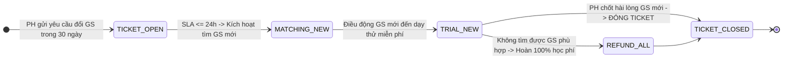
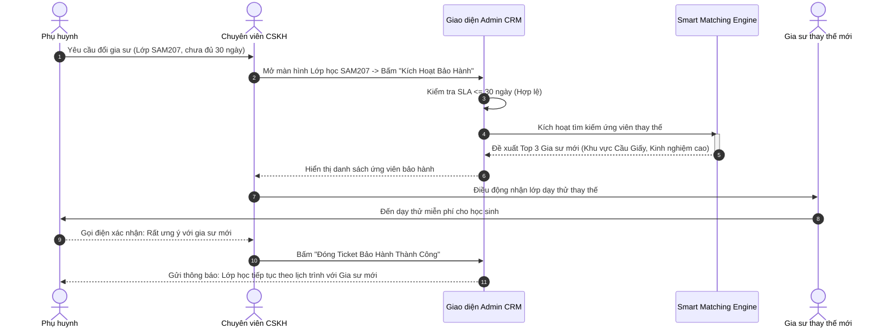

# Usecase: UC-ADM-06 - Quy trình Bảo hành Đổi gia sư 30 ngày & Báo cáo KPI Vận hành (Warranty CSKH & Executive KPI Dashboard)

> **Mã phân hệ:** CRM-REF-06  
> **Phân hệ:** Cổng Quản trị Trung tâm (Admin CRM)  
> **Tác nhân chính:** Giám đốc Điều hành (Director / Admin), Trưởng phòng Kinh doanh (Sales Manager), Chuyên viên Chăm sóc Khách hàng (CSKH), Hệ thống Tự động (Task Engine)

---

## 1. Giới thiệu chức năng

### 1.1. Mục đích
Cung cấp phân hệ quản lý quy trình **Bảo hành Đổi gia sư Miễn phí trong vòng 30 ngày (30-Day Tutor Warranty)** song hành với **Bảng điều khiển Báo cáo Hiệu suất Điều hành (Executive KPI Dashboard)**. Chính sách bảo hành 30 ngày là cam kết cốt lõi tạo nên lợi thế cạnh tranh của trung tâm, đảm bảo phụ huynh được đổi gia sư mới trong vòng $\le 24$ giờ nếu gia sư hiện tại không phù hợp phương pháp giảng dạy. Đồng thời, Executive Dashboard tổng hợp theo thời gian thực các chỉ số đo lường sức khỏe doanh nghiệp (Tổng doanh thu phí môi giới, Tỷ lệ chốt đơn Win Rate, Thời gian ghép lớp trung bình Time-to-Match, Tỷ lệ hoàn cọc và Điểm hài lòng NPS) giúp Ban Giám đốc đưa ra các quyết định chiến lược kịp thời.

### 1.2. Actor (Tác nhân)
* **Giám đốc Trung tâm / Quản trị viên (Director / Admin)**: Theo dõi các chỉ số KPI vĩ mô, đánh giá tốc độ ghép lớp, kiểm soát tỷ lệ bảo hành và tỷ lệ hoàn cọc.
* **Chuyên viên Chăm sóc Khách hàng (CSKH)**: Tiếp nhận yêu cầu bảo hành từ phụ huynh, tạo Ticket khẩn cấp (`URGENT`), kích hoạt động cơ ghép gia sư mới thay thế.
* **Hệ thống Tự động (Automated Task Engine)**: Tự động tính toán các chỉ số thống kê, kích hoạt cảnh báo SLA và sinh nhiệm vụ tự động nhắc việc cho nhân viên theo từng mốc thời gian.

### 1.3. Điều kiện tiên quyết
* Người dùng đăng nhập hệ thống CRM với vai trò `ADMIN`, `SALES`, hoặc `ACADEMIC`.
* Dữ liệu các lớp học, yêu cầu tìm kiếm và giao dịch tài chính đã phát sinh trong cơ sở dữ liệu.

### 1.4. Danh mục các chức năng con (Sub-features)
1. **UC-ADM-06-01**: Tiếp nhận & Xử lý Ticket Bảo hành Đổi Gia sư 30 Ngày (Warranty Ticket Workflow).
2. **UC-ADM-06-02**: Động cơ Tự động Sinh Nhiệm vụ Nhắc việc (Automated Task & Follow-up Engine).
3. **UC-ADM-06-03**: Tổng hợp Báo cáo Chỉ số Doanh thu & Tốc độ Ghép lớp (Revenue & Time-to-Match KPI Analytics).
4. **UC-ADM-06-04**: Quét & Tự động Phê duyệt Buổi học Quá hạn (Scheduled Session Auto-Confirm Scanner).

---

## 2. Dữ liệu nghiệp vụ đầu vào (Input Data & Parameters)

### 2.1. Cấu trúc Chỉ số Báo cáo Điều hành (`GET /api/v1/crm/stats`)

| Chỉ số thống kê | Nguồn dữ liệu & Công thức tính toán | Giá trị mục tiêu chuẩn |
| :--- | :--- | :---: |
| `totalRevenue` | Tổng tiền các giao dịch `type = 'FEE_CONFIRMED'` trong bảng `transactions`. | $\ge 300,000,000$ VNĐ/tháng |
| `activeClasses` | Đếm số lượng lớp học có `status = 'TEACHING'` và `deletedAt = null`. | $\ge 200$ lớp đang học |
| `activeTutors` | Đếm số lượng gia sư có `status = 'ACTIVE'` và `deletedAt = null`. | $\ge 500$ gia sư sẵn sàng |
| `timeToMatchHours` | Trung bình cộng: $(UpdatedAt_{\text{MATCHED}} - CreatedAt_{\text{NEW}})$ của các `TutorRequest` hoàn tất. | $< 4.0$ giờ (Thực tế: 3.8h) |
| `tutorChangeRate` | $\frac{\text{Số lớp kích hoạt bảo hành đổi người}}{\text{Tổng số lớp học chính thức}} \times 100\%$ | $< 5\%$ |
| `winRate` | $\frac{\text{Số lớp chốt TEACHING}}{\text{Tổng số yêu cầu tìm gia sư hợp lệ}} \times 100\%$ | $\ge 40\%$ |

### 2.2. Vòng đời Ticket Bảo hành Đổi Gia sư (`WarrantyTicket`)



---

## 3. Quy tắc nghiệp vụ (Business Rules)

| Mã BR | Tình huống kích hoạt | Xử lý của hệ thống | Mã lỗi / Phản hồi |
| :--- | :--- | :--- | :--- |
| **BR-ADM-06-01** | Kiểm tra điều kiện bảo hành 30 ngày của lớp học. | Tính thời gian từ ngày lớp chuyển sang `TEACHING`: Nếu $\le 30$ ngày: Cho phép tạo Ticket bảo hành miễn phí; Nếu $> 30$ ngày: Từ chối tạo ticket tự động, chuyển sang luồng đăng ký mở lớp mới có thu phí. | `400 BAD_REQUEST` ("Lớp học đã hết thời hạn bảo hành 30 ngày") |
| **BR-ADM-06-02** | Cam kết thời gian giải quyết đổi gia sư (SLA $\le 24$ giờ). | Ticket bảo hành được gán nhãn ưu tiên khẩn cấp `URGENT`. Hệ thống kích hoạt đồng hồ đếm ngược 24 giờ. Nếu sau 18 giờ chưa chỉ định được gia sư mới: Tự động gửi cảnh báo đẩy đến Trưởng phòng Vận hành và Giám đốc. | `SLA_BREACH_WARNING` |
| **BR-ADM-06-03** | Tự động sinh nhiệm vụ nhắc việc sau buổi dạy thử 24 giờ. | Khi buổi dạy thử kết thúc (trạng thái `ATTENDED`): Hệ thống tự động tạo 1 Task trong danh mục công việc của chuyên viên phụ trách: *"Gọi điện cho Phụ huynh [Tên PH] để hỏi thăm kết quả buổi dạy thử của con"*. | `TASK_TRIAL_FOLLOWUP_CREATED` |
| **BR-ADM-06-04** | Tự động quét và chốt buổi học quá hạn 48 giờ (`Auto-Confirm`). | Khi chạy lệnh quét `POST /api/v1/sessions/trigger-auto-confirm`: Hệ thống tìm tất cả các buổi học ở trạng thái `ATTENDED` đã quá 48 giờ mà phụ huynh không phản hồi hoặc không khiếu nại $\rightarrow$ Tự động chuyển thành `CONFIRMED` và cộng thù lao vào ví gia sư. | `200 OK` ("Đã quét và tự động phê duyệt các buổi học quá hạn 48 giờ") |
| **BR-ADM-06-05** | Tái kích hoạt chăm sóc khách hàng đầu năm học mới. | Vào ngày 01 tháng 08 hàng năm, Cronjob hệ thống tự động quét danh sách toàn bộ các phụ huynh đã từng mở lớp trong 12 tháng qua để sinh danh sách chiến dịch gọi điện ưu đãi đầu năm học. | `ANNUAL_CAMPAIGN_GENERATED` |

---

## 4. Đặc tả chi tiết các Use Case chức năng con

```mermaid
usecaseDiagram
    actor "Chuyên viên CSKH" as CSKH
    actor "Giám đốc / Trưởng phòng" as Director
    actor "Hệ thống Tự động" as Engine

    package "UC-ADM-06: Bảo hành CSKH & Báo cáo KPI" {
        usecase "UC-ADM-06-01: Tiếp nhận & Xử lý Ticket Bảo hành" as UC1
        usecase "UC-ADM-06-02: Động cơ Tự động Sinh Nhiệm vụ" as UC2
        usecase "UC-ADM-06-03: Xem Dashboard Báo cáo KPI Doanh thu" as UC3
        usecase "UC-ADM-06-04: Kích hoạt Quét Tự động Phê duyệt Buổi học" as UC4
    }

    CSKH --> UC1
    Engine --> UC1

    Engine --> UC2
    CSKH --> UC2

    Director --> UC3

    Director --> UC4
    Engine --> UC4
```

### 4.1. UC-ADM-06-01: Tiếp nhận & Xử lý Ticket Bảo hành Đổi Gia sư 30 Ngày (Warranty Ticket Workflow)
* **Mục tiêu**: Xử lý yêu cầu thay đổi gia sư của phụ huynh một cách nhanh chóng, bảo vệ quyền lợi khách hàng mà không làm gián đoạn việc học của học sinh.
* **Tác nhân**: Chuyên viên CSKH, Hệ thống Smart Matching.
* **Tiền điều kiện**: Lớp học đang ở trạng thái `TEACHING` trong vòng 30 ngày kể từ ngày chốt lớp.
* **Hậu điều kiện**: Gia sư mới được điều động tới nhận lớp thành công.
* **Luồng cơ bản**:
  1. Phụ huynh gửi yêu cầu đổi gia sư qua Client Portal hoặc gọi điện trực tiếp lên Hotline.
  2. Chuyên viên CSKH mở hồ sơ lớp học, kiểm tra điều kiện bảo hành 30 ngày (BR-ADM-06-01).
  3. Bấm nút "Kích Hoạt Bảo Hành Đổi Gia Sư":
     * Chọn lý do đổi: Phương pháp chưa phù hợp / Gia sư hay đổi lịch / Kiến thức chưa vững.
     * Chọn độ ưu tiên: `URGENT` (Khẩn cấp).
  4. Hệ thống đóng quyền dạy của gia sư cũ tại lớp này, bảo lưu số buổi còn lại.
  5. Hệ thống kích hoạt động cơ Smart Matching quét Top 3 ứng cử viên thay thế phù hợp với tính cách và yêu cầu mới của học sinh.
  6. CSKH liên hệ gia sư mới, hẹn lịch dạy thử thay thế (miễn phí).
  7. Sau buổi dạy thử, phụ huynh xác nhận ưng ý $\rightarrow$ CSKH bấm "Đóng Ticket Bảo Hành Thành Công".
* **Luồng ngoại lệ**: Nếu sau 2 lần đổi gia sư phụ huynh vẫn không hài lòng, trung tâm hoàn trả lại 100% học phí các buổi chưa học.
* **Dữ liệu đầu ra**: Ticket bảo hành được giải quyết, lớp học tiếp tục duy trì ổn định.

### 4.2. UC-ADM-06-02: Động cơ Tự động Sinh Nhiệm vụ Nhắc việc (Automated Task & Follow-up Engine)
* **Mục tiêu**: Tự động hóa lịch chăm sóc khách hàng, ngăn chặn tình trạng nhân viên bỏ sót hoặc quên liên hệ phụ huynh.
* **Tác nhân**: Hệ thống Tự động (Task Engine), Chuyên viên CSKH / Sales.
* **Tiền điều kiện**: Các mốc sự kiện vòng đời lớp học diễn ra.
* **Hậu điều kiện**: Danh sách Task nhắc việc được hiển thị trên bảng điều khiển của nhân viên.
* **Luồng cơ bản**:
  1. Khi một sự kiện xảy ra, Task Engine lập tức sinh công việc:
     * *Sự kiện 1*: Buổi dạy thử hoàn thành $\rightarrow$ Sinh Task: "Khảo sát phụ huynh sau buổi thử (hạn chót: 24h)".
     * *Sự kiện 2*: Lớp học đạt mốc 30 ngày $\rightarrow$ Sinh Task: "Khảo sát chất lượng đào tạo & tiến độ học tập của con sau 1 tháng".
     * *Sự kiện 3*: Đến ngày 01/08 $\rightarrow$ Sinh Task: "Chiến dịch gọi điện tư vấn đầu năm học mới".
  2. Nhân viên đăng nhập CRM nhìn thấy danh sách các công việc cần làm hôm nay kèm số điện thoại gọi nhanh.
  3. Sau khi gọi điện, nhân viên bấm "Hoàn thành Task" kèm ghi chú kết quả.
* **Dữ liệu đầu ra**: Các cuộc gọi chăm sóc được hoàn tất đúng tiến độ cam kết.

### 4.3. UC-ADM-06-03: Tổng hợp Báo cáo Chỉ số Doanh thu & Tốc độ Ghép lớp (Revenue & Time-to-Match KPI Analytics)
* **Mục tiêu**: Cung cấp số liệu tài chính và hiệu suất vận hành thời gian thực cho Ban Giám đốc.
* **Tác nhân**: Giám đốc Điều hành (Director / Admin).
* **Tiền điều kiện**: Truy cập đường dẫn `/admin-crm` (Tab `overview`).
* **Hậu điều kiện**: Báo cáo thống kê được render đầy đủ.
* **Luồng cơ bản**:
  1. Người dùng mở trang Tổng quan CRM.
  2. Frontend gọi API `GET /api/v1/crm/stats`.
  3. Backend thực thi các câu lệnh truy vấn tổng hợp:
     * Tính tổng doanh thu phí môi giới từ `transactions` (`type = 'FEE_CONFIRMED'`).
     * Đếm số lớp đang dạy chính thức (`ClassStatus.TEACHING`).
     * Đếm số lượng gia sư đang hoạt động (`status = 'ACTIVE'`).
     * Tính thời gian ghép lớp trung bình theo giờ (`timeToMatchHours`).
  4. Giao diện render các Card chỉ số nổi bật với màu sắc hiện đại, hiển thị tỷ lệ tăng trưởng so với tháng trước.
* **Dữ liệu đầu ra**: Dashboard điều hành hiển thị dữ liệu chính xác 100% theo database.

### 4.4. UC-ADM-06-04: Quét & Tự động Phê duyệt Buổi học Quá hạn (Scheduled Session Auto-Confirm Scanner)
* **Mục tiêu**: Tự động giải phóng tiền thù lao cho gia sư khi phụ huynh quên bấm phê duyệt buổi học, chống đọng vốn.
* **Tác nhân**: Quản trị viên (Admin), Hệ thống Tự động (Cron Worker).
* **Tiền điều kiện**: Có các buổi học ở trạng thái `ATTENDED` quá 48 giờ.
* **Hậu điều kiện**: Buổi học chuyển sang `CONFIRMED`, tiền thù lao cộng vào ví gia sư.
* **Luồng cơ bản**:
  1. Quản trị viên bấm nút "Quét Tự Động Phê Duyệt" trên thanh điều hướng Tổng quan (hoặc Cronjob chạy ngầm định kỳ hàng ngày).
  2. Gửi yêu cầu `POST /api/v1/sessions/trigger-auto-confirm`.
  3. Backend quét tất cả các buổi học thỏa mãn điều kiện:
     * `status === 'ATTENDED'`.
     * `scheduledTime <= NOW() - 48 giờ`.
     * Không có khiếu nại phát sinh.
  4. Tự động cập nhật `status = 'CONFIRMED'`, cộng thù lao vào ví gia sư và tạo bản ghi `TUTOR_SALARY`.
  5. Phản hồi thông báo: *"Đã tự động xác nhận n buổi học quá hạn 48 giờ thành công."*.
* **Dữ liệu đầu ra**: Các buổi học được thanh toán kịp thời, bảo đảm quyền lợi gia sư.

---

## 5. Sơ đồ tuần tự nghiệp vụ (Sequence Diagrams)



---

## 6. Kịch bản kiểm thử & Nghiệm thu (Test Scenarios)

### Kịch bản 1: Kích hoạt thành công Ticket bảo hành trong hạn 30 ngày
* **Given**: Lớp `SAM207` chuyển sang học chính thức vào ngày 10/09/2026. Ngày phụ huynh yêu cầu đổi gia sư là ngày 25/09/2026 (sau 15 ngày, còn trong hạn 30 ngày bảo hành).
* **When**: Nhân viên CSKH bấm nút tạo Ticket bảo hành.
* **Then**:
  * Hệ thống phê duyệt yêu cầu hợp lệ.
  * Ticket đổi gia sư được tạo với độ ưu tiên `URGENT` kèm hạn chót SLA xử lý là 24 giờ.
  * Bộ lọc Smart Matching tự động trả về danh sách 3 gia sư phù hợp nhất để điều động thay thế.

### Kịch bản 2: Từ chối bảo hành miễn phí khi quá hạn 30 ngày
* **Given**: Lớp `SAM105` đã học chính thức được 45 ngày. Phụ huynh gọi điện yêu cầu đổi gia sư miễn phí.
* **When**: Nhân viên CSKH nhập mã lớp để kích hoạt bảo hành.
* **Then**:
  * Hệ thống phát hiện thời gian $> 30$ ngày và chặn thao tác.
  * Phản hồi thông báo lỗi: `400 BAD_REQUEST` ("Lớp học đã hết thời hạn bảo hành 30 ngày").
  * Hướng dẫn nhân viên tư vấn phụ huynh mở hợp đồng lớp mới.

### Kịch bản 3: Kích hoạt công cụ quét tự động phê duyệt buổi học quá hạn 48 giờ
* **Given**: Hệ thống có 5 buổi học được gia sư điểm danh `ATTENDED` vào 3 ngày trước nhưng phụ huynh bận chưa bấm xác nhận trên app.
* **When**: Admin bấm nút "Quét Tự Động Phê Duyệt" (`POST /api/v1/sessions/trigger-auto-confirm`).
* **Then**:
  * Cả 5 buổi học được chuyển ngay sang trạng thái `CONFIRMED`.
  * Tiền thù lao của cả 5 buổi được cộng chuẩn xác vào ví của các gia sư tương ứng.
  * Hệ thống hiển thị thông báo hoàn tất: "Đã tự động xác nhận 5 buổi học thành công".
