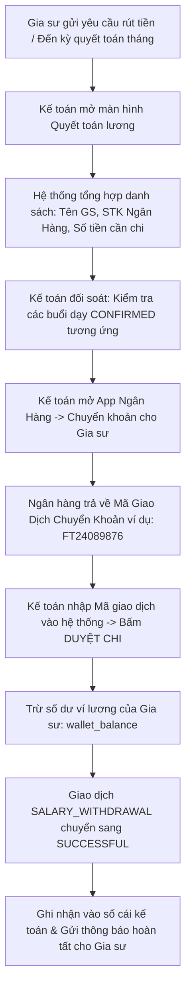
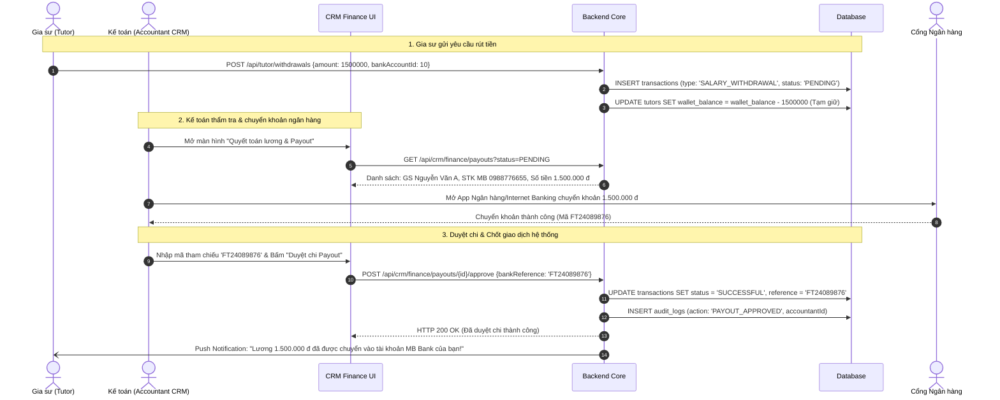

# ĐẶC TẢ NGHIỆP VỤ: QUYẾT TOÁN LƯƠNG & BÁO CÁO TÀI CHÍNH KPI (ADMIN CRM)

> **Mã phân hệ:** CRM-06 / FIN-ADMIN  
> **Đối tượng sử dụng:** Kế toán (Accountant), Giám đốc trung tâm (Admin)  
> **Cổng truy cập:** `http://localhost:5173/admin-crm` (Tab Kế toán & Báo cáo)

---

## 1. Mục Tiêu Nghiệp Vụ
Phân hệ Kế toán & Quyết toán tài chính là nơi quản lý toàn bộ dòng tiền vào - ra của trung tâm:
* Đảm bảo tính toán chính xác 100% thù lao của từng gia sư, triệt tiêu sai sót thủ công.
* Kiểm soát chặt chẽ việc chuyển khoản lương và đối soát bằng mã giao dịch ngân hàng.
* Cung cấp bảng điều khiển (Dashboard) theo dõi các chỉ số KPI vận hành thời gian thực.

---

## 2. Quy Trình Quyết Toán Bảng Lương Gia Sư (Payout Process)



### 2.1. Sơ đồ tuần tự: Quyết toán lương & Đối soát mã ngân hàng (Sequence Diagram)



### 2.1. Các thông tin bắt buộc khi Kế toán duyệt chi:
* **Mã giao dịch ngân hàng (`reference`)**: Bắt buộc nhập mã tham chiếu ủy nhiệm chi hoặc mã FT của ngân hàng để đối soát sau này khi có thanh tra thuế hoặc khiếu nại.
* **Tài khoản thụ hưởng**: Tên ngân hàng, số tài khoản (đối chiếu 4 số cuối với hồ sơ gia sư), tên chủ tài khoản.

---

## 3. Cấu Trúc Báo Cáo Dòng Tiền & Doanh Thu Trung Tâm

Hệ thống tự động phân loại và tính toán các dòng tài chính:

$$\text{Doanh thu thuần của trung tâm} = \sum \text{Tiền gói học phí đã tiêu thụ} - \sum \text{Thù lao đã trả cho gia sư}$$

| Khoản mục tài chính | Cơ chế ghi nhận | Thời điểm ghi nhận |
| :--- | :--- | :--- |
| **Tiền gửi khách hàng (Liability)** | Nạp tiền vào ví phụ huynh (`TUITION_DEPOSIT`). Chưa tính là doanh thu. | Khi phụ huynh nạp tiền. |
| **Doanh thu ghi nhận thực tế** | Giá trị từng buổi học được xác nhận (`CONFIRMED`). | Khi buổi học được phụ huynh/hệ thống duyệt. |
| **Chi phí vốn (COGS)** | Thù lao trả cho gia sư (`classes.tutor_wage_rate`). | Khi buổi học `CONFIRMED`. |
| **Lợi nhuận gộp** | Phần chênh lệch giữa giá phụ huynh trả và giá trả gia sư. | Lũy kế sau từng buổi dạy. |

---

## 4. Hệ Thống Chỉ Số Đo Lường Hiệu Quả (KPI Dashboard)

Dashboard quản trị dành cho Admin hiển thị 5 chỉ số sinh tử của trung tâm:

```text
┌────────────────────────┬────────────────────────┬────────────────────────┐
│   TIME-TO-MATCH (TB)   │    TỶ LỆ ĐỔI GIA SƯ    │   TỶ LỆ KHIẾU NẠI      │
│        18.4 GIỜ        │         3.2%           │         0.8%           │
│   (Mục tiêu: < 24h)    │    (Mục tiêu: < 5%)    │    (Mục tiêu: < 2%)    │
├────────────────────────┼────────────────────────┼────────────────────────┤
│   TỔNG SỐ LỚP ĐANG DẠY │   DOANH THU THÁNG NÀY  │   NĂNG SUẤT HỌC VỤ     │
│        142 LỚP         │     386,500,000 đ      │      142 LỚP / NV      │
│   (+18% so với tháng trước) (+22% so với tháng trước) (Mục tiêu: 150 lớp) │
└────────────────────────┴────────────────────────┴────────────────────────┘
```

### 4.1. Công thức tính chi tiết các chỉ số:
1. **Time-to-Match (Thời gian ghép lớp)**:
   $$\text{TTM} = \frac{\sum (\text{Thời điểm MATCHED} - \text{Thời điểm tạo yêu cầu})}{\text{Tổng số yêu cầu thành công trong kỳ}}$$
2. **Tỷ lệ đổi gia sư / Thất bại dạy thử**:
   $$\text{Tỷ lệ đổi GS} = \frac{\text{Số lớp chuyển TRIAL\_FAILED}}{\text{Tổng số lớp dạy thử trong kỳ}} \times 100\%$$
3. **Năng suất nhân viên Học vụ**:
   $$\text{Năng suất} = \frac{\text{Tổng số lớp TEACHING đang hoạt động}}{\text{Số lượng nhân viên Academic}}$$

---

## 5. Danh Sách Mã Lỗi Phục Vụ Dev & QA

| Mã lỗi (Error Code) | HTTP Status | Nguyên nhân | Hướng xử lý |
| :--- | :---: | :--- | :--- |
| `BANK_REFERENCE_REQUIRED` | 422 | Bấm duyệt chi nhưng không nhập mã giao dịch ngân hàng. | Bắt buộc nhập mã tham chiếu ngân hàng. |
| `PAYOUT_ALREADY_PROCESSED`| 400 | Yêu cầu rút tiền này đã được chuyển khoản và đóng trước đó. | Tải lại danh sách bảng lương. |
| `TUTOR_BALANCE_ZERO` | 400 | Ví lương của gia sư hiện bằng 0, không có số dư để rút. | Kiểm tra lại lịch sử buổi dạy. |
| `DATE_RANGE_INVALID` | 422 | Khoảng thời gian lọc báo cáo doanh thu không hợp lệ (ngày kết thúc trước ngày bắt đầu). | Chọn lại khoảng ngày hợp lệ. |
