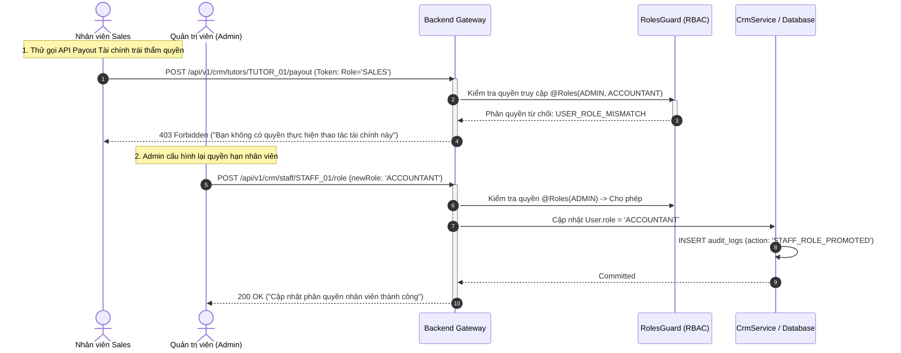

# Usecase: UC-ADM-07 - Phân quyền Vai trò RBAC & Quản trị Tham số Hệ thống (Role-Based Access Control & System Configuration)

> **Mã phân hệ:** CRM-REF-07  
> **Phân hệ:** Cổng Quản trị Trung tâm (Admin CRM)  
> **Tác nhân chính:** Quản trị viên Tối cao (Super Admin), Giám đốc Trung tâm (Director), Trưởng bộ phận Vận hành

---

## 1. Giới thiệu chức năng

### 1.1. Mục đích
Cung cấp giải pháp bảo mật phân quyền theo vai trò **RBAC (Role-Based Access Control)** kết hợp phân hệ **Quản trị Tham số Vận hành Tập trung (System Configuration Engine)**. Hệ thống phân tách rành mạch trách nhiệm giữa các phòng ban chuyên môn (Kinh doanh / Sales, Học vụ / Academic, Kế toán / Accountant, Quản trị / Admin), đảm bảo nguyên tắc đặc quyền tối thiểu (Least Privilege Principle) và ngăn ngừa xung đột lợi ích (Separation of Duties). Bên cạnh đó, hệ thống cho phép Ban Giám đốc cấu hình linh hoạt các tham số nghiệp vụ trọng yếu (mức tiền cọc mặc định, thời gian gia sư liên hệ phụ huynh sau cọc, số buổi dạy thử quy chuẩn, thời hạn bảo hành 30 ngày) mà không cần can thiệp hoặc chỉnh sửa mã nguồn.

### 1.2. Actor (Tác nhân)
* **Quản trị viên Hệ thống (Admin / Super Admin)**: Khởi tạo tài khoản nhân viên, gán quyền hạn, kích hoạt/vô hiệu hóa người dùng và điều chỉnh tham số cấu hình hệ thống.
* **Chuyên viên Tư vấn / Bán hàng (Sales Staff)**: Thực hiện tiếp nhận lead, điều phối ghép lớp, không có quyền can thiệp vào ví tiền hay duyệt quyết toán tài chính.
* **Chuyên viên Học vụ (Academic Staff)**: Thẩm định hồ sơ gia sư, xử lý tranh chấp buổi học, phê duyệt báo nghỉ và theo dõi dạy thử, không có quyền chi trả lương.
* **Kế toán (Accountant)**: Quản trị các lệnh thu tiền cọc, duyệt hoàn cọc và thực hiện quyết toán chi trả thù lao cho gia sư.

### 1.3. Điều kiện tiên quyết
* Người dùng đăng nhập thành công với mã vai trò `ADMIN` để thực hiện cấu hình phân quyền hoặc chỉnh sửa tham số hệ thống.
* Hệ thống bảo mật kích hoạt bộ đôi xác thực NestJS: `JwtAuthGuard` và `RolesGuard`.

### 1.4. Danh mục các chức năng con (Sub-features)
1. **UC-ADM-07-01**: Quản trị Ma trận Phân quyền Vai trò RBAC (RBAC Role & Permission Matrix).
2. **UC-ADM-07-02**: Kiểm soát & Chặn Truy cập Bất hợp lệ (Endpoint Access Guard Enforcement).
3. **UC-ADM-07-03**: Cấu hình Tham số Nghiệp vụ Vận hành (Operational Parameter Configuration).
4. **UC-ADM-07-04**: Quản lý Danh mục Dùng chung Hệ thống (Master Data Taxonomy Management).

---

## 2. Dữ liệu nghiệp vụ đầu vào (Input Data & Parameters)

### 2.1. Ma trận Phân quyền Vai trò Chi tiết (`UserRole` Permissions Matrix)

| Vai trò người dùng (`UserRole`) | Quản lý Gia sư & Phụ huynh | Điều phối & Ghép lớp | Giải quyết Khiếu nại Học vụ | Quyết toán Cọc & Rút ví Thù lao | Cấu hình Tham số Hệ thống |
| :--- | :---: | :---: | :---: | :---: | :---: |
| **`ADMIN`** (Giám đốc) | Toàn quyền (CRUD) | Toàn quyền | Toàn quyền | Toàn quyền | Toàn quyền |
| **`SALES`** (Tư vấn / Điều phối) | Xem / Sửa trạng thái | Toàn quyền | Không có quyền | Không có quyền | Chỉ xem |
| **`ACADEMIC`** (Học vụ / Trọng tài)| Xem hồ sơ / Duyệt KYC | Xem danh sách | Toàn quyền | Chỉ xem trạng thái | Chỉ xem |
| **`ACCOUNTANT`** (Kế toán) | Xem thông tin tài chính | Chỉ xem | Chỉ xem | Toàn quyền (Payout/Refund)| Không có quyền |
| **`PARENT`** (Phụ huynh) | Chỉ xem hồ sơ cá nhân | Đăng yêu cầu tìm lớp | Gửi khiếu nại buổi học | Thanh toán học phí | Không có quyền |
| **`TUTOR`** (Gia sư) | Chỉ sửa hồ sơ cá nhân | Ứng tuyển & Nộp cọc | Giải trình khiếu nại | Yêu cầu rút thù lao | Không có quyền |

### 2.2. Bảng Tham số Cấu hình Vận hành Cốt lõi (System Configuration Parameters)

| Mã tham số | Tên tham số | Giá trị mặc định | Đơn vị | Diễn giải quy tắc nghiệp vụ |
| :--- | :--- | :---: | :---: | :--- |
| `DEFAULT_DEPOSIT_AMOUNT` | Mức tiền cọc nhận lớp chuẩn | 500,000 | VNĐ | Số tiền gia sư phải chuyển khoản qua VietQR để giữ lớp. |
| `TUTOR_CONTACT_DEADLINE` | Hạn chót liên hệ phụ huynh | 2.0 | Giờ | Gia sư phải gọi điện cho phụ huynh sau khi nộp cọc thành công. |
| `TEACHER_TRIAL_SESSIONS`| Số buổi dạy thử Giáo viên | 1 | Buổi | Quy chuẩn số buổi dạy thử bắt buộc đối với Giáo viên trường. |
| `STUDENT_TRIAL_SESSIONS`| Số buổi dạy thử Sinh viên | 2 | Buổi | Quy chuẩn số buổi dạy thử bắt buộc đối với Sinh viên. |
| `WARRANTY_DURATION_DAYS`| Thời hạn bảo hành lớp học | 30 | Ngày | Thời hạn phụ huynh được quyền yêu cầu đổi gia sư miễn phí. |
| `AUTO_CONFIRM_HOURS` | Hạn chót tự động chốt buổi học| 48 | Giờ | Thời gian phụ huynh không phản hồi thì hệ thống tự động giải ngân. |

---

## 3. Quy tắc nghiệp vụ (Business Rules)

| Mã BR | Tình huống kích hoạt | Xử lý của hệ thống | Mã lỗi / Phản hồi |
| :--- | :--- | :--- | :--- |
| **BR-ADM-07-01** | Ngăn chặn gian lận phân tách trách nhiệm (Separation of Duties). | Tuyệt đối cấm tài khoản có vai trò `SALES` hoặc `ACADEMIC` thực thi API quyết toán tài chính `POST /api/v1/crm/tutors/:id/payout` hoặc các lệnh duyệt hoàn tiền. Chỉ có `ACCOUNTANT` và `ADMIN` mới có quyền ký duyệt dòng tiền. | `403 FORBIDDEN` ("Bạn không có quyền thực hiện thao tác tài chính này") |
| **BR-ADM-07-02** | Khóa tài khoản nhân viên khi ngưng công tác. | Khi nhân viên chuyển trạng thái sang `isActive = false`: Mọi JWT Token đang lưu hành của tài khoản này bị vô hiệu hóa ngay lập tức; không cho phép đăng nhập vào CRM. | `401 UNAUTHORIZED` ("Tài khoản đã bị vô hiệu hóa") |
| **BR-ADM-07-03** | Hiệu lực tức thì của tham số vận hành. | Khi Admin thay đổi giá trị cấu hình (VD: đổi mức cọc từ 500k sang 400k): Tham số mới được nạp ngay vào bộ nhớ đệm Cache/Database và áp dụng cho toàn bộ các lớp học mới tạo kế tiếp mà không cần khởi động lại Server. | `CONFIG_UPDATED_RELOAD_CACHE` |
| **BR-ADM-07-04** | Kiểm soát danh mục dùng chung (Master Data Validation). | Không cho phép xóa vĩnh viễn các môn học, khối lớp hoặc quận huyện đang có lớp học tham chiếu liên kết. Chỉ cho phép gắn cờ `isActive = false` (ẩn khỏi danh mục chọn mới). | `409 CONFLICT` ("Danh mục đang được sử dụng bởi các lớp học hiện hữu") |
| **BR-ADM-07-05** | Ghi nhật ký bảo mật cấu hình (Security Audit Trail). | Mọi hành vi thay đổi quyền hạn người dùng hoặc sửa đổi tham số hệ thống đều được lưu vết trong bảng `audit_logs` gồm: `userId` thực hiện, `action: 'SYSTEM_CONFIG_UPDATED'`, giá trị cũ (`oldValue`) và giá trị mới (`newValue`). | `AUDIT_LOG_RECORDED` |

---

## 4. Đặc tả chi tiết các Use Case chức năng con

```mermaid
usecaseDiagram
    actor "Quản trị viên (Admin)" as Admin
    actor "Chuyên viên Nhân sự / Vận hành" as Staff

    package "UC-ADM-07: Phân quyền RBAC & Cấu hình Hệ thống" {
        usecase "UC-ADM-07-01: Quản trị Vai trò & Phân quyền" as UC1
        usecase "UC-ADM-07-02: Kiểm soát & Chặn Endpoint" as UC2
        usecase "UC-ADM-07-03: Cấu hình Tham số Vận hành" as UC3
        usecase "UC-ADM-07-04: Quản lý Danh mục Dùng chung" as UC4
    }

    Admin --> UC1
    Admin --> UC2
    Admin --> UC3
    Admin --> UC4
    Staff --> UC4
```

### 4.1. UC-ADM-07-01: Quản trị Vai trò & Phân quyền (RBAC Role & Permission Matrix)
* **Mục tiêu**: Cấp phát, thu hồi và phân quyền tài khoản cho nhân viên theo từng phòng ban nghiệp vụ cụ thể.
* **Tác nhân**: Quản trị viên (Super Admin).
* **Tiền điều kiện**: Đăng nhập tài khoản có vai trò `ADMIN`.
* **Hậu điều kiện**: Quyền hạn của tài khoản nhân viên được cập nhật trong cơ sở dữ liệu.
* **Luồng cơ bản**:
  1. Admin mở mục "Cấu hình Phân quyền & Nhân sự" trong CRM.
  2. Chọn nhân viên trong danh sách tài khoản nội bộ (`staff`).
  3. Chọn vai trò cần gán từ danh sách dropdown: `SALES`, `ACADEMIC`, `ACCOUNTANT`, `ADMIN`.
  4. Hệ thống hiển thị bảng xem trước (Preview) các quyền tương ứng sẽ được cấp phát.
  5. Bấm "Lưu Thay Đổi Phân Quyền".
  6. Backend cập nhật trường `role` trong bảng `users` và ghi nhận lịch sử vào bảng `audit_logs`.
* **Dữ liệu đầu ra**: Quyền hạn mới có hiệu lực ngay trong phiên làm việc kế tiếp của nhân viên.

### 4.2. UC-ADM-07-02: Kiểm soát & Chặn Truy cập Bất hợp lệ (Endpoint Access Guard Enforcement)
* **Mục tiêu**: Đảm bảo an ninh tuyệt đối cho hệ thống, từ chối mọi yêu cầu API không đúng thẩm quyền.
* **Tác nhân**: Hệ thống Bảo mật (NestJS Guards).
* **Tiền điều kiện**: Request được gửi kèm Bearer JWT Token.
* **Hậu điều kiện**: Cho phép request đi qua hoặc phản hồi mã lỗi `403 Forbidden`.
* **Luồng cơ bản**:
  1. Request từ Frontend chạm vào Controller (Ví dụ: `POST /api/v1/crm/tutors/:id/payout`).
  2. `JwtAuthGuard` giải mã Token, trích xuất thông tin người dùng và vai trò (`user.role`).
  3. `RolesGuard` đối chiếu vai trò người dùng với decorator `@Roles(UserRole.ADMIN, UserRole.ACCOUNTANT)`.
  4. Nếu vai trò hợp lệ: Request tiếp tục được chuyển tới Service để xử lý nghiệp vụ.
  5. Nếu vai trò không khớp (VD: tài khoản `SALES` cố tình gọi API rút tiền): Ngắt kết nối ngay lập tức và trả về mã lỗi `403 FORBIDDEN`.
* **Dữ liệu đầu ra**: Luồng dữ liệu an toàn, chống leo thang đặc quyền (Privilege Escalation).

### 4.3. UC-ADM-07-03: Cấu hình Tham số Nghiệp vụ Vận hành (Operational Parameter Configuration)
* **Mục tiêu**: Tùy biến các quy tắc kinh doanh (mức cọc, thời hạn, SLA) một cách trực quan trên giao diện quản trị.
* **Tác nhân**: Giám đốc Trung tâm / Quản trị viên (Admin).
* **Tiền điều kiện**: Có thẩm quyền phê duyệt chính sách của trung tâm.
* **Hậu điều kiện**: Tham số mới được lưu và áp dụng cho toàn hệ thống.
* **Luồng cơ bản**:
  1. Admin truy cập màn hình "Cấu hình Hệ thống".
  2. Xem danh sách các tham số hiện hành (Mức tiền cọc mặc định, Thời hạn liên hệ, Buổi dạy thử chuẩn, Hạn bảo hành 30 ngày).
  3. Chỉnh sửa giá trị tham số trên ô nhập liệu (Ví dụ: điều chỉnh thời gian tự động chốt buổi học từ 48 giờ xuống 24 giờ).
  4. Nhập lý do thay đổi chính sách phục vụ kiểm toán nội bộ.
  5. Bấm "Cập Nhật Tham Số".
  6. Hệ thống kiểm tra tính hợp lệ của giá trị (không được là số âm, không vượt trần quy định).
  7. Lưu vào bảng cấu hình và hiển thị thông báo Toast thành công.
* **Dữ liệu đầu ra**: Bảng tham số vận hành được cập nhật mới nhất.

### 4.4. UC-ADM-07-04: Quản lý Danh mục Dùng chung Hệ thống (Master Data Taxonomy Management)
* **Mục tiêu**: Quản trị danh sách các Môn học, Khối lớp, Quận/Huyện phục vụ các bộ lọc tìm kiếm và gợi ý ghép lớp.
* **Tác nhân**: Quản trị viên, Trưởng phòng Vận hành.
* **Tiền điều kiện**: Đăng nhập quyền quản trị.
* **Hậu điều kiện**: Danh mục dữ liệu chuẩn được cập nhật.
* **Luồng cơ bản**:
  1. Truy cập phân hệ "Quản lý Danh mục Dùng chung".
  2. Chọn tab danh mục cần quản lý: Môn học (Toán, Lý, Hóa...), Khối lớp (Lớp 1 đến Lớp 12), Địa bàn hoạt động (Quận Ba Đình, Cầu Giấy, Hoàn Kiếm...).
  3. Bấm "Thêm mới" hoặc bấm sửa đổi tên/mã danh mục.
  4. Bật/Tắt công tắc trạng thái `isActive` để hiển thị hoặc ẩn danh mục trên giao diện phụ huynh và gia sư.
  5. Bấm "Lưu Danh Mục".
* **Dữ liệu đầu ra**: Dữ liệu danh mục chuẩn hóa cho toàn bộ hệ sinh thái Web Portal.

---

## 5. Sơ đồ tuần tự nghiệp vụ (Sequence Diagrams)



---

## 6. Kịch bản kiểm thử & Nghiệm thu (Test Scenarios)

### Kịch bản 1: Kiểm tra tính nghiêm ngặt của RolesGuard - Chặn truy cập trái quyền
* **Given**: Nhân viên kinh doanh `sales_user` đăng nhập hệ thống với vai trò `SALES`.
* **When**: Nhân viên này cố tình gửi yêu cầu duyệt chuyển khoản lương `POST /api/v1/crm/tutors/:id/payout` qua Postman hoặc console.
* **Then**:
  * Hệ thống chặn ngay tại `RolesGuard` trước khi chạm vào tầng Service.
  * Phản hồi mã lỗi HTTP `403 Forbidden`.
  * Không có bất kỳ thay đổi nào xảy ra đối với số dư ví gia sư.

### Kịch bản 2: Kế toán thực hiện đúng thẩm quyền phân quyền RBAC
* **Given**: Kế toán `accountant_user` đăng nhập hệ thống với vai trò `ACCOUNTANT`.
* **When**: Kế toán bấm nút thực hiện quyết toán chi trả lương cho gia sư.
* **Then**:
  * Hệ thống xác nhận vai trò hợp lệ.
  * Thao tác được chuyển tiếp vào `CrmService.payoutTutor()`.
  * Số dư ví gia sư được quyết toán về 0 và ghi nhận giao dịch tài chính thành công.

### Kịch bản 3: Admin điều chỉnh tham số hệ thống và lưu vết kiểm toán
* **Given**: Quản trị viên tối cao mở màn hình Cấu hình tham số hệ thống.
* **When**: Admin thay đổi giá trị `DEFAULT_DEPOSIT_AMOUNT` từ `500,000` thành `400,000` VNĐ kèm lý do "Ưu đãi cọc đầu năm".
* **Then**:
  * Giá trị tham số trong bảng cấu hình được cập nhật thành `400,000`.
  * Bảng `audit_logs` tự động ghi nhận 1 bản ghi mới với `action = 'SYSTEM_CONFIG_UPDATED'`, `oldValue = {"deposit": 500000}`, `newValue = {"deposit": 400000}`.
  * Các yêu cầu ghép lớp mới phát sinh sau thời điểm này sẽ áp dụng mức tiền cọc 400,000 VNĐ.
