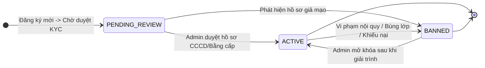
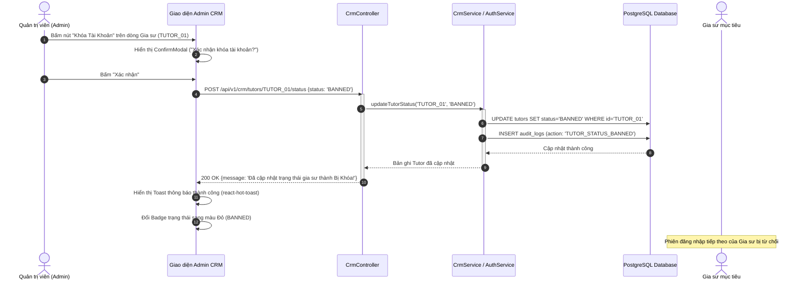

# Usecase: UC-ADM-08 - Quản lý Người dùng Tập trung & Cấp phát Tài khoản (User Identity & Account Management)

> **Mã phân hệ:** CRM-REF-08  
> **Phân hệ:** Cổng Quản trị Trung tâm (Admin CRM)  
> **Tác nhân chính:** Quản trị viên (Admin), Chuyên viên Vận hành / CSKH, Chuyên viên Tư vấn (Sales)

---

## 1. Giới thiệu chức năng

### 1.1. Mục đích
Cung cấp giải pháp quản trị danh tính và vòng đời tài khoản người dùng tập trung cho toàn bộ hệ sinh thái (Gia sư, Phụ huynh và Nhân viên nội bộ). Phân hệ hỗ trợ tìm kiếm thời gian thực (Real-time Search), bộ lọc trạng thái đa chiều, cơ chế phân trang Client-side & Server-side tối ưu cho tập dữ liệu lớn hàng chục ngàn hồ sơ, tính năng cấp phát tài khoản thủ công nhanh thông qua **Add User Modal** (tự động khởi tạo đồng bộ hồ sơ `Parent` hoặc `Tutor` tương ứng) và cơ chế khóa/mở khóa tài khoản tức thời (Account Freezing / Reactivation) với phản hồi Toast notification hiện đại.

### 1.2. Actor (Tác nhân)
* **Quản trị viên (Admin)**: Toàn quyền tạo mới, cấp quyền, đóng băng/khóa tài khoản hoặc mở khóa người dùng.
* **Chuyên viên Tư vấn (Sales Staff)**: Hỗ trợ tạo nhanh tài khoản cho phụ huynh lớn tuổi hoặc gia sư chưa thạo công nghệ khi gọi điện qua tổng đài hotline.
* **Chuyên viên Vận hành / CSKH**: Thẩm tra hồ sơ năng lực gia sư, xét duyệt trạng thái từ `PENDING_REVIEW` sang `ACTIVE`.

### 1.3. Điều kiện tiên quyết
* Người dùng đăng nhập hệ thống CRM với vai trò `ADMIN` hoặc `SALES`.
* Cơ sở dữ liệu đã thiết lập quan hệ toàn vẹn giữa bảng người dùng lõi `users` và các bảng hồ sơ chuyên biệt `tutors`, `parents`, `staff`.

### 1.4. Danh mục các chức năng con (Sub-features)
1. **UC-ADM-08-01**: Tra cứu, Lọc & Phân trang Danh sách Người dùng (User Directory & Search/Pagination).
2. **UC-ADM-08-02**: Cấp phát Tài khoản Thủ công Qua Modal (Manual User Registration Modal).
3. **UC-ADM-08-03**: Quản trị Trạng thái Hoạt động & Đóng băng Tài khoản (Account Status Freezing / Unblocking).
4. **UC-ADM-08-04**: Xét duyệt Hồ sơ Năng lực Gia sư Mới (Tutor Verification & Approval Workflow).

---

## 2. Dữ liệu nghiệp vụ đầu vào (Input Data & Parameters)

### 2.1. Cấu trúc Biểu mẫu Cấp phát Tài khoản Thủ công (`Add User Modal`)

| Trường dữ liệu | Kiểu dữ liệu | Bắt buộc | Quy chuẩn & Ràng buộc nghiệp vụ |
| :--- | :--- | :---: | :--- |
| `role` | Enum | Có | Giá trị: `TUTOR` (Gia sư) hoặc `PARENT` (Phụ huynh). |
| `fullName` | String (100) | Có | Họ và tên đầy đủ của người dùng (từ 2 đến 50 ký tự). |
| `phone` | String (20) | Có | Số điện thoại duy nhất, chuẩn 10 chữ số (VD: `0912345678`), không được trùng lặp. |
| `password` | String (255) | Có | Mật khẩu khởi tạo ban đầu (tối thiểu 6 ký tự, mã hóa bcrypt độ an toàn cao). |

### 2.2. Vòng đời Trạng thái Tài khoản Người dùng



### 2.3. Bảng Trạng thái Tài khoản và Ý nghĩa Nghiệp vụ

| Mã Trạng thái | Đối tượng áp dụng | Ý nghĩa nghiệp vụ | Quyền hạn tương ứng |
| :--- | :--- | :--- | :--- |
| `PENDING_REVIEW`| Gia sư mới | Hồ sơ vừa nộp, đang chờ nhân viên kiểm tra căn cước CCCD và bằng cấp. | Đăng nhập được nhưng không được nhận lớp, không xuất hiện trên sàn gợi ý. |
| `ACTIVE` | Gia sư, Phụ huynh | Tài khoản hoạt động bình thường, uy tín tốt. | Toàn quyền ứng tuyển, nhận lớp, tạo yêu cầu và thanh toán. |
| `BANNED` | Gia sư, Phụ huynh | Tài khoản bị khóa do vi phạm kỷ luật hoặc có hành vi gian lận. | Bị ngắt phiên đăng nhập ngay lập tức, không thể truy cập hệ thống. |

---

## 3. Quy tắc nghiệp vụ (Business Rules)

| Mã BR | Tình huống kích hoạt | Xử lý của hệ thống | Mã lỗi / Phản hồi |
| :--- | :--- | :--- | :--- |
| **BR-ADM-08-01** | Kiểm tra trùng lặp Số điện thoại khi tạo mới. | Số điện thoại `phone` là định danh duy nhất trong toàn hệ thống. Nếu số điện thoại đã tồn tại trong bảng `users`: Từ chối tạo mới và hiển thị cảnh báo Toast đỏ. | `409 CONFLICT` ("Số điện thoại này đã được đăng ký trên hệ thống") |
| **BR-ADM-08-02** | Tự động đồng bộ khởi tạo Profile (Auto-Profile Provisioning). | Khi tạo thành công bản ghi trong bảng `users`: Prisma tự động khởi tạo bản ghi hồ sơ tương ứng trong 1 Transaction:<br>• Nếu `role === 'TUTOR'` $\rightarrow$ INSERT bảng `tutors` (mặc định: `karmaScore = 100`, `status = 'ACTIVE'`, `walletBalance = 0`).<br>• Nếu `role === 'PARENT'` $\rightarrow$ INSERT bảng `parents`. | `PROFILE_PROVISIONED_SUCCESS` |
| **BR-ADM-08-03** | Khóa tài khoản gia sư tức thời (Instant Account Freezing). | Khi Admin bấm Khóa (`BANNED`):<br>1. Cập nhật `tutor.status = 'BANNED'`.<br>2. Hủy toàn bộ các đơn ứng tuyển đang chờ (`class_applications`).<br>3. Ẩn gia sư khỏi thuật toán Smart Matching.<br>4. Ngắt quyền đăng nhập của người dùng. | `200 OK` ("Đã cập nhật trạng thái gia sư thành Bị Khóa!") |
| **BR-ADM-08-04** | Cơ chế phân trang hiệu năng cao (High-performance Pagination). | Danh sách người dùng được phân trang chuẩn 10 bản ghi/trang (`ITEMS_PER_PAGE = 10`). Kết hợp lọc theo từ khóa tìm kiếm (`searchQuery`) và trạng thái (`tutorStatusFilter`), đảm bảo thời gian render DOM luôn mượt mà. | `CLIENT_PAGINATION_APPLIED` |
| **BR-ADM-08-05** | Mã hóa an toàn mật khẩu người dùng. | Mật khẩu tạo mới bắt buộc được mã hóa một chiều qua thuật toán `bcrypt` với muối salt chuẩn ($\ge 10$ rounds) trước khi lưu vào cột `password_hash`. Tuyệt đối không lưu mật khẩu dạng văn bản thô (Plaintext). | `SECURITY_HASH_ENFORCED` |

---

## 4. Đặc tả chi tiết các Use Case chức năng con

```mermaid
usecaseDiagram
    actor "Quản trị viên (Admin)" as Admin
    actor "Chuyên viên Tư vấn (Sales)" as Sales

    package "UC-ADM-08: Quản lý Người dùng Tập trung" {
        usecase "UC-ADM-08-01: Tra cứu, Lọc & Phân trang Người dùng" as UC1
        usecase "UC-ADM-08-02: Cấp phát Tài khoản Thủ công qua Modal" as UC2
        usecase "UC-ADM-08-03: Khóa & Mở khóa Tài khoản (Block/Unblock)" as UC3
        usecase "UC-ADM-08-04: Xét duyệt Hồ sơ Năng lực Gia sư" as UC4
    }

    Admin --> UC1
    Sales --> UC1

    Admin --> UC2
    Sales --> UC2

    Admin --> UC3
    Admin --> UC4
```

### 4.1. UC-ADM-08-01: Tra cứu, Lọc & Phân trang Danh sách Người dùng (User Directory & Search/Pagination)
* **Mục tiêu**: Cung cấp công cụ tra cứu tức thì thông tin của hàng ngàn gia sư và phụ huynh theo thời gian thực.
* **Tác nhân**: Quản trị viên, Chuyên viên Tư vấn / CSKH.
* **Tiền điều kiện**: Đăng nhập quyền Admin CRM.
* **Hậu điều kiện**: Danh sách hiển thị đúng tiêu chí tìm kiếm và trang hiện tại.
* **Luồng cơ bản**:
  1. Người dùng chọn tab "Quản lý Gia sư" (`activeTab === 'tutors'`) hoặc "Quản lý Phụ huynh" (`activeTab === 'parents'`).
  2. Frontend gọi API `GET /api/v1/crm/tutors` hoặc `GET /api/v1/crm/parents`.
  3. Người dùng nhập tên hoặc số điện thoại vào thanh tìm kiếm (`searchQuery`).
  4. Người dùng chọn bộ lọc trạng thái: `ALL`, `ACTIVE`, `BANNED`.
  5. Hệ thống lọc danh sách kết quả phù hợp và phân trang: 10 bản ghi mỗi trang.
  6. Người dùng bấm nút chuyển trang (Trang trước, Trang sau, Số trang cụ thể).
* **Dữ liệu đầu ra**: Bảng Data Table hiển thị danh sách người dùng kèm Avatar tự sinh, Badge trạng thái và các nút hành động.

### 4.2. UC-ADM-08-02: Cấp phát Tài khoản Thủ công Qua Modal (Manual User Registration Modal)
* **Mục tiêu**: Giúp nhân viên trung tâm tạo nhanh tài khoản cho khách hàng ngay trong cuộc gọi tư vấn.
* **Tác nhân**: Chuyên viên Tư vấn, Quản trị viên.
* **Tiền điều kiện**: Thu thập được thông tin Họ tên và Số điện thoại của khách hàng.
* **Hậu điều kiện**: Tài khoản mới được tạo sẵn sàng đăng nhập.
* **Luồng cơ bản**:
  1. Trên góc phải màn hình Quản lý Gia sư hoặc Phụ huynh, người dùng bấm nút **"+ Thêm Người Dùng Mới"**.
  2. Cửa sổ Popup Modal hiện lên với tiêu đề "Thêm mới Gia sư" hoặc "Thêm mới Phụ huynh".
  3. Nhân viên nhập: Họ và tên, Số điện thoại và Mật khẩu khởi tạo (mặc định gợi ý `123456`).
  4. Bấm nút "Khởi Tạo Tài Khoản".
  5. Frontend gửi request lên API khởi tạo người dùng.
  6. Backend kiểm tra tính duy nhất của số điện thoại, băm mật khẩu bằng `bcrypt`, ghi bản ghi vào bảng `users` và tự động sinh bản ghi hồ sơ tương ứng (`tutors` hoặc `parents`).
  7. Toast thông báo hiện lên: *"Khởi tạo tài khoản người dùng thành công!"*. Modal tự động đóng và bảng danh sách được làm mới.
* **Luồng ngoại lệ**: Nếu số điện thoại đã tồn tại, hiển thị Toast đỏ: *"Số điện thoại này đã được đăng ký trên hệ thống"*.
* **Dữ liệu đầu ra**: Tài khoản người dùng mới có thể đăng nhập ngay trên Web Portal.

### 4.3. UC-ADM-08-03: Quản trị Trạng thái Hoạt động & Đóng băng Tài khoản (Account Status Freezing / Unblocking)
* **Mục tiêu**: Xử lý kỷ luật người dùng vi phạm hoặc khôi phục hoạt động cho người dùng sau khi giải trình.
* **Tác nhân**: Quản trị viên (Admin).
* **Tiền điều kiện**: Tài khoản người dùng đang tồn tại trong danh sách.
* **Hậu điều kiện**: Trạng thái người dùng chuyển đổi giữa `ACTIVE` và `BANNED`.
* **Luồng cơ bản**:
  1. Trên hàng danh sách người dùng, Admin bấm nút thao tác nhanh (Icon Khóa màu đỏ hoặc Mở khóa màu xanh).
  2. Hộp thoại xác nhận `ConfirmModal` hiện lên: *"Bạn có chắc chắn muốn khóa tài khoản Gia sư [Tên GS]? Người dùng này sẽ không thể nhận lớp mới."*.
  3. Admin bấm "Xác nhận Khóa".
  4. Frontend gửi `POST /api/v1/crm/tutors/:id/status` với body `{ status: 'BANNED' }` (hoặc `'ACTIVE'`).
  5. Backend cập nhật trạng thái trong database và trả về phản hồi thành công.
  6. Toast notification hiển thị: *"Đã cập nhật trạng thái gia sư thành Bị Khóa!"*. Badge trạng thái trên bảng chuyển sang màu đỏ.
* **Dữ liệu đầu ra**: Trạng thái tài khoản được cập nhật và người dùng bị chặn tương tác hệ thống.

### 4.4. UC-ADM-08-04: Xét duyệt Hồ sơ Năng lực Gia sư Mới (Tutor Verification & Approval Workflow)
* **Mục tiêu**: Kiểm tra tính xác thực của căn cước công dân (CCCD), thẻ sinh viên và bằng cấp tốt nghiệp trước khi cho phép gia sư nhận lớp.
* **Tác nhân**: Chuyên viên Vận hành, Admin.
* **Tiền điều kiện**: Gia sư đăng ký tài khoản và ở trạng thái `PENDING_REVIEW`.
* **Hậu điều kiện**: Hồ sơ gia sư chuyển sang trạng thái `ACTIVE` kèm tích xanh xác minh.
* **Luồng cơ bản**:
  1. Chuyên viên lọc danh sách gia sư theo trạng thái `PENDING_REVIEW`.
  2. Bấm vào chi tiết hồ sơ để xem ảnh chụp CCCD 2 mặt, thẻ sinh viên và các chứng chỉ ngoại ngữ tải lên (`certificates_json`).
  3. Đối chiếu thông tin họ tên, ngày sinh, số CCCD với cơ sở dữ liệu xác thực.
  4. Nếu thông tin chuẩn xác: Bấm nút "Phê Duyệt Hồ Sơ".
  5. Hệ thống cập nhật `status = 'ACTIVE'`, kích hoạt hiển thị hồ sơ trên sàn ghép lớp công khai.
* **Dữ liệu đầu ra**: Gia sư được cấp quyền ứng tuyển và nộp cọc nhận lớp.

---

## 5. Sơ đồ tuần tự nghiệp vụ (Sequence Diagrams)



---

## 6. Kịch bản kiểm thử & Nghiệm thu (Test Scenarios)

### Kịch bản 1: Tạo mới nhanh tài khoản phụ huynh qua Add User Modal
* **Given**: Tư vấn viên đang nghe điện thoại của phụ huynh mới tên `Trần Thu Hà`, SĐT `0988.112.233`.
* **When**: Tư vấn viên mở Modal "Thêm mới Phụ huynh", nhập đầy đủ thông tin và bấm "Khởi Tạo Tài Khoản".
* **Then**:
  * Bản ghi mới được tạo trong bảng `users` với `role = 'PARENT'`.
  * Bản ghi tương ứng được tự động tạo trong bảng `parents` (`Auto-Profile Provisioning`).
  * Toast thông báo thành công hiển thị ở góc màn hình.
  * Phụ huynh Hà có thể dùng ngay SĐT `0988112233` và mật khẩu để đăng nhập vào Client Portal.

### Kịch bản 2: Báo lỗi khi tạo người dùng trùng số điện thoại
* **Given**: Số điện thoại `0912.345.678` đã được một phụ huynh khác đăng ký trước đó.
* **When**: Nhân viên cố tình nhập lại số điện thoại này vào Modal tạo người dùng.
* **Then**:
  * Hệ thống phát hiện vi phạm ràng buộc Unique constraint `phone`.
  * Phản hồi mã lỗi HTTP `409 Conflict`.
  * Toast thông báo lỗi màu đỏ xuất hiện: "Số điện thoại này đã được đăng ký trên hệ thống".
  * Không có dữ liệu rác nào được chèn vào database.

### Kịch bản 3: Khóa tài khoản gia sư vi phạm và kiểm tra phản hồi
* **Given**: Gia sư Nguyễn Văn Nam đang có trạng thái `ACTIVE`.
* **When**: Admin bấm nút chuyển trạng thái sang `BANNED`.
* **Then**:
  * Trường `status` của gia sư trong database đổi thành `BANNED`.
  * Badge trạng thái trên giao diện chuyển ngay sang màu đỏ.
  * Gia sư này không còn xuất hiện trong danh sách gợi ý của thuật toán Smart Matching.
