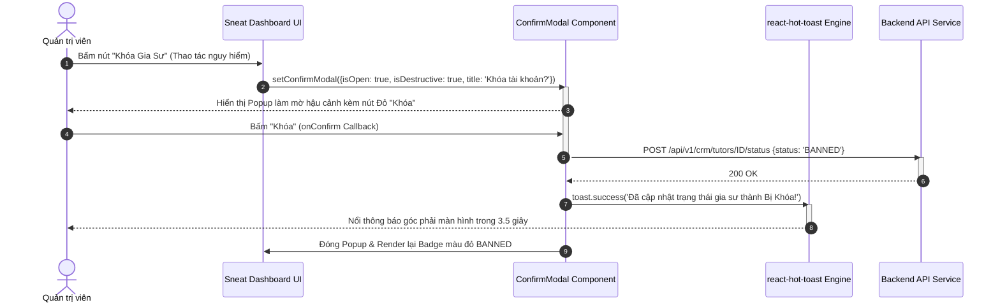

# Usecase: UC-ADM-09 - Kiến trúc Giao diện Sneat & Trải nghiệm Người dùng Điều hành (Executive CRM UI/UX & Responsive Experience)

> **Mã phân hệ:** CRM-REF-09  
> **Phân hệ:** Cổng Quản trị Trung tâm (Admin CRM)  
> **Tác nhân chính:** Quản trị viên (Admin), Nhân viên Vận hành, Kế toán, Chuyên viên Tư vấn

---

## 1. Giới thiệu chức năng

### 1.1. Mục đích
Đặc tả toàn diện tiêu chuẩn kiến trúc giao diện người dùng (UI System) và trải nghiệm tương tác điều hành (Executive UX) áp dụng trên phân hệ Quản trị Trung tâm Admin CRM. Giao diện được thiết kế theo chuẩn **Sneat Dashboard Design System** kết hợp phong cách Glassmorphism nhẹ nhàng và bảng màu công thái học (Ergonomic Color Palette). Mục tiêu tối thượng là tối ưu hóa không gian hiển thị cho các tập dữ liệu lớn (Big Data Management), xóa bỏ sự dư thừa nhận thức (Cognitive Overload), triệt tiêu các hộp thoại chặn màn hình (Non-blocking UI), và mang lại tốc độ phản hồi mượt mà cho nhân viên khi xử lý hàng ngàn giao dịch mỗi ngày.

### 1.2. Actor (Tác nhân)
* **Người dùng Quản trị / Vận hành (Staff Users)**: Thao tác hàng ngày trên các bảng dữ liệu, điều phối lớp học, kiểm tra tài chính mà không bị mỏi mắt.
* **Quản trị viên Hệ thống (Admin)**: Tùy biến thu phóng thanh công cụ, chuyển đổi chế độ hiển thị và thực hiện các thao tác xác nhận an toàn.

### 1.3. Điều kiện tiên quyết
* Ứng dụng chạy trên nền tảng Web hiện đại (Chrome, Edge, Safari, Firefox), hỗ trợ đầy đủ CSS Flexbox/Grid và chuẩn phản hồi Responsive.
* Tích hợp thư viện biểu tượng `lucide-react` và thư viện thông báo `react-hot-toast`.

### 1.4. Danh mục các chức năng con (Sub-features)
1. **UC-ADM-09-01**: Điều hướng Ngữ cảnh Linh hoạt & Tiêu đề Tự động Ẩn/Hiện (Context-Aware Dynamic Headers).
2. **UC-ADM-09-02**: Hệ thống Thông báo Nổi Không Chặn Luồng (Non-blocking Toast Notification Engine).
3. **UC-ADM-09-03**: Chuẩn hóa Thẻ Dữ liệu, Avatar Tự sinh & Badge Trạng thái (Sneat Card, Avatars & Status Badges).
4. **UC-ADM-09-04**: Hộp thoại Xác nhận Hai Lớp & Thanh Bên Tinh chỉnh (ConfirmModal & Collapsible Sidebar).

---

## 2. Dữ liệu nghiệp vụ đầu vào (Input Data & Parameters)

### 2.1. Bảng Mã Màu Chuẩn Sneat Dashboard Theme

| Thành phần thiết kế | Mã màu Hex | Ý nghĩa sử dụng | Hiệu ứng thị giác |
| :--- | :--- | :--- | :--- |
| **Primary Color** | `#696cff` | Màu thương hiệu chủ đạo (Sneat Indigo). Nút bấm chính, tab đang chọn. | Tạo điểm nhấn tinh tế, thanh lịch. |
| **Primary Tint** | `#696cff` / 10% | Nền của Tab/Menu đang được kích hoạt. | Nổi bật không gây chói mắt. |
| **Background Body**| `#f5f5f9` | Màu nền toàn bộ trang ứng dụng CRM. | Giảm độ lóa mắt khi làm việc ban đêm. |
| **Text Primary** | `#566a7f` | Màu chữ tiêu đề chính, thông số số liệu. | Độ tương phản cao, dễ đọc. |
| **Text Muted** | `#a1acb8` | Màu chữ ghi chú, nhãn phụ, ngày tháng. | Phân cấp thị giác rõ ràng. |
| **Success Color** | `#71dd37` / `#e8fadf` | Trạng thái `ACTIVE`, `SUCCESSFUL`, `CONFIRMED`. | Xanh lá tươi tạo cảm giác hoàn tất an tâm. |
| **Danger Color** | `#ff3e1d` / `#ffe0db` | Trạng thái `BANNED`, `DISPUTED`, `FAILED`. | Đỏ cảnh báo nổi bật để xử lý ngay. |
| **Warning Color** | `#ffab00` / `#fff2d6` | Trạng thái `PENDING_REVIEW`, `DEPOSIT`. | Vàng cam báo hiệu cần chờ hành động. |

### 2.2. Ma trận Quy chuẩn Trải nghiệm Tương tác (UX Standards)

```text
┌─────────────────────────────────────────────────────────────────────────────┐
│ 1. BANNER TỔNG QUAN (Chỉ hiện khi ở Tab Overview - Tự động ẩn ở Tab chi tiết)│
│    "Xin chào Admin! Trung tâm đang có 42 lớp học chính thức." [Nút Auto-Confirm]
├───────────────────────┬─────────────────────────────────────────────────────┤
│ 2. COLLAPSIBLE SIDEBAR│ 3. KHÔNG GIAN DỮ LIỆU CHÍNH (Full-height Data Grid) │
│    [Logo Sneat CRM]   │    • Header tìm kiếm thời gian thực (Search Bar)    │
│    • Tổng quan        │    • Bảng dữ liệu viền bo rounded-xl, đổ bóng nhẹ   │
│    • Quản lý Gia sư   │    • Avatar chữ cái đầu tự sinh theo mã màu HSL     │
│    • Quản lý Phụ huynh│    • Badge trạng thái chấm tròn (Status Dots)       │
│    • Kanban Lớp học   │    • Thanh phân trang ghim chân bảng (Pagination)   │
│    • Đối soát Kế toán │                                                     │
│    ────────────────── │                                                     │
│    [Nút Thu gọn (<)]  │ [TOAST GÓC PHẢI]: "Đã cập nhật trạng thái thành công"│
└───────────────────────┴─────────────────────────────────────────────────────┘
```

---

## 3. Quy tắc nghiệp vụ (Business Rules)

| Mã BR | Tình huống kích hoạt | Xử lý của hệ thống | Mã lỗi / Phản hồi |
| :--- | :--- | :--- | :--- |
| **BR-ADM-09-01** | Xóa bỏ sự dư thừa ngữ cảnh (Context-Aware Header Auto-hide). | Khi người dùng ở Tab `overview`: Hiển thị Header lớn kèm nút quét "Auto-Confirm". Khi chuyển sang các Tab chi tiết (`tutors`, `parents`, `classes`, `payouts`): Tiêu đề Tổng quan tự động BỊ ẨN ĐI hoàn toàn, nhường 100% chiều cao màn hình cho Data Table. | `UI_HEADER_CONTEXT_SWITCHED` |
| **BR-ADM-09-02** | Cấm tuyệt đối sử dụng Hộp thoại Chặn trình duyệt (`alert()`). | 100% thông báo hệ thống (Thành công, Lỗi mạng, Cảnh báo nghiệp vụ) phải sử dụng `react-hot-toast`. Toast xuất hiện tại góc trên bên phải màn hình (`top-right`), tự động tiêu biến sau 3.5 giây, không ngắt luồng gõ phím của người dùng. | `TOAST_NOTIFICATION_STANDARD` |
| **BR-ADM-09-03** | Khởi tạo Avatar Chữ cái Đầu Tự động (Deterministic Initials Avatar). | Đối với người dùng chưa có ảnh đại diện: Tự động trích xuất chữ cái đầu của tên (VD: "Nguyễn Văn Nam" $\rightarrow$ "N"), tính mã màu ngẫu nhiên nhưng nhất quán theo hàm HSL dựa trên độ dài chuỗi tên, giúp bảng dữ liệu sinh động và dễ nhận diện. | `AVATAR_INITIALS_RENDERED` |
| **BR-ADM-09-04** | Kiểm soát an toàn Thao tác Phá hủy (Destructive Action Confirmation). | Các thao tác nhạy cảm (Khóa tài khoản `BANNED`, Hủy buổi học `RESOLVED_CANCEL`, Quyết toán rút tiền) bắt buộc phải đi qua hộp thoại `ConfirmModal` với nút xác nhận màu đỏ cảnh báo (`isDestructive = true`), ngăn ngừa việc bấm nhầm chuột. | `CONFIRM_MODAL_ENFORCED` |
| **BR-ADM-09-05** | Tối ưu hóa phản hồi co giãn màn hình (Responsive Collapsible Layout). | Khi màn hình có độ rộng $< 1024px$ (Tablet/Mobile) hoặc khi người dùng bấm nút Menu: Thanh Sidebar thu hẹp về `w-0` kèm hiệu ứng chuyển động mượt `transition-all duration-300`, đảm bảo bảng số liệu không bị tràn viền ngang. | `LAYOUT_RESPONSIVE_TRANSITION` |

---

## 4. Đặc tả chi tiết các Use Case chức năng con

```mermaid
usecaseDiagram
    actor "Nhân viên Vận hành" as Staff
    actor "Quản trị viên" as Admin

    package "UC-ADM-09: Trải nghiệm Giao diện Điều hành Sneat" {
        usecase "UC-ADM-09-01: Chuyển đổi Ngữ cảnh Header Động" as UC1
        usecase "UC-ADM-09-02: Phản hồi Toast Nổi Không Chặn" as UC2
        usecase "UC-ADM-09-03: Render Avatar Tự sinh & Badge Trạng thái" as UC3
        usecase "UC-ADM-09-04: Xác nhận An toàn qua ConfirmModal" as UC4
    }

    Staff --> UC1
    Staff --> UC2
    Staff --> UC3
    Admin --> UC4
    Staff --> UC4
```

### 4.1. UC-ADM-09-01: Điều hướng Ngữ cảnh Linh hoạt & Tiêu đề Tự động Ẩn/Hiện (Context-Aware Dynamic Headers)
* **Mục tiêu**: Tối ưu hóa không gian hiển thị theo mục đích công việc của từng tab chức năng.
* **Tác nhân**: Người dùng hệ thống CRM.
* **Tiền điều kiện**: Ứng dụng đã tải hoàn tất.
* **Hậu điều kiện**: Giao diện hiển thị đúng tiêu đề ngữ cảnh.
* **Luồng cơ bản**:
  1. Người dùng bấm chọn tab "Tổng quan": Màn hình hiển thị Banner chào mừng, thống kê doanh thu và nút quét tự động phê duyệt.
  2. Người dùng chuyển sang tab "Quản lý Gia sư": Banner chào mừng tự động trượt ẩn đi. Tiêu đề trang chuyển thành "Danh sách Gia sư" đi kèm thanh tìm kiếm thời gian thực và nút "+ Thêm Mới Gia Sư".
  3. Biến trạng thái tìm kiếm (`searchQuery`) và phân trang được tự động làm mới về trang 1 để tránh xung đột dữ liệu.
* **Dữ liệu đầu ra**: Trải nghiệm xem dữ liệu sạch sẽ, không bị cuộn trang kép (Dual scrollbars).

### 4.2. UC-ADM-09-02: Hệ thống Thông báo Nổi Không Chặn Luồng (Non-blocking Toast Notification Engine)
* **Mục tiêu**: Cung cấp phản hồi tương tác tức thì mà không cản trở thao tác nhập liệu của người dùng.
* **Tác nhân**: Hệ thống Giao diện (Frontend Engine).
* **Tiền điều kiện**: Một tác vụ API hoàn tất (Thành công hoặc Thất bại).
* **Hậu điều kiện**: Toast xuất hiện và tự đóng.
* **Luồng cơ bản**:
  1. Khi người dùng bấm lưu hoặc thay đổi trạng thái, ứng dụng gửi request ngầm.
  2. Ngay khi có kết quả từ backend:
     * *Thành công*: Kích hoạt `toast.success(message)` hiển thị biểu tượng tích xanh trên nền trắng viền xám nhẹ.
     * *Thất bại*: Kích hoạt `toast.error(errorMessage)` hiển thị biểu tượng dấu X đỏ.
  3. Thông báo hiển thị trong 3 đến 5 giây và mờ dần (Fade out).
  4. Người dùng vẫn có thể tiếp tục gõ phím hoặc click các thành phần khác mà không cần bấm nút "OK" như các alert truyền thống.
* **Dữ liệu đầu ra**: Trải nghiệm phần mềm mượt mà, chuyên nghiệp chuẩn Enterprise SPA.

### 4.3. UC-ADM-09-03: Chuẩn hóa Thẻ Dữ liệu, Avatar Tự sinh & Badge Trạng thái (Sneat Card, Avatars & Status Badges)
* **Mục tiêu**: Tăng tốc độ nhận diện thị giác cho nhân viên khi lướt qua hàng trăm hàng dữ liệu.
* **Tác nhân**: Nhân viên Vận hành, Kế toán.
* **Tiền điều kiện**: Dữ liệu người dùng hoặc lớp học được tải vào bảng.
* **Hậu điều kiện**: Các thành phần trực quan được render chuẩn xác.
* **Luồng cơ bản**:
  1. Với mỗi hàng dữ liệu người dùng:
     * Nếu có `avatarUrl`: Render ảnh đại diện hình tròn bo tròn `rounded-full`.
     * Nếu không có ảnh: Thuật toán tách chữ cái đầu (VD: "L" từ "Linh"), sinh màu nền ngẫu nhiên và hiển thị chữ in hoa sắc nét.
  2. Với mỗi trạng thái nghiệp vụ:
     * Trạng thái `ACTIVE`: Hiển thị Badge nền xanh lá nhạt (`bg-[#e8fadf]`), chữ xanh lá (`text-[#71dd37]`) kèm 1 chấm tròn nhỏ (Status Dot).
     * Trạng thái `BANNED`: Hiển thị Badge nền đỏ nhạt (`bg-[#ffe0db]`), chữ đỏ (`text-[#ff3e1d]`).
     * Trạng thái `PENDING_REVIEW`: Hiển thị Badge nền cam nhạt (`bg-[#fff2d6]`), chữ cam (`text-[#ffab00]`).
  3. Cấu trúc thẻ Card bao bọc có bo góc nhẹ `rounded-xl`, viền mờ `border-gray-100` và đổ bóng nổi `shadow-sm`.
* **Dữ liệu đầu ra**: Giao diện trực quan, nhận diện tức thì tình trạng hồ sơ.

### 4.4. UC-ADM-09-04: Hộp thoại Xác nhận Hai Lớp & Thanh Bên Tinh chỉnh (ConfirmModal & Collapsible Sidebar)
* **Mục tiêu**: Bảo đảm tính an toàn khi thực hiện các tác vụ nguy hiểm và cung cấp khả năng mở rộng không gian làm việc.
* **Tác nhân**: Quản trị viên (Admin).
* **Tiền điều kiện**: Người dùng bấm vào nút thao tác mang tính quyết định.
* **Hậu điều kiện**: Hành động được xác nhận hoặc hủy bỏ an toàn.
* **Luồng cơ bản**:
  1. Khi Admin bấm nút có rủi ro (VD: "Khóa Tài Khoản", "Huỷ Buổi Học", "Rút Tiền Ví"):
  2. Thành phần `ConfirmModal` được kích hoạt với hiệu ứng Backdrop làm mờ hậu cảnh:
     * Hiển thị tiêu đề cảnh báo rõ ràng.
     * Hiển thị nội dung chi tiết hệ quả của thao tác.
     * Nút "Xác nhận" mang màu đỏ cảnh báo nếu là thao tác hủy (`isDestructive = true`).
  3. Nếu bấm "Hủy": Modal đóng lại, không có thay đổi nào được thực thi.
  4. Nếu bấm "Xác nhận": Hàm callback `onConfirm()` được kích hoạt để gọi API.
  5. Đồng thời, người dùng có thể bấm icon Menu ở góc trên bên trái để thu gọn hoặc mở rộng thanh Sidebar theo nhu cầu làm việc.
* **Dữ liệu đầu ra**: Ngăn ngừa hoàn toàn tình trạng vô tình bấm nhầm làm hỏng dữ liệu khách hàng.

---

## 5. Sơ đồ tuần tự nghiệp vụ (Sequence Diagrams)



---

## 6. Kịch bản kiểm thử & Nghiệm thu (Test Scenarios)

### Kịch bản 1: Tiêu đề tự động co giãn và ẩn hiện thông minh khi chuyển tab
* **Given**: Người dùng đang ở màn hình Dashboard Tổng quan, nhìn thấy Banner chào mừng lớn và nút quét Auto-Confirm.
* **When**: Người dùng bấm chuột chuyển sang tab "Kanban Lớp học".
* **Then**:
  * Banner Tổng quan tự động biến mất hoàn toàn.
  * Toàn bộ chiều cao màn hình được dành riêng cho 4 cột Kanban.
  * Không xuất hiện hiện tượng nhảy giật khung hình hoặc thanh cuộn đôi.

### Kịch bản 2: Kiểm tra tính phi chặn luồng của Toast Notifications
* **Given**: Nhân viên đang cập nhật trạng thái hoạt động của một gia sư.
* **When**: Thao tác thành công và Toast màu xanh lá hiện lên ở góc phải màn hình.
* **Then**:
  * Không xuất hiện hộp thoại `window.alert()` chặn màn hình.
  * Nhân viên có thể tiếp tục gõ chữ vào thanh tìm kiếm hoặc click chọn gia sư khác ngay lập tức.
  * Toast tự động biến mất sau 3.5 giây.

### Kịch bản 3: Hộp thoại xác nhận thao tác phá hủy (ConfirmModal)
* **Given**: Kế toán chuẩn bị bấm nút quyết toán rút toàn bộ số dư ví của gia sư về 0.
* **When**: Kế toán bấm nút "Quyết Toán Lương".
* **Then**:
  * Cửa sổ `ConfirmModal` hiện lên với tiêu đề và số tiền cụ thể cần thanh toán.
  * Nút xác nhận hiển thị màu đỏ cảnh báo.
  * Nếu kế toán bấm ra vùng mờ bên ngoài (Backdrop) hoặc bấm nút "Hủy": Modal đóng lại và không có giao dịch nào được gửi lên server.
