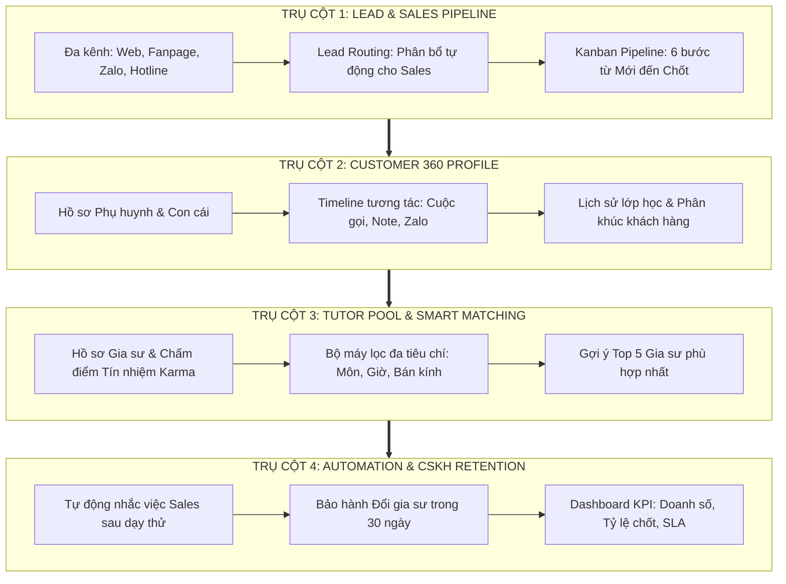
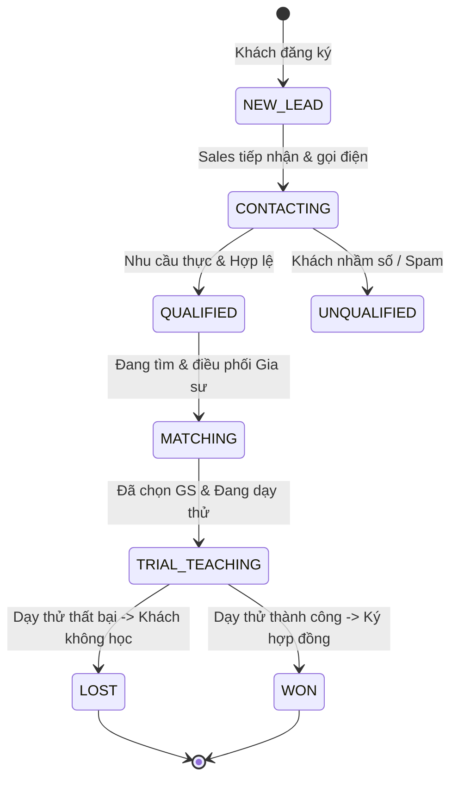

# ĐẶC TẢ CHI TIẾT: 4 TRỤ CỘT CỦA HỆ THỐNG CRM GIA SƯ CHUYÊN NGHIỆP

> **Định hướng:** Chuyển đổi từ mô hình ví tiền/điểm danh phức tạp sang **Hệ thống CRM chuyên sâu (Pure CRM)** tập trung vào Quản trị Quan hệ Khách hàng, Tối ưu chuyển đổi bán hàng và Nâng cao trải nghiệm dịch vụ.

---

## 🗺️ TỔNG QUAN KIẾN TRÚC 4 TRỤ CỘT



---

## 🏛️ TRỤ CỘT 1: QUẢN LÝ PHỄU KHÁCH HÀNG (LEAD & SALES PIPELINE)

Mục tiêu cốt lõi: **Không bỏ sót bất kỳ một khách hàng tiềm năng nào, tối đa hóa tỷ lệ chốt đơn và rút ngắn thời gian xử lý yêu cầu.**

### 1.1. Tiếp nhận Lead Đa kênh (Omni-channel Ingestion)
Toàn bộ yêu cầu tìm gia sư từ mọi nguồn được tự động gom về một phễu duy nhất:
* **Form Website / Landing Page:** Đổ trực tiếp qua Webhook/API.
* **Facebook Fanpage / Messenger:** Tích hợp nhận tin nhắn và số điện thoại từ inbox/bình luận.
* **Zalo ZNS / Zalo Official Account:** Tự động tạo Lead khi phụ huynh quét mã hoặc nhắn tin.
* **Tổng đài Hotline:** Tự động tạo Lead từ cuộc gọi đến kèm bản ghi âm.
* **Nhập thủ công (Manual Lead):** Dành cho khách người quen giới thiệu hoặc đến trực tiếp văn phòng.

### 1.2. Thuật toán phân bổ Lead tự động (Lead Routing)
Tránh tình trạng tranh giành khách hoặc nhân viên quá tải:
* **Quy tắc Vòng tròn (Round-Robin):** Lần lượt chia đều Lead cho các nhân viên Sales đang online.
* **Phân bổ theo Địa bàn / Môn học:** 
  * Sales A chuyên khu vực Cầu Giấy / Ba Đình.
  * Sales B chuyên luyện thi Đại học / Tiếng Anh IELTS.
* **Quy tắc SLA Phản hồi (Speed-to-Lead):**
  * Trong vòng **15 phút** kể từ khi Lead đổ về, nếu Sales không bấm "Tiếp nhận", hệ thống tự động thu hồi và chuyển cho Sales khác.

### 1.3. Vòng đời Phễu bán hàng (Kanban Sales Pipeline)



* **Trường dữ liệu Bắt buộc khi Đóng đơn (Lost Reason):** Nếu trạng thái chuyển sang `LOST`, Sales bắt buộc phải chọn nguyên nhân:
  1. *Học phí vượt quá ngân sách*.
  2. *Không tìm được gia sư đúng yêu cầu*.
  3. *Gia sư dạy thử không đạt yêu cầu*.
  4. *Khách đổi ý (gia đình có việc/tự dạy)*.
  5. *Lịch học không khớp*.

---

## 🏛️ TRỤ CỘT 2: HỒ SƠ KHÁCH HÀNG 360 ĐỘ (CUSTOMER 360)

Mục tiêu cốt lõi: **Biết khách hàng cần gì trước khi họ nói, phục vụ cá nhân hóa và quản lý tập trung tài sản dữ liệu.**

### 2.1. Cấu trúc Hồ sơ Gia đình (Family-Centric Data Model)
* Khách hàng trung tâm là **Phụ huynh** (Họ tên, SĐT, Email, Nghề nghiệp, Khu vực sinh sống, Ghi chú đặc biệt).
* Dưới Phụ huynh là danh sách **Học sinh (Con cái)**:
  * Tên con, trường đang học, lớp hiện tại.
  * Học lực: Mất gốc, trung bình, khá, giỏi, ôn thi chuyên.
  * Tính cách & Tâm lý: Nhút nhát, hiếu động, thích gia sư nghiêm khắc hay nhẹ nhàng.
  * Mục tiêu kỳ vọng của phụ huynh: Đạt 8+ điểm thi vào 10, đỗ trường Amsterdam...

### 2.2. Dòng thời gian tương tác (Activity Timeline)
Mọi lịch sử đều được hiển thị dạng dòng thời gian như mạng xã hội:
* **Lịch sử cuộc gọi:** Ngày/giờ, thời lượng, nhân viên phụ trách, file ghi âm cuộc gọi.
* **Ghi chú tư vấn (Call Notes):** *"Mẹ bé rất kỹ tính, yêu cầu gia sư phải là sinh viên Sư phạm Toán, không nhận Ngoại thương"*.
* **Lịch sử lớp học:** Các lớp đã mở, lớp đang học, lớp đã kết thúc.
* **Lịch sử các gia sư từng tương tác:** Từng thử những gia sư nào, lý do ưng hoặc không ưng.

### 2.3. Phân nhóm khách hàng (Customer Segmentation)
* **Khách VIP:** Thuê nhiều con cùng lúc, trả học phí cao, trung thành trên 1 năm.
* **Khách tiềm năng:** Có nhiều con nhỏ đang đến tuổi cần tìm gia sư môn tiếp theo.
* **Khách có nguy cơ rời bỏ (At-Risk):** Có phản ánh tiêu cực hoặc hủy lịch liên tục.

---

## 🏛️ TRỤ CỘT 3: MẠNG LƯỚI GIA SƯ & BỘ MÁY GHÉP LỚP (TUTOR POOL & SMART MATCHING)

Mục tiêu cốt lõi: **Xây dựng mạng lưới gia sư chất lượng và tìm đúng người cho đúng lớp chỉ trong vài giây.**

### 3.1. Hồ sơ năng lực Đối tác Gia sư (Tutor Profile)
* **Thông tin cá nhân & Thẩm định:** CCCD, Thẻ sinh viên/Bằng tốt nghiệp Sư phạm, Chứng chỉ quốc tế (IELTS, HSK...).
* **Năng lực giảng dạy:** Danh mục môn dạy và khối lớp (đã qua kiểm duyệt năng lực).
* **Ma trận Lịch rảnh (Availability Matrix):** Bảng lưới thời gian 7 ngày trong tuần, các khung giờ Sáng - Chiều - Tối.
* **Địa bàn hoạt động:** Tọa độ GPS nhà ở hoặc danh sách Quận/Huyện có thể di chuyển (kèm bán kính tối đa, ví dụ: tối đa 7 km).

### 3.2. Điểm Tín Nhiệm & Uy Tín (Tutor Karma Score)
Hệ thống tự động chấm điểm để ưu tiên giao lớp:
* **Cộng điểm:**
  * Dạy thử thành công được phụ huynh nhận: $+15$ điểm.
  * Được phụ huynh đánh giá 5 sao: $+10$ điểm.
  * Nhận lớp và đóng cọc đúng hẹn: $+5$ điểm.
* **Trừ điểm & Chế tài:**
  * Bị phụ huynh phản ánh đến muộn / tác phong tệ: $-20$ điểm.
  * Tự ý hủy lớp / bỏ dạy: $-50$ điểm.
  * Điểm uy tín $< 40$: Hệ thống tự động khóa quyền ứng tuyển lớp mới trong 30 ngày.
  * Điểm uy tín $< 20$: Đưa vào **Blacklist** vĩnh viễn.

### 3.3. Bộ máy Ghép lớp Thông minh (Smart Matching Engine)
Khi phụ huynh tạo yêu cầu, thuật toán tự động chấm điểm độ tương thích (% Match Score) dựa trên 5 trọng số:

$$\text{Match Score} = (W_1 \times \text{Môn/Lớp}) + (W_2 \times \text{Lịch rảnh}) + (W_3 \times \text{Khoảng cách}) + (W_4 \times \text{Mức phí}) + (W_5 \times \text{Điểm uy tín})$$

* **Kết quả:** CRM hiển thị danh sách **Top 5 gia sư phù hợp nhất**. Sales chỉ cần bấm 1 nút để:
  * Gửi tin nhắn Zalo/SMS mời nhận lớp.
  * Hoặc trực tiếp chọn gia sư này để xếp lịch dạy thử.

---

## 🏛️ TRỤ CỘT 4: TỰ ĐỘNG HÓA CHĂM SÓC & GIỮ CHÂN (AUTOMATION & CSKH RETENTION)

Mục tiêu cốt lõi: **Biến khách hàng một lần thành khách hàng trọn đời, chủ động phòng ngừa tranh chấp.**

### 4.1. Quy trình Tự động nhắc việc (Task & Reminder Automation)
Nhân viên không cần phải nhớ việc trong đầu, CRM tự động sinh đầu việc:
* **Nhắc sau buổi dạy thử 24 giờ:** Hệ thống tự tạo Task có thông báo đỏ trên màn hình Sales: *"Gọi điện cho Chị Hương hỏi thăm kết quả buổi dạy thử Toán của bạn Huy"*.
* **Nhắc định kỳ sau 30 ngày:** Tự động sinh Task CSKH: *"Kiểm tra chất lượng định kỳ tháng đầu tiên"*.
* **Nhắc sinh nhật học sinh / phụ huynh:** Gửi SMS/Zalo chúc mừng tự động kèm mã giảm giá.
* **Nhắc chăm sóc đầu năm học mới (Tháng 8 - Tháng 9):** Tự động lọc toàn bộ phụ huynh cũ để gửi thông báo ưu đãi đăng ký sớm.

### 4.2. Quy trình Quản lý Bảo hành & Khiếu nại (Ticket & Warranty System)
* **Chính sách bảo hành 30 ngày:**
  * Nếu sau buổi dạy thử hoặc trong 30 ngày đầu phụ huynh không hài lòng:
  * Nhân viên mở một **Ticket đổi gia sư** (Ticket Priority: `URGENT`).
  * Hệ thống tự động kích hoạt lại luồng Matching để chọn gia sư thay thế trong vòng **24 giờ**.
* **Đánh giá mức độ hài lòng (NPS - Net Promoter Score):**
  * Tự động gửi link khảo sát 1 chạm sau tháng đầu: *"Từ 1 đến 10, anh/chị sẵn sàng giới thiệu trung tâm cho bạn bè ở mức nào?"*.
  * Nếu đánh giá $\le 6$: Báo động ngay cho Trưởng phòng CSKH gọi điện xử lý.

### 4.3. Bảng điều khiển Quản trị & Báo cáo KPI (Executive Dashboard)

```text
┌────────────────────────┬────────────────────────┬────────────────────────┐
│     TỔNG LEAD THÁNG    │   TỶ LỆ CHỐT THÀNH CÔNG│   THỜI GIAN GHÉP LỚP   │
│        1,250 LEAD      │         38.5%          │         4.2 GIỜ        │
│    (+12% so với kỳ trước)│   (Mục tiêu: > 35%)    │    (Mục tiêu: < 6 giờ) │
├────────────────────────┼────────────────────────┼────────────────────────┤
│     DOANH SỐ PHÍ MÔI GIỚI│   TOP NGUYÊN NHÂN RỚT   │    CHỈ SỐ HÀI LÒNG NPS │
│      245,000,000 đ     │ 1. Không khớp lịch (42%)│          82 điểm       │
│   (Đạt 108% kế hoạch)  │ 2. Giá cao (28%)       │        (Mức Xuất sắc)  │
└────────────────────────┴────────────────────────┴────────────────────────┘
```

---

## 📋 SO SÁNH GIÁ TRỊ VẬN HÀNH

| Tiêu chí | Khi làm theo mô hình Cũ (Ví tiền/Điểm danh) | Khi chuyển sang mô hình MỚI (4 Trụ Cột CRM) |
| :--- | :--- | :--- |
| **Trải nghiệm Phụ huynh** | Phức tạp, e ngại nạp tiền triệu vào app trước khi học. | Nhẹ nhàng, miễn phí đăng bài, được tư vấn tận tình như dịch vụ cao cấp. |
| **Trải nghiệm Gia sư** | Không trách nhiệm, nhận lớp bừa bãi rồi bỏ dạy. | Chuyên nghiệp, có điểm tín nhiệm, nhận được lớp đúng thế mạnh và gần nhà. |
| **Hiệu suất của Sales** | Bị kẹt trong việc đối soát mã PIN, giải thích trừ tiền ví. | Tập trung 100% thời gian vào **tư vấn, chốt đơn và chăm sóc khách**. |
| **Báo cáo cho Quản lý** | Chỉ thấy số dư ví và lượt buổi học. | Thấy rõ **tỷ lệ chuyển đổi, hiệu suất từng nhân viên, doanh số và phản hồi của khách**. |
