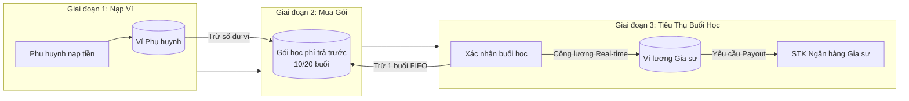
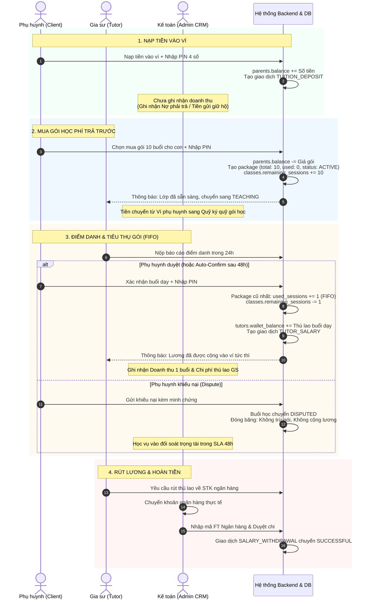

# ĐẶC TẢ NGHIỆP VỤ: QUẢN LÝ VÍ TIỀN & GÓI HỌC PHÍ (ĐỐI CHIẾU 3 BÊN)

> **Mã chuyên đề:** FIN-CROSS-PORTAL  
> **Các phân hệ tương tác:** Client Portal, Tutor Portal, Admin CRM  
> **Mục tiêu:** Mô tả chi tiết dòng tiền 3 bước, cơ chế tiêu thụ gói FIFO, cộng lương Real-time và đối soát hoàn tiền giữa Phụ huynh, Gia sư và Trung tâm.

---

## 1. Tổng Quan Kiến Trúc Dòng Tiền 3 Bước (3-Step Money Flow)

Hệ thống loại bỏ hoàn toàn các rủi ro tài chính kinh điển (bùng học phí, quỵt lương gia sư, trừ tiền kép) thông qua việc tách bạch rõ ràng 3 giai đoạn:



---

## 2. Ma Trận Đối Chiếu Chi Tiết 3 Bên

| Tiêu chí | 👨‍👩‍👧 Phụ huynh (Client Portal) | 👨‍🏫 Gia sư (Tutor Portal) | 🏢 Trung tâm (Admin CRM - Kế toán) |
| :--- | :--- | :--- | :--- |
| **Bản chất tài khoản tiền** | `parents.balance`<br>(Ví trả trước dùng chung cho cả gia đình) | `tutors.wallet_balance`<br>(Ví thu nhập thù lao giảng dạy) | Tài khoản ngân hàng công ty / Quỹ trung gian của trung tâm |
| **Xác thực bảo mật** | Bắt buộc nhập **Mã PIN 4 số** khi nạp, mua gói, duyệt buổi | Mã hóa AES-256 số tài khoản ngân hàng nhận lương | RBAC (Role-based access), kiểm soát truy vết qua `audit_logs` |
| **Thời điểm trừ tiền / nhận tiền** | • Trừ tiền ví **1 lần duy nhất** khi mua gói<br>• Điểm danh: **Không trừ thêm tiền** | Nhận tiền thù lao ngay thời điểm buổi học chuyển `CONFIRMED` | Ghi nhận doanh thu thực và lợi nhuận gộp theo từng buổi hoàn thành |
| **Chứng từ & Bút toán phát sinh** | `TUITION_DEPOSIT`, `SESSION_DEDUCTION` | `TUTOR_SALARY`, `SALARY_WITHDRAWAL` | Sổ cái doanh thu, chi phí vốn (COGS), mã đối soát ngân hàng (FT Ref) |

---

## 3. Phân Tích Chi Tiết Từng Nghiệp Vụ Giữa 3 Bên



---

### 3.1. Nghiệp vụ 1: Nạp Tiền Vào Ví (Top-up Wallet)

#### Đối với Phụ huynh:
* **Mục đích:** Tạo nguồn vốn sẵn có để chủ động thanh toán các gói học phí cho con bất kỳ lúc nào.
* **Quy trình:**
  1. Phụ huynh truy cập menu **Ví tiền** $\rightarrow$ chọn **Nạp tiền**.
  2. Chọn các hạn mức đề xuất (1,000,000 đ, 2,000,000 đ, 5,000,000 đ...) hoặc nhập số tiền tùy chọn (tối thiểu 200,000 đ).
  3. Nhập **Mã PIN 4 số** xác thực giao dịch.
  4. Số dư khả dụng `parents.balance` được cộng ngay lập tức.
* **Quyền kiểm soát:** Phụ huynh sở hữu hoàn toàn số dư này và có thể yêu cầu rút lại nếu chưa mua gói.

#### Đối với Gia sư:
* **Tác động:** Không có tác động hay biến động nào tới gia sư ở bước này. Gia sư không xem được số dư ví cá nhân của phụ huynh.

#### Đối với Trung tâm (Kế toán CRM):
* **Bản chất kế toán:** Đây **chưa phải là doanh thu** của trung tâm.
* Tiền nạp vào ví được xếp vào khoản **Tiền gửi giữ hộ của khách hàng (Nợ phải trả - Liability)**. Trung tâm chỉ giữ tiền tạm thời thay cho phụ huynh.
* Hệ thống sinh bản ghi giao dịch trong bảng `transactions` với `type = TUITION_DEPOSIT`, trạng thái `SUCCESSFUL`.

---

### 3.2. Nghiệp vụ 2: Mua Gói Học Phí Trả Trước (Prepaid Packages)

#### Đối với Phụ huynh:
* **Nguyên tắc:** Gói học phí được mua riêng cho từng lớp học cụ thể của từng người con.
* **Quy định số buổi:** Tối thiểu 10 buổi (10, 20, 30 buổi).
* **Quy trình:**
  1. Chọn lớp học của con cần gia hạn/mua gói.
  2. Chọn số lượng buổi học $\rightarrow$ Hệ thống tính tổng tiền = $\text{Số buổi} \times \text{Đơn giá buổi học}$.
  3. Nhập **Mã PIN 4 số**.
  4. Hệ thống trừ trực tiếp số dư ví `parents.balance`. Nếu số dư không đủ, hiển thị cảnh báo `BALANCE_INSUFFICIENT` và gợi ý nạp bù.
* **Sau khi mua:** Số buổi của lớp tăng lên, đảm bảo con không bị gián đoạn bài giảng.

#### Đối với Gia sư:
* **Sự đảm bảo:** Gia sư nhận được thông báo lớp học đã được phụ huynh thanh toán trước gói học.
* Trạng thái lớp chuyển sang **`TEACHING`**.
* Gia sư hoàn toàn an tâm lên giáo án và giảng dạy vì nguồn ngân sách đã được trung tâm bảo chứng, loại bỏ 100% rủi ro bị bùng tiền học phí.

#### Đối với Trung tâm (Kế toán CRM):
* Khởi tạo bản ghi trong bảng `packages`:
  ```json
  {
    "class_id": 101,
    "total_sessions": 10,
    "used_sessions": 0,
    "status": "ACTIVE",
    "purchased_at": "2026-09-22T08:00:00Z"
  }
  ```
* Tăng `classes.remaining_sessions = classes.remaining_sessions + 10`.
* Nếu lớp đang ở trạng thái `SUSPENDED` (tạm dừng do hết gói), hệ thống tự động mở lại trạng thái `TEACHING`.
* Về mặt kế toán, tiền từ mục "Tiền gửi ví" chuyển sang mục "Ký quỹ gói dịch vụ chờ thực hiện". Vẫn chưa kết chuyển thành doanh thu.

---

### 3.3. Nghiệp vụ 3: Tiêu Thụ Gói Theo Cơ Chế FIFO & Trả Lương Real-time

#### Đối với Phụ huynh:
* **Không trừ tiền ví:** Đây là điểm mấu chốt — khi buổi học hoàn thành, phụ huynh **hoàn toàn không bị trừ thêm bất kỳ khoản tiền nào trong ví**.
* **Quy trình xác nhận:**
  1. Sau khi gia sư nộp điểm danh, phụ huynh có **48 giờ** để kiểm tra nội dung bài dạy, nhận xét và giờ thực dạy.
  2. Phụ huynh bấm **"Xác nhận buổi học"** và nhập **Mã PIN 4 số**.
  3. *(Nếu quá 48h không phản hồi, Cron Job hệ thống sẽ Auto-Confirm).*
* **Cơ chế FIFO (First-In, First-Out):**
  * Buổi học tự động cắn trừ vào gói học cũ nhất còn hạn.
  * Tăng `used_sessions + 1` của gói cũ trước. Khi gói cũ đạt `used_sessions = total_sessions`, gói tự động chuyển trạng thái `EXHAUSTED`. Các buổi tiếp theo sẽ cắn sang gói mới hơn.
* **Cảnh báo cạn gói:** Khi số buổi còn lại $\le 2$, phụ huynh nhận thông báo nhắc nạp gói tiếp theo.

#### Đối với Gia sư:
* **Cộng lương Real-time:** Ngay thời khắc buổi học chuyển sang trạng thái `CONFIRMED`:
  $$\text{tutors.wallet\_balance} = \text{tutors.wallet\_balance} + \text{classes.tutor\_wage\_rate}$$
* Gia sư nhận thông báo đẩy tức thì: *"Ví lương vừa được cộng +250.000đ từ buổi học bé Khôi"*.
* **Yêu cầu rút tiền (Payout):**
  * Gia sư có thể liên kết tối đa 3 STK ngân hàng.
  * Được phép tạo yêu cầu rút tiền bất kỳ lúc nào khi số dư $\ge 200,000$ đ.
  * Số tiền rút sẽ tạm thời bị khóa (`PENDING`) cho đến khi kế toán duyệt chi.

#### Đối với Trung tâm (Kế toán CRM):
* **Thời điểm vàng ghi nhận Doanh thu & Lợi nhuận:**
  * **Doanh thu ghi nhận:** Bằng giá trị 1 buổi học phụ huynh đã trả.
  * **Chi phí vốn (COGS):** Bằng thù lao thỏa thuận chi trả cho gia sư (`tutor_wage_rate`).
  * **Lợi nhuận gộp:** $\text{Doanh thu} - \text{Chi phí thù lao}$.
* Sinh cặp giao dịch đối soát:
  * `SESSION_DEDUCTION`: Ghi nhận trừ 1 buổi học trong gói.
  * `TUTOR_SALARY`: Ghi nhận nghĩa vụ trả thù lao cho gia sư.
* **Quy trình duyệt chi Payout của Kế toán:**
  1. Kế toán mở danh sách yêu cầu rút tiền `PENDING`.
  2. Mở app ngân hàng thực hiện chuyển khoản cho gia sư.
  3. Nhập **Mã tham chiếu ngân hàng (FT reference)** vào hệ thống và bấm **"Duyệt chi"**.
  4. Giao dịch chuyển sang `SUCCESSFUL`, trừ vĩnh viễn số dư ví gia sư và ghi log bảo mật `audit_logs`.

---

### 3.4. Nghiệp vụ 4: Hoàn Tiền (Refund) Khi Kết Thúc Lớp Sớm

#### Đối với Phụ huynh:
* **Tình huống áp dụng:** Lớp học dừng đột xuất (gia sư bận việc dài hạn, học sinh chuyển trường, gia đình dừng nhu cầu).
* **Quyền lợi:** Phụ huynh được hoàn lại 100% giá trị của **các buổi học chưa dùng**.
* **Công thức hoàn tiền:**
  $$\text{Số tiền hoàn} = (\text{total\_sessions} - \text{used\_sessions}) \times \text{Đơn giá buổi học của gói đã mua}$$
* **Hình thức nhận:** Tiền có thể hoàn trả lại vào số dư ví `parents.balance` hoặc kế toán chuyển khoản trực tiếp về tài khoản ngân hàng của phụ huynh.

#### Đối với Gia sư:
* **Quyền lợi bảo toàn:** Toàn bộ các buổi gia sư đã dạy trước đó và đã được xác nhận `CONFIRMED` **tuyệt đối không bị thu hồi hay hủy lương**.
* Lớp học kết thúc, lịch dạy được gỡ bỏ để gia sư sẵn sàng nhận lớp mới.

#### Đối với Trung tâm (Kế toán CRM):
* Kế toán kiểm tra số buổi thực tế đã học và số buổi còn dư trên hệ thống.
* Chuyển trạng thái gói học từ `ACTIVE` sang **`REFUNDED`**.
* Hệ thống sinh giao dịch loại `REFUND` và đóng lớp học.
* Cân đối lại sổ cái tài chính, loại bỏ phần doanh thu chưa thực hiện tương ứng.

---

## 4. Bảng Tra Cứu Trạng Thái & Giao Dịch Dữ Liệu

### 4.1. Vòng đời Trạng thái Gói học (`PackageStatus`)
```text
[MUA GÓI] ──> ACTIVE (Đang dùng, used < total) 
                 │
                 ├── (Dùng hết buổi) ──> EXHAUSTED (Đã dùng hết 100%)
                 │
                 └── (Hủy lớp sớm) ────> REFUNDED (Đã hoàn tiền buổi thừa)
```

### 4.2. Danh mục Bút toán Giao dịch (`TransactionType`)
| Loại giao dịch | Phụ huynh | Gia sư | Kế toán Trung tâm |
| :--- | :---: | :---: | :--- |
| `TUITION_DEPOSIT` | **+ Tăng** | Không đổi | Tăng tiền gửi giữ hộ (Liability) |
| `SESSION_DEDUCTION` | Trừ buổi | Không đổi | Giảm trừ nghĩa vụ giảng dạy của gói |
| `TUTOR_SALARY` | Không đổi | **+ Tăng** | Ghi nhận chi phí vốn & Doanh thu thực tế |
| `SALARY_WITHDRAWAL`| Không đổi | **- Giảm** | Xuất tiền mặt/tiền gửi ngân hàng chi trả lương |
| `REFUND` | **+ Tăng** | Không đổi | Giảm trừ tiền ký quỹ hoàn trả khách hàng |
