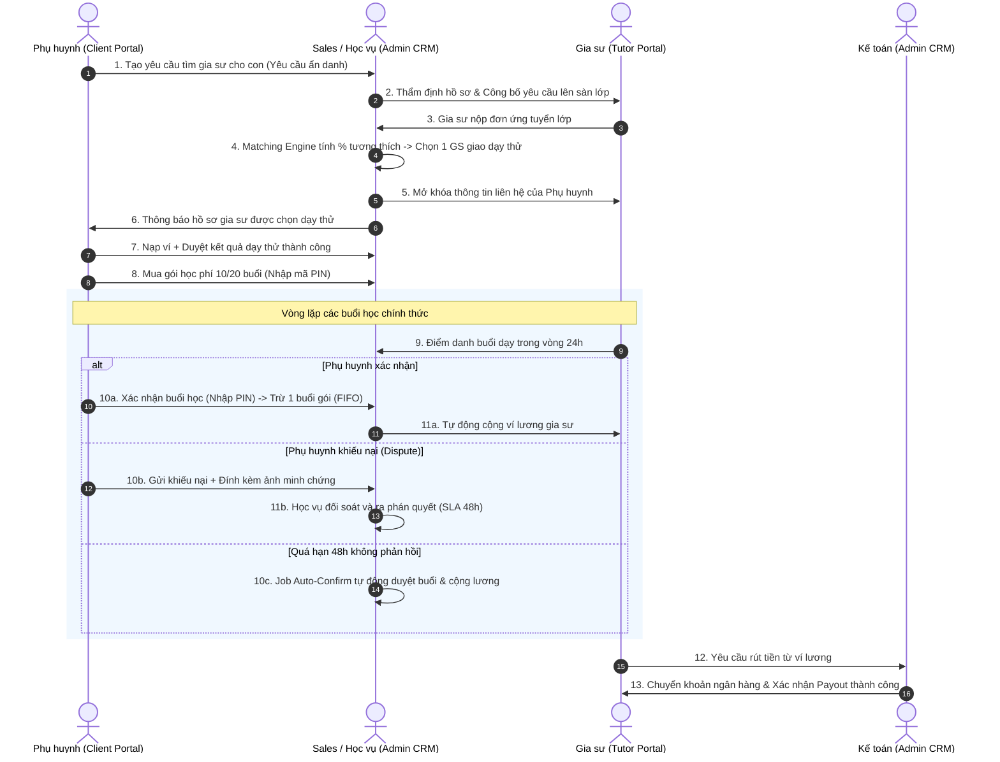

# 📚 KIẾN TRÚC NGHIỆP VỤ HỆ THỐNG CRM GIA SƯ (TỔNG QUAN 3 CỔNG)

Tài liệu này đóng vai trò bản đồ nghiệp vụ trung tâm, kết nối và điều phối toàn bộ các quy trình vận hành giữa ba phân hệ (3 Portals) độc lập nhưng tương tác chặt chẽ trong hệ thống CRM Trung tâm Gia sư.

---

## 🏛️ 1. Ba Phân Hệ Cổng Tương Tác Cốt Lõi

```text
┌─────────────────────────────────────────────────────────────────────────┐
│                           CRM TRUNG TÂM GIA SƯ                          │
└─────────────────────────────────────────────────────────────────────────┘
        ▲                                     ▲                     ▲
        │                                     │                     │
┌───────┴───────────────┐           ┌─────────┴─────────┐  ┌────────┴─────────────┐
│ 1. CLIENT PORTAL      │           │  2. TUTOR PORTAL  │  │ 3. ADMIN CRM PORTAL  │
│ (Phụ huynh & Học sinh)│           │     (Gia sư)      │  │(Vận hành & Quản trị) │
├───────────────────────┤           ├───────────────────┤  ├──────────────────────┤
│ • Family Account      │           │ • Hồ sơ & Môn dạy │  │ • Sales & Khớp lớp   │
│ • Quản lý con cái     │           │ • Lịch rảnh tuần  │  │ • Thẩm định gia sư   │
│ • Ví & Gói học (FIFO) │           │ • Ứng tuyển lớp   │  │ • Xử lý khiếu nại    │
│ • Điểm danh (Mã PIN)  │           │ • Điểm danh (24h) │  │ • Giám sát học vụ    │
│ • Báo nghỉ (4h)       │           │ • Báo nghỉ (24h)  │  │ • Kế toán & Payout   │
│ • Khiếu nại (Dispute) │           │ • Ví lương & STK  │  │ • Báo cáo KPI & Logs │
└───────────────────────┘           └───────────────────┘  └──────────────────────┘
```

---

## 🔄 2. Bản Đồ Luồng Dữ Liệu Liên Cổng (Cross-Portal Workflow)



---

## 📋 3. Ma Trận Trách Nhiệm & Phân Định Quyền Hạn (RACI Matrix)

| Nghiệp vụ trọng yếu | Phụ huynh | Học sinh | Gia sư | Sales | Học vụ | Kế toán | Admin |
| :--- | :---: | :---: | :---: | :---: | :---: | :---: | :---: |
| Quản lý hồ sơ con (Family Account) | **A / R** | C | I | I | I | I | I |
| Nạp ví & Mua gói học phí trả trước | **A / R** | I | I | C | I | I | I |
| Tạo yêu cầu tìm gia sư | **A / R** | C | I | **R** | I | I | I |
| Đăng ký lịch rảnh & Ứng tuyển | I | I | **A / R** | C | I | I | I |
| Thẩm định & Duyệt hồ sơ gia sư | I | I | C | **A / R** | C | I | I |
| Điều phối & Giao lớp dạy thử | C | I | C | **A / R** | I | I | I |
| Điểm danh buổi học (trong 24h) | I | I | **A / R** | I | I | I | I |
| Xác nhận buổi học (nhập mã PIN) | **A / R** | I | I | I | I | I | I |
| Xử lý khiếu nại điểm danh (Dispute) | C | I | C | I | **A / R** | I | I |
| Xin nghỉ học lẻ (Student leave) | **A** | **R** | C | I | I | I | I |
| Xin nghỉ dạy lẻ (Tutor leave) | C | I | **A / R** | I | C | I | I |
| Quyết toán lương gia sư (Payout) | I | I | C | I | I | **A / R** | I |

*Ghi chú:* **A** (Accountable - Chịu trách nhiệm chính), **R** (Responsible - Người thực hiện), **C** (Consulted - Người được tham vấn), **I** (Informed - Người nhận thông báo).

---

## 📂 4. Danh Mục Tài Liệu Chi Tiết Theo Cổng

### 👨‍👩‍👧 Phân hệ 1: Cổng Phụ Huynh & Học Sinh (`1-client-portal/`)
* [01-HoSoGiaDinhVaProfile.md](file:///f:/CRM-Gia%20s%C6%B0/CRM-Gia%20s%C6%B0/docs/nghiep-vu/1-client-portal/01-HoSoGiaDinhVaProfile.md): Mô hình Family Account, Profile Switcher, phân quyền bảo mật giữa Phụ huynh và Con.
* [02-ViTienVaGoiHocPhi.md](file:///f:/CRM-Gia%20s%C6%B0/CRM-Gia%20s%C6%B0/docs/nghiep-vu/1-client-portal/02-ViTienVaGoiHocPhi.md): Cơ chế dòng tiền ví trung gian, mua gói học phí trả trước, tiêu thụ theo FIFO, mã PIN bảo mật và hoàn tiền.
* [03-YeuCauTimGiaSu.md](file:///f:/CRM-Gia%20s%C6%B0/CRM-Gia%20s%C6%B0/docs/nghiep-vu/1-client-portal/03-YeuCauTimGiaSu.md): Quy trình tạo yêu cầu tìm gia sư, cơ chế ẩn danh chống đi đêm, vòng đời yêu cầu (`NEW` -> `MATCHED`).
* [04-DiemDanhVaKhieuNai.md](file:///f:/CRM-Gia%20s%C6%B0/CRM-Gia%20s%C6%B0/docs/nghiep-vu/1-client-portal/04-DiemDanhVaKhieuNai.md): Xác nhận buổi học bằng mã PIN, quy trình khiếu nại (Dispute), cơ chế Auto-Confirm sau 48h.
* [05-LichHocVaBaoNghi.md](file:///f:/CRM-Gia%20s%C6%B0/CRM-Gia%20s%C6%B0/docs/nghiep-vu/1-client-portal/05-LichHocVaBaoNghi.md): Quản lý thời khóa biểu, quy trình báo nghỉ trước 4h, chế tài nghỉ muộn.

### 👨‍🏫 Phân hệ 2: Cổng Gia Sư (`2-tutor-portal/`)
* [01-HoSoVaLichRanh.md](file:///f:/CRM-Gia%20s%C6%B0/CRM-Gia%20s%C6%B0/docs/nghiep-vu/2-tutor-portal/01-HoSoVaLichRanh.md): Khai báo bằng cấp/CCCD, môn dạy được duyệt, ma trận lịch rảnh hàng tuần.
* [02-UngTuyenLopMoi.md](file:///f:/CRM-Gia%20s%C6%B0/CRM-Gia%20s%C6%B0/docs/nghiep-vu/2-tutor-portal/02-UngTuyenLopMoi.md): Sàn tìm lớp ẩn danh, kiểm tra xung đột lịch (`SCHEDULE_CONFLICT`), quy trình ứng tuyển.
* [03-DiemDanhBuoiDay.md](file:///f:/CRM-Gia%20s%C6%B0/CRM-Gia%20s%C6%B0/docs/nghiep-vu/2-tutor-portal/03-DiemDanhBuoiDay.md): Điểm danh trong vòng 24h, ghi nhận nội dung giảng dạy và đánh giá học sinh.
* [04-BaoNghiVaDayBu.md](file:///f:/CRM-Gia%20s%C6%B0/CRM-Gia%20s%C6%B0/docs/nghiep-vu/2-tutor-portal/04-BaoNghiVaDayBu.md): Quy tắc báo nghỉ trước 24h, xử lý vi phạm nghỉ muộn, quy trình thống nhất lịch dạy bù.
* [05-ViLuongVaQuyetToan.md](file:///f:/CRM-Gia%20s%C6%B0/CRM-Gia%20s%C6%B0/docs/nghiep-vu/2-tutor-portal/05-ViLuongVaQuyetToan.md): Cơ chế cộng lương real-time, quản lý tài khoản ngân hàng, quy trình yêu cầu rút lương.

### 🏢 Phân hệ 3: Cổng Quản Trị CRM (`3-admin-crm/`)
* [01-PhanQuyenVaNhanSu.md](file:///f:/CRM-Gia%20s%C6%B0/CRM-Gia%20s%C6%B0/docs/nghiep-vu/3-admin-crm/01-PhanQuyenVaNhanSu.md): Phân quyền vai trò nội bộ RBAC, kiểm soát truy vết Audit Log bảo mật.
* [02-DuyetGiaSuVaMonDay.md](file:///f:/CRM-Gia%20s%C6%B0/CRM-Gia%20s%C6%B0/docs/nghiep-vu/3-admin-crm/02-DuyetGiaSuVaMonDay.md): Quy trình thẩm định bằng cấp, duyệt danh mục môn dạy, quản lý trạng thái hồ sơ.
* [03-KhopLopVaDayThu.md](file:///f:/CRM-Gia%20s%C6%B0/CRM-Gia%20s%C6%B0/docs/nghiep-vu/3-admin-crm/03-KhopLopVaDayThu.md): Matching Engine gợi ý gia sư, giao dạy thử, quy trình mở khóa và thu hồi thông tin liên hệ.
* [04-QuanLyLopVaGoiHoc.md](file:///f:/CRM-Gia%20s%C6%B0/CRM-Gia%20s%C6%B0/docs/nghiep-vu/3-admin-crm/04-QuanLyLopVaGoiHoc.md): Quản lý vòng đời lớp học, cảnh báo cạn gói học phí, xử lý tạm dừng lớp.
* [05-GiaiQuyetKhieuNai.md](file:///f:/CRM-Gia%20s%C6%B0/CRM-Gia%20s%C6%B0/docs/nghiep-vu/3-admin-crm/05-GiaiQuyetKhieuNai.md): Quy trình xử lý tranh chấp điểm danh của Học vụ, SLA 48h, 3 kết quả phán quyết.
* [06-QuyetToanVaTaiChinh.md](file:///f:/CRM-Gia%20s%C6%B0/CRM-Gia%20s%C6%B0/docs/nghiep-vu/3-admin-crm/06-QuyetToanVaTaiChinh.md): Quy trình kết toán lương tháng của Kế toán, kiểm soát dòng tiền, báo cáo doanh thu & KPI.
