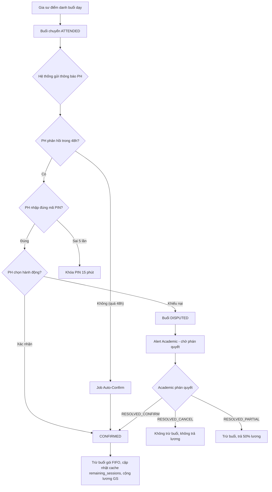
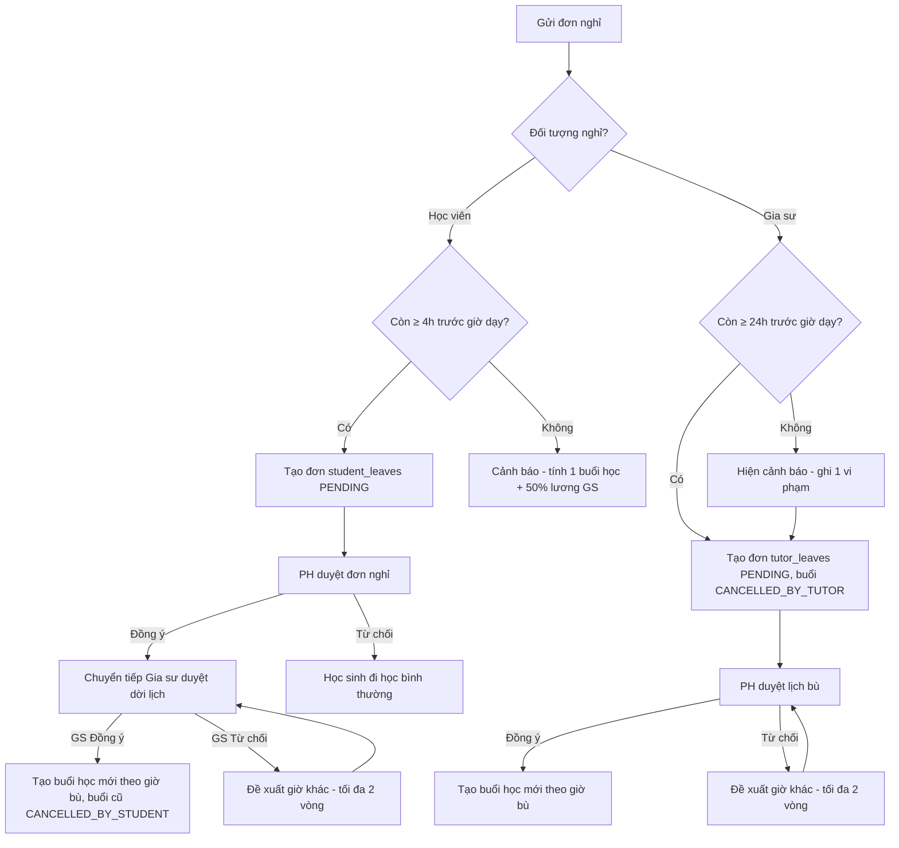
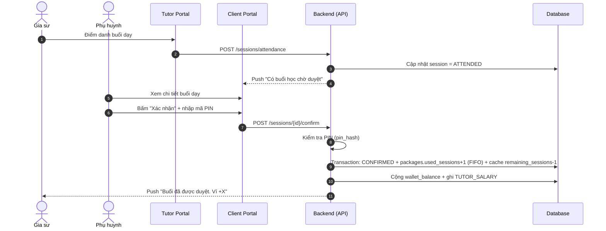
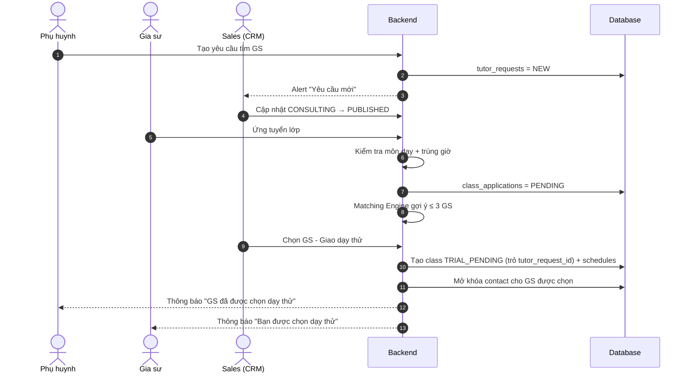
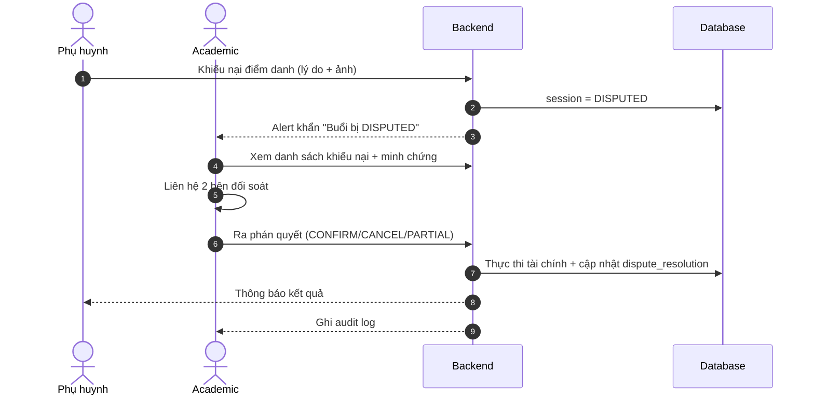
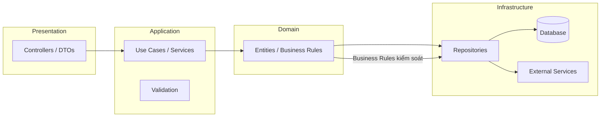
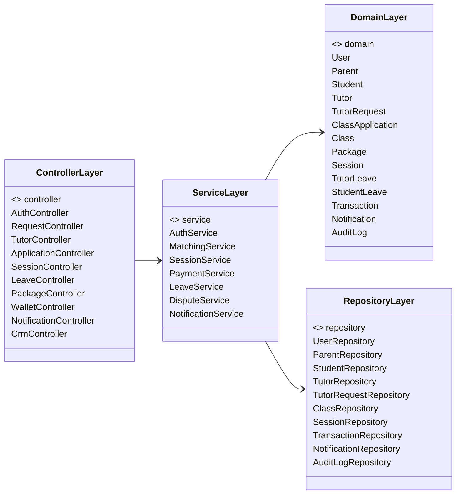
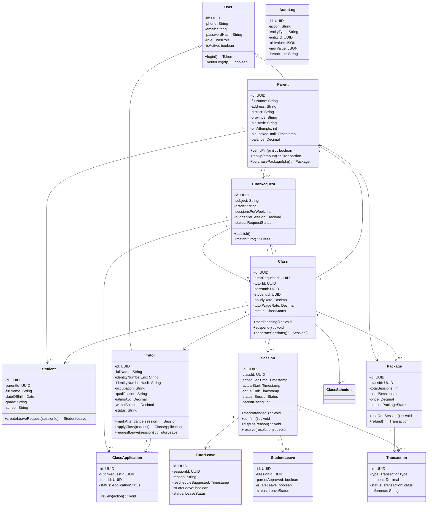
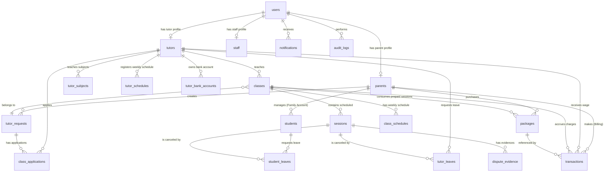

    # BÁO CÁO ĐỒ ÁN

## XÂY DỰNG HỆ THỐNG CRM TRUNG TÂM GIA SƯ VÀ CLIENT/TUTOR PORTAL

---

# Chương 1. Giới thiệu đề tài

## 1.1. Lý do chọn đề tài

Thị trường gia sư tại Việt Nam phát triển mạnh nhưng đa số các trung tâm vận hành theo phương thức thủ công: quản lý khách hàng bằng Excel, trao đổi qua tin nhắn Zalo, tuyển gia sư qua các nhóm Facebook. Thực trạng này gây ra hàng loạt hệ lụy:

| Vấn đề hiện tại | Hậu quả |
| :--- | :--- |
| Quản lý khách hàng thủ công (Excel, Zalo, Facebook) | Thất thoát thông tin khách hàng, không có dữ liệu tập trung |
| Kết nối gia sư – học viên chậm | Thời gian ghép lớp trung bình lên tới 3 ngày |
| Điểm danh & đối soát buổi dạy thủ công | Sai sót, thất thoát tài chính, chậm trả lương gia sư |
| Không kiểm soát được liên hệ trực tiếp | Rủi ro gia sư và phụ huynh tự ý "đi đêm" — thỏa thuận dạy riêng để trốn phí dịch vụ |

Chính vì vậy, việc xây dựng một **hệ thống CRM (Customer Relationship Management) tập trung** kết hợp các **Portal trực tuyến** cho Phụ huynh, Học viên và Gia sư là nhu cầu cấp thiết nhằm: tự động hóa quy trình kết nối, tối ưu vận hành tài chính (gói học trả trước, tự động tính lương), đảm bảo minh bạch và ngăn chặn thất thoát doanh thu.

## 1.2. Mục tiêu của đề tài

Xây dựng hệ thống phần mềm web đáp ứng các mục tiêu nghiệp vụ sau:

| Mục tiêu nghiệp vụ | Chỉ tiêu KPI |
| :--- | :--- |
| Rút ngắn thời gian ghép lớp (Time-to-Match) | Từ 3 ngày xuống **dưới 24 giờ** |
| Giảm tỷ lệ đổi gia sư do không phù hợp | Xuống **dưới 5%** |
| Tự động hóa đối soát buổi dạy | Sai sót đối soát về **0%** |
| Tăng năng suất nhân viên Học vụ | Từ 50 lớp lên **200 lớp/nhân viên** |

Hệ thống hướng tới cung cấp 3 phân hệ chính:

1. **CRM Back-office** — dành cho nhân viên trung tâm (Admin, Sales, Academic, Accountant).
2. **Client Portal** — dành cho Phụ huynh và Học viên (mô hình Family Account).
3. **Tutor Portal** — dành cho Gia sư.

## 1.3. Phạm vi và giới hạn

### Phạm vi (In-Scope)
- Quản lý hồ sơ: Phụ huynh, Học viên, Gia sư, Nhân viên nội bộ.
- Quy trình tìm kiếm & khớp gia sư (Matching), ứng tuyển và dạy thử.
- Quản lý lớp học, lịch định kỳ, lịch rảnh của gia sư.
- Quản lý gói học phí trả trước (mua/gia hạn/hoàn tiền) và ví thu nhập gia sư.
- Điểm danh buổi dạy, xác nhận thanh toán (mã PIN), khiếu nại (Dispute).
- Quản lý lịch nghỉ/dời lịch, đánh giá & xử phạt gia sư.
- Thông báo đa kênh, nhật ký kiểm toán (Audit Log), báo cáo KPI.

### Giới hạn (Out-of-Scope)
- Nền tảng phòng học trực tuyến (video conference).
- Quản lý kho giáo trình vật lý.
- Ứng dụng di động native (chỉ phát triển Web Responsive).
- Tích hợp thanh toán thật (chỉ thiết kế giao diện cổng thanh toán, môi trường sandbox).

## 1.4. Phương pháp thực hiện

Đề tài được thực hiện theo **quy trình phát triển phần mềm thác nước cải tiến (Iterative Waterfall)** kết hợp tư duy phân tích nghiệp vụ có cấu trúc:

| Bước | Nội dung | Công cụ / Kết quả |
| :--- | :--- | :--- |
| 1. Thu thập & phân tích yêu cầu | Khảo sát hiện trạng, xác định actor, quy trình AS-IS/TO-BE | BRD, SRS, Business Rules |
| 2. Phân tích thiết kế | Use Case, biểu đồ hoạt động, tuần tự, thiết kế DB | Use_Cases, Database_Design |
| 3. Thiết kế API | Đặc tả endpoint RESTful | API_Specification |
| 4. Phát triển | Frontend (React), Backend (Node.js), PostgreSQL | Mã nguồn |
| 5. Kiểm thử | Test case theo Use Case, UAT | Tài liệu QA |

**Công nghệ đề xuất:** Backend **Node.js (NestJS)**, Frontend **React**, Cơ sở dữ liệu **PostgreSQL**, xác thực **JWT**, biểu đồ thiết kế dùng **Mermaid**.

---

# Chương 2. Phân tích hệ thống

## 2.1. Mô tả bài toán

Trung tâm gia sư cần một hệ thống tập trung để quản lý toàn bộ vòng đời một "lớp học": từ khi phụ huynh có nhu cầu → tìm & khớp gia sư → mua gói học → tổ chức các buổi dạy (điểm danh, thanh toán, nghỉ bù) → kết thúc/đổi gia sư.

**Các chủ thể (Actor) tham gia:**

| Actor | Vai trò |
| :--- | :--- |
| Phụ huynh (Parent) | Người trả tiền, giám sát, quyết định |
| Học viên (Student) | Người học (Profile con, không có tài khoản riêng) |
| Gia sư (Tutor) | Người cung cấp dịch vụ dạy |
| Sales | Tiếp nhận nhu cầu, khớp lớp |
| Academic | Quản lý chất lượng, giải quyết khiếu nại |
| Accountant | Kiểm soát dòng tiền |
| Admin | Quản trị hệ thống |
| Hệ thống (System) | Các job tự động (auto-confirm, sinh lịch...) |

**Bài toán cốt lõi:** xây dựng quy trình khép kín giữa 3 bên (Phụ huynh – Gia sư – Trung tâm) với cơ chế **ẩn danh để chống "đi đêm"**, cơ chế **gói học trả trước + mã PIN** để đảm bảo tài chính, và cơ chế **điểm danh – duyệt – tự động quyết toán** để đảm bảo minh bạch.

## 2.2. Yêu cầu chức năng

### 2.2.1. CRM Back-office
| Mã | Yêu cầu |
| :--- | :--- |
| FR-CRM-01 | Quản lý hồ sơ Gia sư (duyệt hồ sơ, môn dạy, khóa/kích hoạt) |
| FR-CRM-02 | Duyệt ứng tuyển & khớp lớp (Matching Engine gợi ý ≤ 3 GS) |
| FR-CRM-03 | Quản lý lớp học (trạng thái, số buổi còn lại) |
| FR-CRM-04 | Học vụ giải quyết khiếu nại (Dispute), SLA ≤ 48h |
| FR-CRM-05 | Quản lý gói học phí, hoàn tiền |
| FR-CRM-06 | Quản lý lịch định kỳ lớp |
| FR-CRM-07 | Kết toán lương Gia sư |
| FR-CRM-08 | Báo cáo Dashboard KPI & truy vết Audit Log |

### 2.2.2. Client Portal (Phụ huynh & Học viên)
| Mã | Yêu cầu |
| :--- | :--- |
| FR-CLI-01 | Profile Switcher (PH có mã PIN, HV chỉ xem lịch/báo nghỉ) |
| FR-CLI-02 | Tìm kiếm gia sư ẩn danh |
| FR-CLI-03 | Xác nhận điểm danh & chấm sao (nhập PIN) |
| FR-CLI-04 | Đăng ký yêu cầu tìm gia sư |
| FR-CLI-05 | Mua & gia hạn gói học phí |
| FR-CLI-06 | Duyệt lịch dạy bù |
| FR-CLI-07 | Trung tâm thông báo |

### 2.2.3. Tutor Portal (Gia sư)
| Mã | Yêu cầu |
| :--- | :--- |
| FR-TUT-01 | Quản lý lịch rảnh & thời khóa biểu |
| FR-TUT-02 | Điểm danh buổi dạy (trong 24h) |
| FR-TUT-03 | Yêu cầu nghỉ dạy & dời lịch |
| FR-TUT-04 | Ứng tuyển lớp mới |
| FR-TUT-05 | Ví thu nhập & tài khoản ngân hàng |
| FR-TUT-06 | Trung tâm thông báo |

## 2.3. Yêu cầu phi chức năng

| Nhóm | Yêu cầu |
| :--- | :--- |
| **Hiệu năng** | API < 500ms; tìm kiếm GS < 1s; tối thiểu 1000 người dùng đồng thời |
| **Khả dụng** | Uptime ≥ 99.9% |
| **Bảo mật** | HTTPS; mật khẩu/PIN băm bcrypt; CCCD & số TK ngân hàng mã hóa AES-256; khóa nhập PIN 15 phút sau 5 lần sai |
| **Truy vết** | Ghi audit log mọi thao tác nhạy cảm |
| **Mở rộng** | Cấu hình gói học, môn học, quy tắc thời gian mà không sửa mã nguồn |

## 2.4. Use Case Diagram tổng quát

```mermaid
leftToRightDirection
fcg --o ClientPortal
fcg --o TutorPortal
fcg --o CRM_System

rectangle ClientPortal {
    usecase UC01 as "UC-01: Đăng ký tìm gia sư"
    usecase UC02 as "UC-02: Tìm kiếm gia sư ẩn danh"
    usecase UC03 as "UC-03: Xác nhận điểm danh (Mã PIN)"
    usecase UC04 as "UC-04: Báo nghỉ học lẻ"
}

rectangle TutorPortal {
    usecase UC05 as "UC-05: Đăng ký hồ sơ & lịch rảnh"
    usecase UC06 as "UC-06: Ứng tuyển nhận lớp mới"
    usecase UC07 as "UC-07: Điểm danh buổi dạy"
    usecase UC08 as "UC-08: Báo nghỉ dạy & dời lịch"
}

rectangle CRM_System {
    usecase UC09 as "UC-09: Khớp gia sư tự động/thủ công"
    usecase UC10 as "UC-10: Quản lý ví tiền & duyệt lương"
    usecase UC11 as "UC-11: Giải quyết khiếu nại (Dispute)"
}

Parent --> UC01
Parent --> UC02
Parent --> UC03
Parent --> UC04
Student --> UC04
Tutor --> UC05
Tutor --> UC06
Tutor --> UC07
Tutor --> UC08
Sales --> UC09
Accountant --> UC10
Academic --> UC11
```

## 2.5. Mô tả các Use Case chính

### UC-03: Xác nhận điểm danh & trừ tiền học phí
- **Actor chính:** Phụ huynh. **Actor phụ:** Hệ thống (Autopay Job).
- **Tiền điều kiện:** Lớp `TEACHING`, buổi học `ATTENDED`, PH ở Profile PH (đã xác thực PIN).
- **Luồng chính:** PH nhận thông báo → xem chi tiết buổi dạy → bấm "Xác nhận buổi học" → nhập mã PIN → hệ thống: chuyển `CONFIRMED`, tăng `used_sessions`, cộng lương GS, gửi thông báo.
- **Luồng thay thế (Khiếu nại):** PH bấm "Khiếu nại" + lý do + ảnh minh chứng → buổi `DISPUTED`, không trừ buổi, không trả lương, cảnh báo Học vụ.
- **Luồng ngoại lệ:** Sai PIN 5 lần → khóa 15 phút; gói hết buổi → chặn, hướng dẫn mua gói mới.

### UC-07: Điểm danh buổi dạy
- **Actor chính:** Gia sư.
- **Luồng chính:** GS vào "Buổi học hôm nay" → bấm "Điểm danh" → nhập giờ thực tế + nhận xét → hệ thống kiểm tra trong 24h → `ATTENDED` → gửi thông báo cho PH duyệt.
- **Ngoại lệ:** Quá 24h → `ATTENDANCE_LOCKED`; điểm danh trùng → báo đã điểm danh.

### UC-08: Báo nghỉ dạy & dời lịch
- **Actor chính:** Gia sư. **Actor phụ:** Phụ huynh.
- **Luồng chính:** GS chọn buổi → "Báo nghỉ dạy" → lý do + giờ bù → (≥ 24h) → buổi cũ `CANCELLED_BY_TUTOR`, tạo `tutor_leaves` `PENDING` → PH duyệt → tự sinh buổi mới theo lịch bù.
- **Ngoại lệ:** Nghỉ < 24h → cảnh báo + ghi 1 vi phạm; PH từ chối → đề xuất giờ khác (tối đa 2 vòng).

### UC-09: Khớp gia sư
- **Actor chính:** Sales.
- **Luồng chính:** Matching Engine gợi ý GS khớp → Sales xem điểm tương thích → chọn GS → "Giao dạy thử" → tạo lớp `TRIAL_PENDING`, mở khóa SĐT PH cho GS được chọn, các đơn khác `REJECTED`.
- **Thay thế:** Dạy thử thất bại → `TRIAL_FAILED`, thu hồi thông tin liên hệ, chọn GS thay thế.

### UC-10: Quản lý ví tiền & duyệt lương
- **Actors:** Phụ huynh (mua gói), Gia sư (xem ví/rút lương), Kế toán (kết toán).
- **Luồng chính:** PH nạp tiền → mua gói (trừ tiền ngay, trừ buổi dần) → mỗi buổi `CONFIRMED` cộng lương vào ví GS → GS yêu cầu rút lương → Kế toán duyệt chi, trừ ví, ghi mã giao dịch.

### UC-11: Giải quyết khiếu nại
- **Actor chính:** Academic.
- **Luồng chính:** Nhận alert buổi `DISPUTED` → xem lý do + minh chứng → liên hệ 2 bên → ra phán quyết: `RESOLVED_CONFIRM` / `RESOLVED_CANCEL` / `RESOLVED_PARTIAL` (trả 50%) → hệ thống tự thực thi tài chính.
- **Ngoại lệ:** Quá 48h chưa xử lý → cảnh báo Admin.

## 2.6. Biểu đồ hoạt động (Các chức năng chính)

### 2.6.1. Hoạt động "Xác nhận điểm danh" (UC-03)



### 2.6.2. Hoạt động "Khớp gia sư" (UC-09)

```mermaid
flowchart TD
    A[PH tạo yêu cầu tìm GS] --> B[Request: NEW]
    B --> C[Sales tư vấn - CONSULTING]
    C --> D[Đăng tuyển - PUBLISHED]
    D --> E{GS ứng tuyển}
    E --> F{Đủ chuyên môn? Không trùng giờ?}
    F -- Không --> G[Chặn ứng tuyển]
    F -- Có --> H[Đơn PENDING]
    H --> I[Matching Engine gợi ý ≤ 3 GS SHORTLISTED]
    I --> J[Sales chọn GS - Giao dạy thử]
    J --> K[Tạo lớp TRIAL_PENDING (trỏ tutor_request_id) + mở khóa SĐT PH]
    K --> L{Dạy thử thành công?}
    L -- Có --> M{PH mua gói ≥ 10 buổi?}
    M -- Có --> N[Lớp TEACHING]
    M -- Không --> O[Lớp chờ mua gói]
    L -- Không --> P[Lớp TRIAL_FAILED - thu hồi thông tin]
    P --> P1[Khấu trừ học phí 1 buổi dạy thử từ số dư ví PH trả GS]
    P1 --> Q[Chọn GS thay thế từ shortlist / Request lại]
    Q --> K
```

### 2.6.3. Hoạt động "Báo nghỉ dạy & dời lịch" (UC-04 & UC-08)



## 2.7. Biểu đồ tuần tự (các chức năng chính)

### 2.7.1. Tuần tự "Xác nhận điểm danh" (UC-03)



### 2.7.2. Tuần tự "Khớp gia sư" (UC-09)



### 2.7.3. Tuần tự "Xử lý khiếu nại" (UC-11)



---

# Chương 3. Thiết kế hệ thống

## 3.1. Sơ đồ kiến trúc tổng thể hệ thống

### 3.1.1. Lựa chọn kiến trúc phần mềm

Qua phân tích, đồ án lựa chọn kiến trúc **Modular Monolith (Đơn thể phân khối) kết hợp Clean Architecture**, triển khai dưới dạng **Web Application 3 tầng (REST API + Frontend Web)**.

**Lý do lựa chọn:**

| Tiêu chí | Đánh giá | Kết luận |
| :--- | :--- | :--- |
| Quy mô (1000 user đồng thời) | Monolith đáp ứng tốt, không cần microservices | ✅ |
| Thời gian MVP (3 tháng) | Monolith triển khai nhanh, ít phức tạp vận hành | ✅ |
| Chi phí hạ tầng | Một ứng dụng, một database → tiết kiệm | ✅ |
| Khả năng mở rộng | Phân tách theo module nghiệp vụ → dễ tách microservices sau này | ✅ |
| Giao dịch tài chính | Monolith đảm bảo tính nhất quán ACID trong 1 DB | ✅ |
| Phòng thủ cho việc chia tách | Clean Architecture + Module boundary rõ ràng | ✅ |

**Phương án so sánh:**

| Phương án | Ưu điểm | Nhược điểm | Quyết định |
| :--- | :--- | :--- | :--- |
| **A. Modular Monolith + Clean Architecture** | Nhanh, rẻ, nhất quán giao dịch, dễ mở rộng sau | Giới hạn scale theo máy | ✅ **Chọn** |
| **B. Microservices** | Scale độc lập từng module | Phức tạp vận hành, chi phí cao, không phù hợp MVP | ❌ Loại |

### 3.1.2. Sơ đồ kiến trúc tổng thể

```mermaid
flowchart TB
    subgraph Clients
        PB[Phụ huynh / Học viên<br/>Web Responsive]
        TB[Tutor Web Mobile]
        CB[Nhân viên CRM<br/>Desktop Web]
    end

    subgraph Frontend
        REACT[React SPA<br/>Client Portal]
        TUT_FE[Tutor Portal]
        CRM_FE[CRM Back-office]
    end

    subgraph Backend - Modular Monolith (NestJS)
        API[REST API Gateway<br/>JWT Auth / RBAC / Rate Limit]
        MOD_AUTH[Module Auth]
        MOD_MATCH[Module Matching]
        MOD_CLASS[Module Lớp học & Lịch]
        MOD_SESS[Module Điểm danh]
        MOD_FIN[Module Tài chính & Ví]
        MOD_LEAVE[Module Nghỉ & Dispute]
        MOD_NOTI[Module Thông báo]
    end

    subgraph Data
        PG[(PostgreSQL)]
        REDIS[(Redis<br/>Cache/Session)]
        S3[(Cloud Storage<br/>Chứng chỉ, ảnh minh chứng)]
    end

    subgraph External
        SMS[SMS/OTP Provider]
        PAY[Payment Gateway]
        FCM[Push Notification (FCM)]
    end

    PB --> REACT
    TB --> TUT_FE
    CB --> CRM_FE
    REACT --> API
    TUT_FE --> API
    CRM_FE --> API
    API --> MOD_AUTH & MOD_MATCH & MOD_CLASS & MOD_SESS & MOD_FIN & MOD_LEAVE & MOD_NOTI
    MOD_AUTH --> REDIS
    MOD_FIN --> PG
    MOD_SESS --> PG
    MOD_CLASS --> PG
    MOD_MATCH --> PG
    MOD_LEAVE --> PG
    MOD_NOTI --> REDIS
    MOD_SESS --> S3
    MOD_AUTH --> SMS
    MOD_FIN --> PAY
    MOD_NOTI --> FCM
```

### 3.1.3. Phân tầng trong ứng dụng (Clean Architecture)



**Nguyên tắc phân tầng:**
- **Presentation:** Controller, DTO, xác thực JWT, kiểm tra quyền (role + profile_type).
- **Application:** Service xử lý use case, orchestrate business logic, transaction.
- **Domain:** Entity + các quy tắc nghiệp vụ cốt lõi (không phụ thuộc framework).
- **Infrastructure:** Repository (PostgreSQL), Redis, S3, SMS, Payment.

## 3.2. Thiết kế lớp (Class Diagram)

### 3.2.1. Class Diagram tổng quan (Package)



### 3.2.2. Class Diagram chi tiết (các lớp cốt lõi)



> **Ghi chú quan trọng:** `Student` **không kế thừa `User`** — học viên không phải tài khoản đăng nhập, mà là thực thể con của `Parent` (Family Account). Quyền truy cập của học viên được phân biệt qua **ngữ cảnh Profile** trong token (profile_type = STUDENT) chứ không qua quan hệ kế thừa.

## 3.3. Thiết kế cơ sở dữ liệu (ERD, bảng, mối quan hệ)

### 3.3.1. Sơ đồ quan hệ thực thể (ERD)



### 3.3.2. Danh sách bảng và mối quan hệ chính

| Bảng | Khóa chính | Khóa ngoại quan trọng | Mô tả |
| :--- | :--- | :--- | :--- |
| `users` | `id` | | Tài khoản đăng nhập (role: ADMIN/SALES/ACADEMIC/ACCOUNTANT/PARENT/TUTOR) |
| `staff` | `id` | `id → users.id` | Nhân viên nội bộ (department, supervisor) |
| `parents` | `id` | `id → users.id` | Thông tin tài chính PH (pin_hash, balance) |
| `students` | `id` | `parent_id → parents.id` | Học viên trực thuộc Family Account |
| `tutors` | `id` | `id → users.id` | Hồ sơ gia sư (rating, wallet_balance, status) |
| `tutor_subjects` | `id` | `tutor_id → tutors.id` | Môn dạy được duyệt (BR-MAT-01) |
| `tutor_schedules` | `id` | `tutor_id → tutors.id` | Lịch rảnh trong tuần |
| `tutor_requests` | `id` | `parent_id`, `student_id` | Yêu cầu tìm gia sư |
| `class_applications` | `id` | `tutor_request_id`, `tutor_id` | Đơn ứng tuyển |
| `classes` | `id` | `tutor_request_id`, `tutor_id`, `parent_id`, `student_id` | Lớp học chính thức |
| `class_schedules` | `id` | `class_id → classes.id` | Lịch định kỳ của lớp |
| `packages` | `id` | `class_id`, `parent_id` | Gói học phí trả trước |
| `sessions` | `id` | `class_id → classes.id` | Buổi học lẻ & điểm danh |
| `tutor_leaves` | `id` | `session_id`, `tutor_id` | Đơn nghỉ dạy của GS |
| `student_leaves` | `id` | `session_id`, `student_id` | Đơn nghỉ học của HV |
| `tutor_bank_accounts` | `id` | `tutor_id → tutors.id` | Tài khoản nhận lương |
| `transactions` | `id` | `parent_id`, `tutor_id`, `class_id`, `session_id`, `package_id` | Dòng tiền (nạp/trừ/lương/hoàn) |
| `dispute_evidence` | `id` | `session_id → sessions.id` | Minh chứng khiếu nại |
| `notifications` | `id` | `user_id → users.id` | Trung tâm thông báo |
| `audit_logs` | `id` | `user_id → users.id` | Nhật ký kiểm toán |

### 3.3.3. Mối quan hệ nghiệp vụ nổi bật

| Quan hệ | Kiểu | Ý nghĩa nghiệp vụ |
| :--- | :--- | :--- |
| `parents` 1—N `students` | One-to-Many | 1 PH quản nhiều con (Family Account) |
| `tutors` 1—N `tutor_subjects` | One-to-Many | GS dạy nhiều môn/cấp |
| `tutor_requests` 1—N `class_applications` | One-to-Many | 1 yêu cầu có nhiều GS ứng tuyển |
| `tutor_requests` 1—N `classes` | One-to-Many | Yêu cầu khớp sinh ra lớp dạy thử (có thể nhiều lần) |
| `classes` 1—N `sessions` | One-to-Many | Lớp sinh nhiều buổi học |
| `classes` 1—N `packages` | One-to-Many | Lớp có nhiều gói học phí |
| `packages` 1—N `transactions` | One-to-Many | Gói liên quan nhiều giao dịch đối soát |
| `sessions` 1—N `dispute_evidence` | One-to-Many | Buổi khiếu nại có nhiều minh chứng |

### 3.3.4. Ghi chú thiết kế quan trọng

1. **Mô hình dòng tiền chống trừ tiền 2 lần:** Phụ huynh nạp tiền (TUITION_DEPOSIT) → mua gói (trừ `balance` ngay) → xác nhận buổi chỉ tăng `used_sessions` (SESSION_DEDUCTION mang tính đối soát, không đổi `balance` - FIFO package consumption). Dạy thử thất bại trừ tiền 1 buổi thẳng từ số dư tài khoản của Phụ huynh.
2. **STUDENT không phải role đăng nhập:** học viên là bản ghi `students` trỏ về `parents`; phân quyền qua `profile_type`/`profile_id` trong JWT được xác thực bảo mật bằng endpoint `AUTH-07`.
3. **Soft Delete + Audit:** mọi bảng có `deleted_at`/`deleted_by`; mọi thay đổi nhạy cảm ghi `audit_logs`.
4. **Dữ liệu nhạy cảm:** `password_hash`/`pin_hash` băm bcrypt; `identity_number` mã hóa AES-256 và dùng `identity_number_hash` làm Blind Index; `account_number_encrypted` mã hóa AES-256.
5. **`classes.remaining_sessions` là giá trị cache** được cập nhật tự động từ packages qua DB Triggers/Transactions để tối ưu hóa hiệu năng và tránh lệch dữ liệu.

---

# PHỤ LỤC: Liên hệ giữa các tài liệu

| Tài liệu nguồn | Vai trò trong đồ án |
| :--- | :--- |
| `BRD.md` | Nhu cầu nghiệp vụ, mục tiêu KPI, phạm vi |
| `SRS.md` | Yêu cầu chức năng & phi chức năng, ma trận truy vết |
| `Business_Rules.md` | 24 quy tắc nghiệp vụ + state transition + validation |
| `Use_Cases.md` | 11 use case + biểu đồ + acceptance criteria |
| `Database_Design.md` | 20 bảng, enum, index, ràng buộc, job tự động |
| `API_Specification.md` | ~40 endpoint RESTful theo 11 nhóm |
