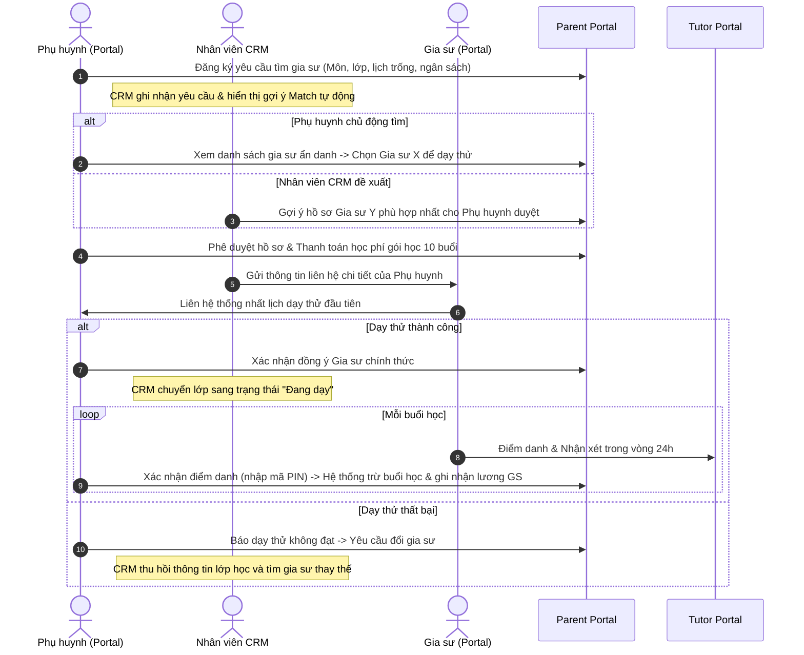

# Business Requirements Document (BRD) - Hệ Thống CRM Trung Tâm Gia Sư

## 1. Kiểm Soát Tài Liệu (Document Control)
*   **Tên dự án:** CRM Trung tâm Gia sư & Client/Tutor Portal
*   **Phiên bản:** v1.2 (cập nhật 31/07/2026 - bổ sung phương pháp đo KPI, giả định, rủi ro, RACI, roadmap, dependencies)
*   **Tác giả:** Lead Business Analyst
*   **Ngày tạo:** 31/07/2026

---

## 2. Tổng Quan Dự Án (Project Overview)

### 2.1. Bối cảnh (Background)
Hiện nay, quy trình vận hành tại Trung tâm Gia sư đang gặp nhiều hạn chế do quản lý thủ công (qua Excel, tin nhắn Zalo, Facebook nhóm). Điều này gây ra tình trạng thất thoát thông tin khách hàng, chậm trễ trong việc kết nối gia sư với học viên, khó khăn trong quản lý lịch dạy và điểm danh, và tăng rủi ro gia sư và phụ huynh tự ý "đi đêm" (bỏ qua trung tâm để trốn phí dịch vụ).

### 2.2. Tầm nhìn dự án (Vision)
Xây dựng một hệ thống CRM tập trung kết hợp Portal tương tác trực tuyến cho Phụ huynh, Học viên và Gia sư. Dự án hướng tới tự động hóa quy trình kết nối, tối ưu vận hành tài chính (gói học trả trước, tự động tính lương) và tăng cường trải nghiệm tương tác trực tiếp hai chiều nhằm đảm bảo chất lượng giảng dạy.

---

## 3. Mục Tiêu Nghiệp Vụ & Chỉ Số Đo Lường (Business Goals & KPIs)

| Mục tiêu nghiệp vụ (Business Goals) | Chỉ số đo lường hiệu quả (KPIs) |
| :--- | :--- |
| **Rút ngắn thời gian ghép lớp (Time-to-Match)** | Thời gian trung bình từ khi phụ huynh tạo yêu cầu đến khi khớp gia sư giảm từ **3 ngày** xuống còn **dưới 24 giờ**. |
| **Giảm tỷ lệ bỏ học/đổi gia sư** | Tỷ lệ đổi gia sư do không phù hợp chất lượng giảm xuống **dưới 5%** nhờ cơ chế lọc và duyệt hồ sơ minh bạch. |
| **Triệt tiêu thất thoát tài chính** | Tự động hóa 100% việc đối soát buổi dạy, giảm thiểu sai sót điểm danh thủ công về **0%**. |
| **Tối ưu năng suất nhân sự trung tâm** | Một nhân viên học vụ có thể quản lý vận hành từ **50 lớp** tăng lên **200 lớp** nhờ các tính năng tự động gợi ý lịch học và xin nghỉ. |

### 3.1. Phương pháp đo KPI (KPI Measurement Method)

| KPI | Công thức tính | Nguồn dữ liệu | Tần suất đo | Dashboard hiển thị |
| :--- | :--- | :--- | :--- | :--- |
| **Time-to-Match** | Σ (thời điểm `MATCHED` − thời điểm tạo request) ÷ số request trong kỳ | `tutor_requests.created_at`, `status`, `matched_class_id` | Hàng ngày | Biểu đồ đường trung bình 7 ngày |
| **Tỷ lệ đổi gia sư** | Số lớp chuyển `TRIAL_FAILED` hoặc đổi GS ÷ tổng lớp `TEACHING` trong kỳ | `classes.status`, `trial_failed_note` | Hàng tuần | Biểu đồ cột theo tháng |
| **Sai sót đối soát** | Số giao dịch `SESSION_DEDUCTION` bị sửa thủ công ÷ tổng giao dịch | `audit_logs`, `transactions` | Hàng tuần | Bảng theo dõi cảnh báo |
| **Năng suất nhân sự** | Số lớp `TEACHING` + `SUSPENDED` đang phụ trách ÷ số nhân viên Academic | `classes`, `staff.department` | Hàng tuần | Bảng xếp hạng nhân viên |

---

## 4. Phân Tích Đối Tượng Liên Quan (Stakeholder Analysis)

| Đối tượng | Vai trò nghiệp vụ | Mục tiêu chính khi sử dụng hệ thống |
| :--- | :--- | :--- |
| **Phụ huynh (Parent)** | Người trả tiền & giám sát | Khảo sát tìm kiếm gia sư chất lượng, giám sát lịch học/điểm danh, mua gói học phí dễ dàng. |
| **Học viên (Student)** | Người trực tiếp sử dụng dịch vụ | Xem thời khóa biểu, nhận/nộp bài tập, xin nghỉ học đột xuất (có phụ huynh duyệt). |
| **Gia sư (Tutor)** | Người cung cấp dịch vụ dạy | Xem lớp mới tuyển để ứng tuyển, điểm danh nhận lương, quản lý lịch dạy và nghỉ dạy. |
| **Tư vấn viên (Sales)** | Nhân viên tuyển sinh/CRM | Tiếp nhận yêu cầu, tư vấn chốt gói học phí, sàng lọc gia sư phù hợp từ gợi ý hệ thống. |
| **Nhân viên Học vụ (Academic)** | Quản lý chất lượng | Theo dõi tình hình các lớp học, can thiệp khi có tranh chấp (Dispute) hoặc đổi gia sư. |
| **Kế toán (Accountant)** | Quản lý dòng tiền | Kiểm tra nạp tiền của phụ huynh, kết toán bảng lương gia sư cuối tháng. |

---

## 5. Phạm Vi Dự Án (Product Scope)

### 5.1. Nằm trong phạm vi (In-Scope)
*   **CRM nội bộ:** Quản lý Leads, Hồ sơ Phụ huynh/Học sinh, Hồ sơ Gia sư, Lớp học, Lịch dạy/lịch rảnh, Gói học phí (mua/gia hạn/hoàn tiền), Giao dịch tài chính (Nạp/Duyệt lương), Giải quyết khiếu nại (Dispute), Báo cáo tổng quan & truy vết (Audit Log).
*   **Portal Phụ huynh/Học viên (Client Portal):** Chung cổng đăng nhập, phân tách Profile (Netflix-style). Phụ huynh được tìm kiếm gia sư, mua gói học phí trả trước, duyệt thanh toán, chấm điểm gia sư, duyệt lịch nghỉ/bù. Học viên được xem lịch học, nhận/nộp bài, báo nghỉ học lẻ (có phụ huynh duyệt).
*   **Portal Gia sư (Tutor Portal):** Quản lý lịch rảnh, ứng tuyển lớp mới, điểm danh buổi học, gửi đơn báo nghỉ dạy/reschedule, theo dõi ví thu nhập và tài khoản ngân hàng nhận lương.

### 5.2. Ngoài phạm vi (Out-of-Scope)
*   Nền tảng phòng học trực tuyến (Video conference).
*   Quản lý kho giáo trình vật lý.

---

## 6. Sơ Đồ Quy Trình Nghiệp Vụ TO-BE (Business Process)

Hệ thống tích hợp quy trình khép kín giữa ba chủ thể chính thông qua sơ đồ sau:

---

## 7. Giả Định & Ràng Buộc (Assumptions & Constraints)

### 7.1. Giả định (Assumptions)
| # | Giả định | Ảnh hưởng nếu sai |
| :--- | :--- | :--- |
| A-01 | Phụ huynh sẵn sàng thanh toán trực tuyến qua ngân hàng/ví điện tử | Phải hỗ trợ thêm chuyển khoản thủ công + đối soát |
| A-02 | Gia sư & phụ huynh có smartphone sử dụng Web Mobile | Phải giảm bớt tính năng nếu chỉ dùng máy tính |
| A-03 | Hệ thống lưu trữ dữ liệu trên Cloud (không cần server vật lý) | Ảnh hưởng chi phí & hạ tầng |
| A-04 | Số lượng giao dịch tài chính ngày cao điểm ≤ 5.000 | Phải thiết kế hàng đợi (queue) nếu vượt quá |
| A-05 | Nhân viên CRM có sẵn danh bạ gia sư để nạp dữ liệu ban đầu | Chậm triển khai nếu chưa có dữ liệu |

### 7.2. Ràng buộc (Constraints)
| # | Ràng buộc | Mô tả |
| :--- | :--- | :--- |
| C-01 | Pháp lý | Tuân thủ quy định bảo vệ dữ liệu cá nhân (PDPD - Việt Nam) khi lưu CCCD, SĐT |
| C-02 | Bảo mật | Mọi giao dịch tài chính bắt buộc HTTPS + mã hóa dữ liệu nhạy cảm |
| C-03 | Thời gian | Giai đoạn 1 (MVP) bàn giao trong 3 tháng |
| C-04 | Ngân sách | Chi phí hạ tầng Cloud & dịch vụ SMS/payment nằm trong ngân sách đã duyệt |
| C-05 | Kỹ thuật | Không dùng dịch vụ thanh toán quốc tế chưa được ngân hàng đối tác xác nhận |

---

## 8. Rủi Ro & Giảm Thiểu (Risks & Mitigation)

| # | Rủi ro | Mức độ | Xác suất | Giảm thiểu |
| :--- | :--- | :--- | :--- | :--- |
| R-01 | Gia sư & phụ huynh "đi đêm" (bỏ qua trung tâm) | Cao | Cao | BR-SEC-01/02 ẩn định danh, quy trình thu hồi khi dạy thử thất bại (BR-MAT-04) |
| R-02 | Phụ huynh quên xác nhận điểm danh → chậm lương GS | Trung bình | Cao | Auto-Confirm sau 48h (BR-FIN-02) + Push notification nhắc |
| R-03 | Trừ tiền sai gấp đôi khi xác nhận buổi học | Cao | Thấp | Mô hình dòng tiền minh bạch (DB 4.1) + transaction đối soát + audit log |
| R-04 | Nhập sai mã PIN / tấn công brute force | Trung bình | Thấp | Khóa 15 phút sau 5 lần sai (BR-SEC-04) |
| R-05 | Dữ liệu tài chính bị truy cập trái phép | Cao | Thấp | Mã hóa AES-256, phân quyền endpoint, audit log |
| R-06 | Tranh chấp giữa phụ huynh & gia sư không xử lý kịp | Trung bình | Trung bình | SLA 48h xử lý Dispute (FR-CRM-04) + cảnh báo lên Admin khi quá hạn |
| R-07 | Nhân viên CRM không đủ kỹ năng dùng hệ thống | Trung bình | Trung bình | Đào tạo, tài liệu hướng dẫn, hỗ trợ trong giai đoạn đầu |

---

## 9. Ma Trận RACI

| Hoạt động nghiệp vụ | Parent | Student | Tutor | Sales | Academic | Accountant | Admin | Hệ thống |
| :--- | :--- | :--- | :--- | :--- | :--- | :--- | :--- | :--- |
| Tạo yêu cầu tìm gia sư | **R/A** | I | | C | | | I | R |
| Duyệt hồ sơ gia sư | | | C | **R/A** | C | | I | C |
| Khớp & giao lớp dạy thử | C | | C | **R/A** | I | | | C |
| Mua gói học phí | **R/A** | | | C | | I | | R |
| Điểm danh buổi dạy | C | | **R/A** | | | | | R |
| Xác nhận điểm danh | **R/A** | | C | | | | | R |
| Giải quyết khiếu nại | C | I | C | I | **R/A** | I | C | R |
| Kết toán lương gia sư | | | C | | I | **R/A** | I | R |
| Hoàn tiền cho phụ huynh | C | | | | C | **R/A** | C | R |
| Quản lý lịch nghỉ/bù | C | I | C | | **R/A** | | | R |

*Ghi chú: **R** = Responsible (thực hiện), **A** = Accountable (chịu trách nhiệm cuối), **C** = Consulted (tham vấn), **I** = Informed (được thông báo).*

---

## 10. Lộ Trình Triển Khai (Delivery Roadmap)

| Giai đoạn | Nội dung | Mốc bàn giao | Tiêu chí ra mắt (Go/No-Go) |
| :--- | :--- | :--- | :--- |
| **Giai đoạn 1 - MVP** | Đăng ký/đăng nhập, hồ sơ GS, yêu cầu tìm GS, khớp lớp thủ công, lớp học, điểm danh + duyệt, gói học phí, ví lương | Tuần 12 | Time-to-Match trung bình < 72h trong nhóm thử nghiệm 20 lớp |
| **Giai đoạn 2** | Matching Engine tự động, xin nghỉ/dời lịch online, Dispute, hoàn tiền | Tuần 20 | Tỷ lệ đơn nghỉ xử lý online ≥ 80% |
| **Giai đoạn 3** | Báo cáo Dashboard KPI, kết toán lương tự động, thông báo đa kênh | Tuần 26 | KPI dashboard chính xác, đối soát lương sai số 0% |

---

## 11. Phụ Thuộc Bên Ngoài (External Dependencies)

| Dịch vụ | Mục đích | Nhà cung cấp đề xuất | Ghi chú |
| :--- | :--- | :--- | :--- |
| **SMS Gateway / OTP** | Xác thực OTP đăng ký, cảnh báo bảo mật PIN | Esms, Twilio, Infobip | Cần SLA ≥ 99.5% |
| **Cổng thanh toán** | Nạp tiền học phí trực tuyến | VNPay, MoMo | Hỗ trợ web + mobile web |
| **Push Notification** | Thông báo duyệt điểm danh/lịch bù | Firebase Cloud Messaging (FCM) | Miễn phí, tích hợp Web |
| **Cloud Hosting** | Triển khai backend + database | AWS / GCP / VPS nội địa | Tuân thủ yêu cầu lưu trữ dữ liệu người dùng VN |
| **Lưu trữ file** | Minh chứng khiếu nại, chứng chỉ GS | S3 / Cloud Storage | Ký URL truy cập có hạn |
