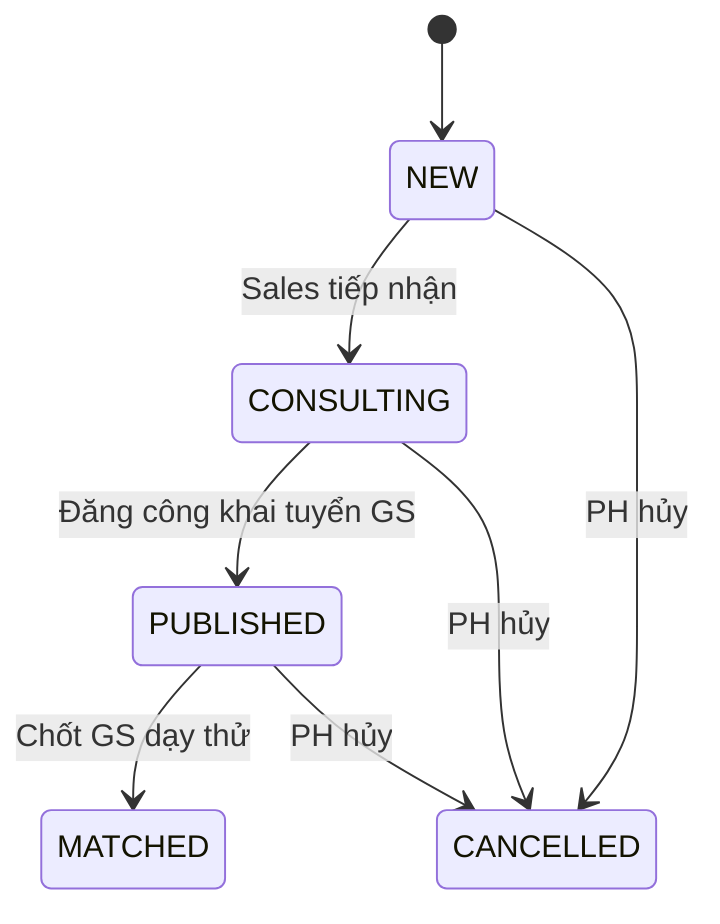
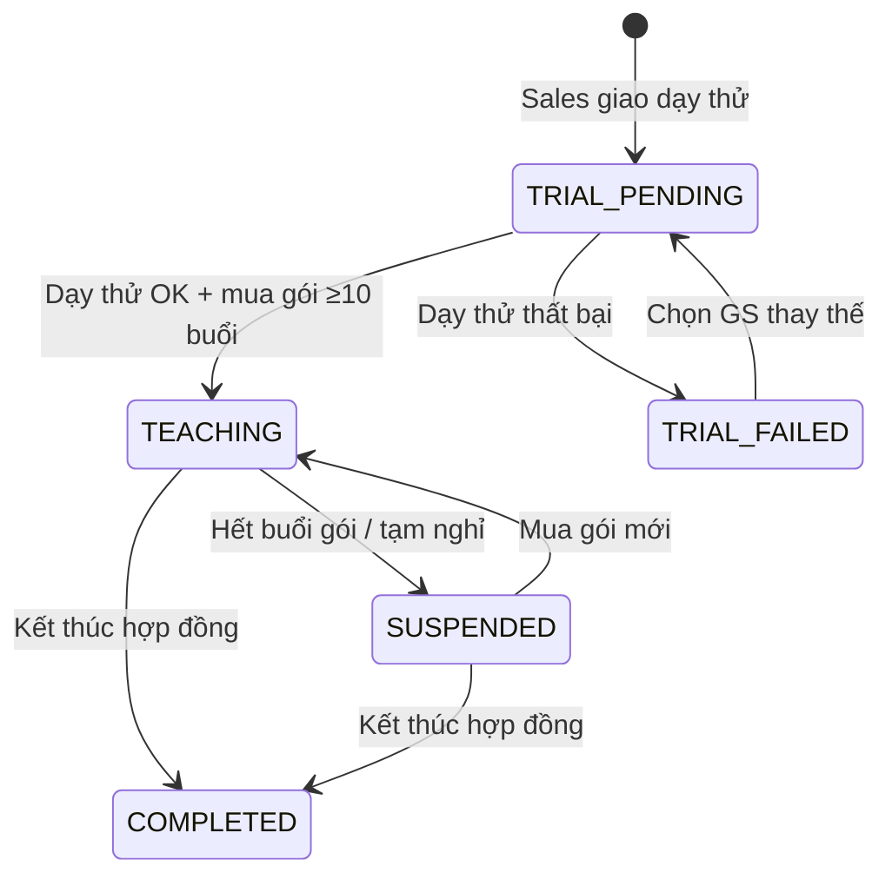

# Business Rules Specification (Quy Tắc Nghiệp Vụ)

Tài liệu này tập hợp toàn bộ các quy tắc nghiệp vụ (Business Rules) áp dụng trên hệ thống CRM và Portal của Trung tâm Gia sư nhằm kiểm soát vận hành, tài chính và bảo mật thông tin.

**Phiên bản:** v1.3 (cập nhật 31/07/2026 - bổ sung thuộc tính rule, state transition, validation rules)

---

## 1. Phân Loại Quy Tắc (Rules Categorization)

Hệ thống quy tắc được chia làm 6 nhóm chính:
*   **SEC:** Bảo mật thông tin & Chống đi đêm (Security & Anti-Bypass)
*   **FIN:** Tài chính & Giao dịch học phí (Finance & Billing)
*   **MAT:** Khớp lớp & Tuyển dụng (Matching & Recruitment)
*   **SCH:** Lịch học & Quản lý lịch nghỉ (Schedule & Leaves)
*   **PEN:** Đánh giá & Phạt gia sư (Feedback & Penalties)
*   **COM:** Truyền thông & Thông báo (Communication & Notification)

---

## 2. Danh Sách Quy Tắc Nghiệp Vụ Chi Tiết

### 2.1. Nhóm Bảo Mật & Chống Đi Đêm (SEC)

#### `BR-SEC-01`: Ẩn thông tin liên hệ định danh của Khách hàng
*   **Nội dung:** Thông tin liên hệ trực tiếp của Phụ huynh (Số điện thoại, email, số nhà cụ thể) phải được ẩn hoàn toàn trên mọi màn hình hiển thị dành cho Gia sư (Danh sách lớp mới tuyển, danh sách ứng tuyển) cho đến khi:
    1. Gia sư đã được trung tâm lựa chọn để dạy thử cho lớp học đó.
    2. Phụ huynh đã bấm xác nhận đồng ý gia sư dạy thử và đóng tiền đặt cọc/học phí đợt đầu thành công.
*   **Lý do:** Tránh việc gia sư tự ý liên hệ phụ huynh để thỏa thuận dạy riêng bên ngoài, bỏ qua trung tâm để trốn phí dịch vụ.
*   **Hành động hệ thống:** Hiển thị địa chỉ rút gọn (chỉ hiển thị đến cấp Đường, Phường, Quận) đối với các tin tuyển lớp công khai.

#### `BR-SEC-02`: Bảo vệ hồ sơ Gia sư công khai
*   **Nội dung:** Hồ sơ gia sư công khai trên cổng Portal dành cho phụ huynh tìm kiếm chỉ hiển thị Họ + Tên đệm viết tắt + Tên (ví dụ: "Nguyễn V. A.") và ẩn số điện thoại, mạng xã hội và địa chỉ nhà cụ thể của gia sư.
*   **Lý do:** Bảo vệ thông tin cá nhân của gia sư và ngăn phụ huynh liên hệ trực tiếp không qua trung tâm.

#### `BR-SEC-03`: Mã hóa dữ liệu nhạy cảm
*   **Nội dung:** Mọi trường dữ liệu nhạy cảm phải được bảo vệ theo bảng sau:
    *   Mật khẩu & Mã PIN: băm một chiều (bcrypt, cost ≥ 10) - **không lưu plaintext**.
    *   CCCD của gia sư, số tài khoản ngân hàng: mã hóa AES-256 (khóa quản lý bằng KMS).
    *   Số dư ví/ví lương: truy xuất theo phân quyền role, ghi audit log khi đọc/ghi.
*   **Hành động hệ thống:** API không bao giờ trả về `pin_hash`, `identity_number` (bản rõ) hay `account_number_encrypted` ra ngoài.

#### `BR-SEC-04`: Khóa tạm thời khi nhập sai mã PIN
*   **Nội dung:** Nhập sai mã PIN **5 lần liên tiếp** → khóa tính năng xác nhận điểm danh/nạp tiền trong **15 phút**, ghi audit log và gửi cảnh báo bảo mật qua SMS đến Phụ huynh.
*   **Hành động hệ thống:** Tăng `pin_attempts` sau mỗi lần sai; reset về `0` khi nhập đúng hoặc khi hết thời gian khóa.

---

### 2.2. Nhóm Tài Chính & Giao Dịch (FIN)

#### `BR-FIN-01`: Quy định Gói học Trả trước (Prepaid Package) & Phí Dạy thử
*   **Nội dung:** Lớp học chỉ được chuyển trạng thái sang "Đang dạy" (TEACHING) chính thức sau khi Phụ huynh hoàn thành mua gói học tối thiểu **10 buổi**.
*   **Mô hình dòng tiền (quan trọng - tránh trừ tiền 2 lần):**
    *   **Bước 1 - Nạp tiền:** Phụ huynh nạp tiền vào tài khoản trung gian (`parents.balance`) qua giao dịch `TUITION_DEPOSIT`.
    *   **Bước 1b - Thanh toán Dạy thử (Trial):** Trước khi dạy thử, Phụ huynh phải nạp số dư tương đương giá trị ít nhất 1 buổi học vào ví. Nếu dạy thử thành công và Phụ huynh mua gói $\ge$ 10 buổi, buổi này tính là buổi đầu tiên của gói. Nếu dạy thử thất bại, học phí 1 buổi dạy thử này sẽ được tự động khấu trừ trực tiếp từ `parents.balance` để chuyển khoản trả lương cho Gia sư.
    *   **Bước 2 - Mua gói:** Khi mua gói, hệ thống kiểm tra `balance ≥ price`, **trừ ngay giá gói khỏi `balance`** và tạo bản ghi gói học (`packages`).
    *   **Bước 3 - Sử dụng buổi:** Mỗi buổi học được xác nhận (`CONFIRMED`) **chỉ làm tăng `packages.used_sessions`** (trừ dần SỐ BUỔI) và ghi nhận lương gia sư. Giao dịch `SESSION_DEDUCTION` chỉ mang tính **đối soát nội bộ**, KHÔNG làm thay đổi `parents.balance` lần nữa.
    *   **Bước 3b - Tiêu thụ gói lũy kế (FIFO):** Trường hợp Phụ huynh mua nhiều gói học phí gối đầu nhau cho 1 lớp, hệ thống tự động trừ buổi lẻ vào gói học có thời gian mua sớm nhất (`packages.purchased_at` ASC) mà chưa sử dụng hết (`used_sessions < total_sessions`).
*   **Lý do:** Đảm bảo khả năng thanh toán học phí của phụ huynh, giữ uy tín trả lương cho gia sư, và tránh sai sót đối soát (trừ tiền trùng).

#### `BR-FIN-02`: Điểm danh & Trừ tiền tự động (Auto-Confirm & Settlement)
*   **Nội dung:** Sau khi Gia sư điểm danh, Phụ huynh có tối đa **48 giờ** để "Xác nhận" (Confirm) hoặc "Khiếu nại" (Dispute) trên Portal.
    *   Nếu Phụ huynh xác nhận: Hệ thống trừ 1 buổi học trong tài khoản của phụ huynh và kết chuyển lương của buổi dạy đó sang ví thu nhập của gia sư.
    *   Nếu quá 48 giờ Phụ huynh không phản hồi: Hệ thống chạy Job tự động chuyển trạng thái buổi dạy thành `CONFIRMED`, tự động trừ buổi học và cộng lương cho gia sư.
*   **Lý do:** Tránh tình trạng phụ huynh quên xác nhận làm chậm thời gian nhận lương của gia sư.

#### `BR-FIN-03`: Xác thực mã PIN khi thao tác tài chính
*   **Nội dung:** Tất cả các thao tác xác nhận điểm danh, nạp tiền, hoặc yêu cầu hoàn phí trên Portal Phụ huynh đều yêu cầu nhập mã PIN bảo mật 4 số (xác thực bằng `pin_hash`).
*   **Lý do:** Đảm bảo an toàn tài chính trong trường hợp trẻ em (học viên) cầm thiết bị đăng nhập Portal của phụ huynh để nghịch phá.

#### `BR-FIN-04`: Hết gói buổi học & Gia hạn
*   **Nội dung:** Khi `packages.used_sessions` đạt `total_sessions` (hết buổi):
    *   Chuyển gói sang `EXHAUSTED`, lớp tự động chuyển `SUSPENDED`.
    *   Lớp chỉ quay lại `TEACHING` khi Phụ huynh mua gói mới.
*   **Cảnh báo sớm:** Khi gói còn **≤ 2 buổi**, hệ thống gửi thông báo nhắc Phụ huynh nạp thêm.
*   **Lý do:** Tránh phát sinh nợ học phí; đảm bảo ngân sách cho việc chi trả lương gia sư.

#### `BR-FIN-05`: Hoàn tiền (Refund)
*   **Nội dung:** Hoàn tiền được thực hiện khi: Phụ huynh yêu cầu dừng hợp đồng, hoặc Học vụ xác nhận lỗi thuộc về trung tâm (đổi gia sư thất bại nhiều lần...).
*   **Quy tắc:** Số tiền hoàn = Số buổi chưa sử dụng × `hourly_rate` (theo gói đã mua), chỉ trả khi Phụ huynh nhập đúng mã PIN.
*   **Hành động hệ thống:** Tạo giao dịch `REFUND`, chuyển gói sang `REFUNDED`, cập nhật `parents.balance`.

#### `BR-FIN-06`: Lương gia sư chỉ ghi nhận khi buổi học được xác nhận
*   **Nội dung:** Tiền lương của một buổi dạy chỉ được cộng vào `tutors.wallet_balance` khi buổi học ở trạng thái `CONFIRMED` (duyệt tay hoặc Auto-Confirm). Buổi học `DISPUTED`, `CANCELLED_*` không phát sinh lương.
*   **Lý do:** Đảm bảo minh bạch, tránh tranh chấp lương.

---

### 2.3. Nhóm Khớp Lớp & Tuyển Dụng (MAT)

#### `BR-MAT-01`: Giới hạn ứng tuyển theo năng lực
*   **Nội dung:** Gia sư chỉ được phép bấm nút "Ứng tuyển" đối với những lớp có yêu cầu về Môn học và Cấp lớp nằm trong danh sách Môn dạy được duyệt (`tutor_subjects`) trong hồ sơ gia sư.
*   **Lý do:** Đảm bảo chất lượng giảng dạy, tránh gia sư nhận lớp không đúng chuyên môn.

#### `BR-MAT-02`: Chống trùng ứng tuyển thời điểm
*   **Nội dung:** Một gia sư không được phép ứng tuyển **2 lớp có lịch trùng khung giờ** trong tuần. Hệ thống kiểm tra giao lịch giữa:
    *   Lịch rảnh đã đăng ký (`tutor_schedules`).
    *   Lịch của các lớp đang dạy (`class_schedules`).
    *   Lịch đề xuất của lớp đang ứng tuyển (`tutor_requests.schedule_notes`).
*   **Hành động hệ thống:** Từ chối đơn ứng tuyển với mã lỗi `SCHEDULE_CONFLICT` nếu trùng giờ.

#### `BR-MAT-03`: Giới hạn số gia sư được chọn dạy thử
*   **Nội dung:** Mỗi yêu cầu tìm gia sư chỉ chọn tối đa **3 gia sư** vào vòng dạy thử. Sau khi 1 gia sư được Phụ huynh chốt chính thức, các đơn còn lại tự chuyển `REJECTED`.
*   **Lý do:** Kiểm soát trải nghiệm phụ huynh, tránh quá nhiều gia sư tiếp cận học sinh.

#### `BR-MAT-04`: Dạy thử thất bại → thu hồi thông tin liên hệ
*   **Nội dung:** Khi Phụ huynh báo dạy thử thất bại (`TRIAL_FAILED`):
    *   Hệ thống ngay lập tức **thu hồi** quyền xem thông tin liên hệ của gia sư đối với lớp đó.
    *   Yêu cầu quay lại trạng thái tìm gia sư (tạo request mới hoặc tái sử dụng).
*   **Lý do:** Tuân thủ `BR-SEC-01`, ngăn gia sư tiếp tục liên hệ ngoài luồng.

---

### 2.4. Nhóm Lịch Học & Nghỉ Học (SCH)

#### `BR-SCH-01`: Quy tắc báo nghỉ của Học viên
*   **Nội dung:** Đơn xin nghỉ của Học viên phải gửi trước giờ học tối thiểu **4 giờ** và bắt buộc phải được xác nhận phê duyệt bởi tài khoản Phụ huynh trước khi chuyển đến Gia sư.
    *   *Nghỉ đúng hạn (>4h):* Không bị trừ tiền buổi học. Phụ huynh phê duyệt đơn nghỉ, đơn chuyển tiếp sang Gia sư để thống nhất và phê duyệt lịch dời học bù (để tránh xung đột lịch rảnh của Gia sư). Buổi học chỉ chuyển thành công sang giờ bù mới khi cả Gia sư và Phụ huynh đã xác nhận.
    *   *Nghỉ muộn (<4h hoặc tự ý nghỉ):* Hệ thống vẫn tính buổi học đó đã diễn ra và trừ 1 buổi học trong gói của Phụ huynh. Tiền lương của buổi dạy đó sẽ được giữ lại hỗ trợ 50% cho gia sư (hoặc theo chính sách hợp đồng cụ thể).

#### `BR-SCH-02`: Quy tắc báo nghỉ của Gia sư
*   **Nội dung:** Gia sư chỉ được xin nghỉ trước giờ dạy tối thiểu **24 giờ** và đề xuất lịch dạy bù tương ứng.
    *   Nghỉ đúng hạn (≥24h): Không bị phạt, tạo phiên học bù sau khi Phụ huynh duyệt.
    *   Nghỉ muộn (<24h): Hệ thống vẫn nhận đơn nhưng ghi nhận **1 vi phạm nghỉ muộn** vào hồ sơ gia sư (`tutor_leaves.is_late_leave = true`), gửi cảnh báo cho Học vụ.
*   **Lý do:** Tôn trọng thời gian của phụ huynh và học sinh, tránh xáo trộn lịch sinh hoạt gia đình.

#### `BR-SCH-03`: Lịch học định kỳ của Lớp
*   **Nội dung:** Mỗi lớp học có lịch định kỳ (`class_schedules`) do Sales/CRM thiết lập khi tạo lớp. Buổi học cụ thể (`sessions`) được sinh tự động từ lịch định kỳ.
*   **Quy tắc đổi lịch:** Mọi thay đổi lịch định kỳ phải được **cả Phụ huynh và Gia sư** xác nhận, thay đổi có hiệu lực từ tuần sau, không áp dụng hồi tố.

#### `BR-SCH-04`: Khóa điểm danh theo thời gian
*   **Nội dung:** Gia sư chỉ được điểm danh trong vòng **24 giờ** sau khi buổi học kết thúc. Quá hạn → API trả lỗi `ATTENDANCE_LOCKED`.
*   **Lý do:** Đảm bảo tính chính xác của dữ liệu điểm danh, tránh báo bù khống.

---

### 2.5. Nhóm Đánh Giá & Phạt (PEN)

#### `BR-PEN-01`: Cảnh báo chất lượng giảng dạy yếu kém
*   **Nội dung:** Hệ thống CRM sẽ tự động gửi cảnh báo khẩn cấp (Alert) đến nhân viên Học vụ nếu một gia sư nhận đánh giá từ **2 sao trở xuống** trong **2 buổi học liên tiếp** từ phụ huynh.
*   **Hành động:** Nhân viên Học vụ liên hệ khảo sát phụ huynh để xem xét chất lượng và kích hoạt quy trình đổi gia sư nếu cần.

#### `BR-PEN-02`: Khóa tài khoản Gia sư do tự ý bỏ lớp
*   **Nội dung:** Gia sư tự ý hủy lớp học chính thức giữa chừng mà không báo trước 7 ngày, hoặc tự ý nghỉ dạy không lý do quá 2 lần trong 1 tháng sẽ bị hệ thống tự động khóa tài khoản tạm thời 30 ngày (lần đầu) hoặc vĩnh viễn (nếu tái diễn).

#### `BR-PEN-03`: Hệ thống tích lũy vi phạm
*   **Nội dung:** Mỗi vi phạm (nghỉ muộn <24h, tự ý bỏ lớp, điểm đánh giá thấp liên tiếp) được ghi nhận vào hồ sơ gia sư dưới dạng lịch sử vi phạm (lưu trong `audit_logs` + `tutor_leaves.is_late_leave`).
*   **Hành động hệ thống:** Học vụ xem tổng hợp vi phạm theo gia sư khi quyết định cảnh cáo/khóa (`tutors.status`).

---

### 2.6. Nhóm Truyền Thông & Thông Báo (COM)

#### `BR-COM-01`: Kênh thông báo theo đối tượng
*   **Nội dung:** Thông báo quan trọng phải được gửi qua **nhiều kênh** song song:
    *   Phụ huynh/Gia sư/Học viên: Push Notification + SMS (cho thao tác tài chính, duyệt lịch).
    *   Nhân viên CRM: Thông báo nội bộ + Email (cho Dispute, cảnh báo vi phạm).
*   **Hành động hệ thống:** Mọi thông báo đều lưu vào bảng `notifications` để người dùng xem lại lịch sử.

#### `BR-COM-02`: Nguyên tắc nội dung thông báo
*   **Nội dung:** Thông báo gửi đến Gia sư **không được chứa** số điện thoại/địa chỉ chính xác của Phụ huynh (tuân thủ `BR-SEC-01`). Thông báo gửi đến Phụ huynh không được chứa thông tin liên hệ trực tiếp của Gia sư (tuân thủ `BR-SEC-02`).

---

## 3. Thuộc Tính Quy Tắc (Priority & Trigger)

> **Priority:** MUST = bắt buộc (không được phép bỏ qua), SHOULD = khuyến nghị, MAY = tùy chọn.
> **Trigger:** Sự kiện kích hoạt kiểm tra quy tắc.

| Mã quy tắc | Priority | Trigger | Xử lý khi vi phạm |
| :--- | :--- | :--- | :--- |
| BR-SEC-01 | MUST | Hiển thị danh sách lớp/đơn cho Gia sư | Không trả SĐT/địa chỉ chính xác trong mọi response |
| BR-SEC-02 | MUST | Tìm kiếm hồ sơ Gia sư công khai | Chỉ trả `display_name` + dữ liệu `public_profile` |
| BR-SEC-03 | MUST | Lưu/đọc dữ liệu nhạy cảm | Mã hóa/băm; không log giá trị bản rõ |
| BR-SEC-04 | MUST | Nhập sai mã PIN | Tăng `pin_attempts`; khóa 15 phút khi ≥ 5 lần |
| BR-FIN-01 | MUST | Mua gói / chuyển lớp `TEACHING` | Chặn nếu gói < 10 buổi hoặc `balance < price` |
| BR-FIN-02 | MUST | Xác nhận điểm danh / Job 48h | Auto-confirm chuyển `CONFIRMED` + trả lương |
| BR-FIN-03 | MUST | Thao tác tài chính (duyệt/nạp/hoàn) | Yêu cầu PIN hợp lệ |
| BR-FIN-04 | MUST | `used_sessions = total_sessions` | Chuyển `SUSPENDED` + cảnh báo nạp thêm |
| BR-FIN-05 | SHOULD | Yêu cầu hoàn tiền | Tính tiền hoàn = buổi còn lại × hourly_rate |
| BR-FIN-06 | MUST | Xác nhận buổi học | Chỉ cộng lương khi `CONFIRMED` |
| BR-MAT-01 | MUST | Bấm ứng tuyển | Chặn nếu môn/cấp không trong `tutor_subjects` |
| BR-MAT-02 | MUST | Ứng tuyển / sửa lịch rảnh | Chặn nếu trùng khung giờ (`SCHEDULE_CONFLICT`) |
| BR-MAT-03 | MUST | Duyệt đơn / chốt dạy thử | Giới hạn ≤ 3 đơn được chọn / yêu cầu |
| BR-MAT-04 | MUST | Dạy thử thất bại | Thu hồi quyền xem thông tin liên hệ |
| BR-SCH-01 | MUST | Học viên gửi đơn nghỉ | Kiểm tra ≥ 4h; nghỉ muộn tính buổi + 50% lương GS |
| BR-SCH-02 | MUST | Gia sư gửi đơn nghỉ | Kiểm tra ≥ 24h; nghỉ muộn ghi vi phạm |
| BR-SCH-03 | SHOULD | Tạo/đổi lịch định kỳ lớp | Hiệu lực tuần sau; cần hai bên xác nhận |
| BR-SCH-04 | MUST | Gia sư điểm danh | Chặn nếu quá 24h (`ATTENDANCE_LOCKED`) |
| BR-PEN-01 | MUST | Đánh giá ≤ 2 sao liên tiếp 2 buổi | Cảnh báo khẩn cho Học vụ |
| BR-PEN-02 | MUST | Tự ý bỏ lớp / nghỉ không lý do | Khóa tài khoản 30 ngày (lần 1) / vĩnh viễn |
| BR-PEN-03 | MUST | Mọi sự kiện vi phạm | Ghi nhận lịch sử vi phạm |
| BR-COM-01 | SHOULD | Mọi sự kiện nghiệp vụ | Gửi đa kênh theo đối tượng |
| BR-COM-02 | MUST | Soạn nội dung thông báo | Lọc thông tin định danh theo role |

---

## 4. Ma Trận Chuyển Trạng Thái (State Transition)

### 4.1. Trạng thái Yêu cầu tìm gia sư (`tutor_requests.status`)

### 4.2. Trạng thái Đơn ứng tuyển (`class_applications.status`)
| Từ \ Đến | PENDING | SHORTLISTED | SELECTED_FOR_TRIAL | REJECTED | WITHDRAWN |
| :--- | :--- | :--- | :--- | :--- | :--- |
| **PENDING** | | Matching engine / Sales | | Sales | GS rút |
| **SHORTLISTED** | | | Sales chọn | Chốt GS khác | GS rút |
| **SELECTED_FOR_TRIAL** | | | | Chốt GS khác | |

### 4.3. Trạng thái Lớp học (`classes.status`)

### 4.4. Trạng thái Buổi học (`sessions.status`)
| Từ \ Đến | ATTENDED | CONFIRMED | CANCELLED_BY_TUTOR | CANCELLED_BY_STUDENT | DISPUTED |
| :--- | :--- | :--- | :--- | :--- | :--- |
| **SCHEDULED** | GS điểm danh | | GS nghỉ hợp lệ | HV nghỉ hợp lệ | |
| **ATTENDED** | | PH duyệt / Job 48h | | | PH khiếu nại |
| **DISPUTED** | | Học vụ `RESOLVED_CONFIRM` | Học vụ `RESOLVED_CANCEL` | | |

> Ghi chú: `RESOLVED_PARTIAL` → buổi chuyển `CONFIRMED` nhưng chỉ trả 50% lương GS.

### 4.5. Trạng thái Gói học phí (`packages.status`)
| Từ \ Đến | EXHAUSTED | REFUNDED |
| :--- | :--- | :--- |
| **ACTIVE** | Hết buổi (job tự động) | Kế toán duyệt hoàn tiền |

---

## 5. Quy Tắc Kiểm Tra Dữ Liệu (Data Validation Rules)

| Trường dữ liệu | Quy tắc validation | Mã lỗi |
| :--- | :--- | :--- |
| `phone` | Định dạng SĐT VN: `^0\d{9}$` hoặc `+84\d{9}$` | `VALIDATION_ERROR` |
| `password` | ≥ 8 ký tự, có chữ + số, tối đa 72 ký tự | `VALIDATION_ERROR` |
| `parent_pin` / `new_pin` | Đúng 4 chữ số | `VALIDATION_ERROR` |
| `rating` | Nguyên trong khoảng 1-5 | `VALIDATION_ERROR` |
| `day_of_week` | Nguyên trong khoảng 2-8 | `VALIDATION_ERROR` |
| `slot_start` < `slot_end` | Bắt buộc; tối thiểu 30 phút | `VALIDATION_ERROR` |
| `total_sessions` | ≥ 10 (BR-FIN-01) | `VALIDATION_ERROR` |
| `amount` (nạp tiền, rút lương) | > 0, tối đa 2 chữ số thập phân | `VALIDATION_ERROR` |
| `tutor_gender_pref` | `MALE` / `FEMALE` / `ANY` | `VALIDATION_ERROR` |
| `sessions_per_week` | Nguyên trong khoảng 1-7 | `VALIDATION_ERROR` |
| `budget_per_session` | > 0, ≤ 5.000.000 | `VALIDATION_ERROR` |
| `hourly_rate`, `tutor_wage_rate` | `hourly_rate > tutor_wage_rate > 0` | `VALIDATION_ERROR` |
| `actual_start` < `actual_end` | Bắt buộc khi điểm danh | `VALIDATION_ERROR` |
| `uploaded file` | Ảnh minh chứng ≤ 5MB, định dạng JPEG/PNG | `VALIDATION_ERROR` |
| `cover_letter` | Tối đa 500 ký tự | `VALIDATION_ERROR` |

---

## 6. Ma Trận Quy Tắc - Đối Tượng Áp Dụng (Rule Matrix)

| Mã quy tắc | Parent | Student | Tutor | Sales | Academic | Accountant | System Job |
| :--- | :--- | :--- | :--- | :--- | :--- | :--- | :--- |
| BR-SEC-01 | ✓ | | ✓ | ✓ | | | |
| BR-SEC-02 | ✓ | | ✓ | ✓ | | | |
| BR-SEC-03 | ✓ | | ✓ | | | ✓ | ✓ |
| BR-SEC-04 | ✓ | | | | | | ✓ |
| BR-FIN-01 | ✓ | | | ✓ | | ✓ | |
| BR-FIN-02 | ✓ | | ✓ | | | | ✓ |
| BR-FIN-03 | ✓ | | | | | | ✓ |
| BR-FIN-04 | ✓ | | | ✓ | | ✓ | ✓ |
| BR-FIN-05 | ✓ | | | | ✓ | ✓ | |
| BR-FIN-06 | | | ✓ | | | | ✓ |
| BR-MAT-01 | | | ✓ | ✓ | | | |
| BR-MAT-02 | | | ✓ | | | | ✓ |
| BR-MAT-03 | | | ✓ | ✓ | | | ✓ |
| BR-MAT-04 | ✓ | | ✓ | ✓ | ✓ | | |
| BR-SCH-01 | ✓ | ✓ | ✓ | | | | |
| BR-SCH-02 | ✓ | | ✓ | | ✓ | | |
| BR-SCH-03 | ✓ | | ✓ | ✓ | | | ✓ |
| BR-SCH-04 | | | ✓ | | | | ✓ |
| BR-PEN-01 | ✓ | | | | ✓ | | ✓ |
| BR-PEN-02 | | | ✓ | | ✓ | | ✓ |
| BR-PEN-03 | | | ✓ | | ✓ | | ✓ |
| BR-COM-01 | ✓ | ✓ | ✓ | ✓ | ✓ | ✓ | ✓ |
| BR-COM-02 | ✓ | | ✓ | | | | ✓ |
