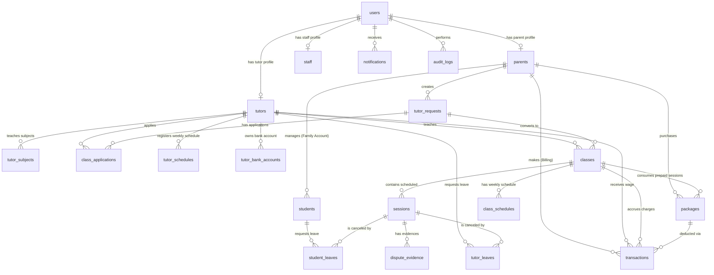

# Database Design Document (Thiết Kế Cơ Sở Dữ Liệu)

Tài liệu này đặc tả thiết kế cơ sở dữ liệu vật lý của hệ thống CRM Trung tâm Gia sư, phục vụ đội ngũ phát triển Backend và Database Administrator.

**Phiên bản:** v1.3 (cập nhật 31/07/2026 - bổ sung indexes, constraints, JSONB schema, seed data, backup/migration)

---

## 1. Sơ đồ Quan hệ Thực thể (Entity Relationship Diagram - ERD)



---

## 2. Đặc Tả Enums Hệ Thống (System Enums)

```sql
-- Quyền hạn người dùng đăng nhập hệ thống
CREATE TYPE UserRole AS ENUM (
    'ADMIN',
    'SALES',
    'ACADEMIC',
    'ACCOUNTANT',
    'PARENT',
    'TUTOR'
);
-- LƯU Ý QUAN TRỌNG: 'STUDENT' KHÔNG phải là role đăng nhập.
-- Học viên không có tài khoản riêng; chỉ là Profile con (profile_type='STUDENT')
-- trong Family Account của Phụ huynh. Quyền STUDENT được xử lý qua
-- ngữ cảnh profile trong JWT (profile_type, profile_id), KHÔNG qua users.role.

-- Trạng thái xử lý yêu cầu tìm gia sư
CREATE TYPE RequestStatus AS ENUM (
    'NEW',            -- Yêu cầu vừa tạo
    'CONSULTING',     -- Nhân viên CRM đang liên hệ tư vấn phụ huynh
    'PUBLISHED',      -- Đã đăng công khai cho gia sư ứng tuyển
    'MATCHED',        -- Đã khớp gia sư (đang chờ dạy thử)
    'CANCELLED'       -- Phụ huynh hủy yêu cầu
);

-- Trạng thái đơn ứng tuyển của gia sư
CREATE TYPE ApplicationStatus AS ENUM (
    'PENDING',           -- Chờ duyệt hồ sơ
    'SHORTLISTED',       -- Lọt danh sách đề xuất cho Phụ huynh
    'SELECTED_FOR_TRIAL',-- Được chọn đi dạy thử
    'REJECTED',          -- Bị từ chối
    'WITHDRAWN'          -- Gia sư rút đơn
);

-- Trạng thái lớp học
CREATE TYPE ClassStatus AS ENUM (
    'TRIAL_PENDING',  -- Đang chờ dạy thử buổi đầu
    'TRIAL_FAILED',   -- Dạy thử thất bại (đang tìm gia sư thay thế)
    'TEACHING',       -- Đang dạy chính thức
    'SUSPENDED',      -- Lớp đang tạm dừng (hết gói buổi / tạm nghỉ)
    'COMPLETED'       -- Lớp đã kết thúc hợp đồng
);

-- Trạng thái buổi học lẻ
CREATE TYPE SessionStatus AS ENUM (
    'SCHEDULED',            -- Đã lên lịch
    'ATTENDED',             -- Gia sư đã báo điểm danh (chờ duyệt)
    'CONFIRMED',            -- Đã xác nhận (khấu trừ học phí & ghi nhận lương)
    'CANCELLED_BY_TUTOR',   -- Gia sư nghỉ dạy (hợp lệ)
    'CANCELLED_BY_STUDENT', -- Học sinh nghỉ học (hợp lệ)
    'DISPUTED'              -- Có khiếu nại thông tin điểm danh
);

-- Kết quả giải quyết khiếu nại của Nhân viên Học vụ
CREATE TYPE DisputeResolution AS ENUM (
    'RESOLVED_CONFIRM',   -- Xác nhận đúng, trừ buổi & trả lương
    'RESOLVED_CANCEL',    -- Hủy buổi, không trừ buổi & không trả lương
    'RESOLVED_PARTIAL'    -- Xác nhận nhưng trả lương 50% (nghỉ muộn)
);

-- Trạng thái đơn xin nghỉ học/nghỉ dạy
CREATE TYPE LeaveStatus AS ENUM (
    'PENDING',
    'APPROVED',
    'REJECTED'
);

-- Trạng thái gói học phí trả trước
CREATE TYPE PackageStatus AS ENUM (
    'ACTIVE',      -- Còn buổi sử dụng
    'EXHAUSTED',   -- Đã dùng hết số buổi
    'REFUNDED'     -- Đã hoàn tiền (đóng gói)
);

-- Loại giao dịch dòng tiền
CREATE TYPE TransactionType AS ENUM (
    'TUITION_DEPOSIT',     -- Phụ huynh nạp tiền vào tài khoản học phí (tăng balance)
    'SESSION_DEDUCTION',   -- Đối soát nội bộ: 1 buổi học đã sử dụng (KHÔNG thay đổi balance)
    'TUTOR_SALARY',        -- Ghi nhận lương buổi dạy (cộng ví lương gia sư)
    'SALARY_WITHDRAWAL',   -- Gia sư rút tiền từ ví lương (Kế toán chuyển khoản, trừ ví lương)
    'REFUND'               -- Hoàn tiền cho phụ huynh (cộng lại balance)
);

-- Trạng thái giao dịch
CREATE TYPE TransactionStatus AS ENUM (
    'PENDING',
    'SUCCESSFUL',
    'FAILED'
);

-- Loại thông báo
CREATE TYPE NotificationType AS ENUM (
    'SESSION_CONFIRM_REQUEST',  -- Phụ huynh cần duyệt điểm danh
    'LEAVE_APPROVAL',           -- Đồng ý / từ chối dời lịch
    'CLASS_UPDATE',             -- Thay đổi trạng thái lớp
    'WALLET_UPDATE',            -- Biến động số dư ví
    'DISPUTE_ALERT',            -- Cảnh báo khiếu nại cho Học vụ
    'SYSTEM'                    -- Thông báo hệ thống
);
```

---

## 3. Danh Sách Các Bảng Chi Tiết (Data Dictionary)

Tất cả các bảng đều áp dụng cơ chế **Soft Delete** và các trường kiểm toán (**Audit Fields**): `created_at`, `updated_at`, `deleted_at`, `deleted_by`. Để tránh lặp lại, các bảng chi tiết phía dưới **chỉ liệt kê các trường nghiệp vụ riêng** (audit fields mặc định áp dụng cho mọi bảng). Riêng bảng `users` hiển thị đầy đủ các trường này để làm chuẩn tham chiếu.

### 3.1. Bảng `users` (Tài khoản người dùng)
| Tên trường | Kiểu dữ liệu | NULL | Khóa | Ràng buộc / Mô tả |
| :--- | :--- | :--- | :--- | :--- |
| `id` | UUID | No | PK | Khóa chính tự sinh |
| `phone` | VARCHAR(20) | No | Unique | Số điện thoại dùng làm tên đăng nhập |
| `email` | VARCHAR(255) | Yes | Unique | Email liên hệ phụ |
| `password_hash` | VARCHAR(255) | No | | Mật khẩu mã hóa một chiều (bcrypt) |
| `role` | UserRole | No | | Phân quyền truy cập chính |
| `is_active` | BOOLEAN | No | | Trạng thái kích hoạt (Default `true`) |
| `last_login_at` | TIMESTAMP | Yes | | Lần đăng nhập gần nhất |
| `created_at` | TIMESTAMP | No | | Thời gian tạo tài khoản |
| `updated_at` | TIMESTAMP | No | | Thời gian cập nhật gần nhất |
| `deleted_at` | TIMESTAMP | Yes | | Xóa logic (Soft delete) |
| `deleted_by` | UUID | Yes | FK | Người thực hiện xóa logic |

### 3.2. Bảng `parents` (Thông tin tài chính Phụ huynh)
| Tên trường | Kiểu dữ liệu | NULL | Khóa | Ràng buộc / Mô tả |
| :--- | :--- | :--- | :--- | :--- |
| `id` | UUID | No | PK, FK | Trỏ đến `users.id` |
| `full_name` | VARCHAR(100) | No | | Họ tên phụ huynh |
| `address` | VARCHAR(255) | No | | Địa chỉ nhà cụ thể phục vụ lọc gia sư |
| `district` | VARCHAR(50) | No | | Quận/Huyện phục vụ lọc nhanh |
| `province` | VARCHAR(50) | No | | Tỉnh/Thành phố |
| `pin_hash` | VARCHAR(255) | No | | Mã PIN 4 số đã mã hóa (bcrypt) - không lưu plaintext |
| `pin_attempts` | INT | No | | Số lần nhập PIN sai liên tiếp (Default `0`) |
| `pin_locked_until` | TIMESTAMP | Yes | | Thời điểm mở khóa tính năng nhập PIN (nếu bị khóa) |
| `balance` | DECIMAL(12,2) | No | | Số dư tài khoản học phí (Default `0.00`) |

### 3.3. Bảng `students` (Học viên trực thuộc tài khoản Gia đình)
| Tên trường | Kiểu dữ liệu | NULL | Khóa | Ràng buộc / Mô tả |
| :--- | :--- | :--- | :--- | :--- |
| `id` | UUID | No | PK | Khóa chính |
| `parent_id` | UUID | No | FK | Khóa ngoại trỏ đến `parents.id` |
| `full_name` | VARCHAR(100) | No | | Họ tên học sinh |
| `gender` | VARCHAR(10) | No | | Giới tính học sinh |
| `date_of_birth`| DATE | No | | Ngày sinh học sinh |
| `school` | VARCHAR(150) | Yes | | Trường học hiện tại |
| `grade` | VARCHAR(20) | Yes | | Cấp lớp hiện tại |
| `notes` | TEXT | Yes | | Điểm đặc biệt cần lưu ý về học lực/tính cách |

### 3.4. Bảng `tutors` (Hồ sơ Gia sư)
| Tên trường | Kiểu dữ liệu | NULL | Khóa | Ràng buộc / Mô tả |
| :--- | :--- | :--- | :--- | :--- |
| `id` | UUID | No | PK, FK | Trỏ đến `users.id` |
| `full_name` | VARCHAR(100) | No | | Họ tên thật của gia sư |
| `gender` | VARCHAR(10) | No | | Nam / Nữ |
| `date_of_birth`| DATE | No | | Ngày sinh |
| `identity_number`| VARCHAR(255) | No | | Số CMND/CCCD **mã hóa** (đối soát) |
| `identity_number_hash`| VARCHAR(64) | No | Unique | Mã hash một chiều SHA-256 làm **Blind Index** để tìm trùng lặp CCCD an toàn |
| `occupation` | VARCHAR(100) | No | | Nghề nghiệp hiện tại (Sinh viên ĐH Bách Khoa...) |
| `qualification` | VARCHAR(255) | No | | Trình độ học vấn cao nhất |
| `certificates_json`| JSONB | Yes | | Danh sách link bằng cấp, chứng chỉ số hóa |
| `is_public` | BOOLEAN | No | | Default `true`. Cho phép hiển thị ra ngoài portal |
| `public_profile` | JSONB | Yes | | Dữ liệu hiển thị (Họ tên viết tắt, mô tả bản thân) |
| `rating_avg` | DECIMAL(3,2) | No | | Điểm đánh giá trung bình từ Phụ huynh (Default `5.00`) |
| `wallet_balance` | DECIMAL(12,2) | No | | Ví tích lũy thu nhập (Default `0.00`) |
| `status` | VARCHAR(20) | No | | ACTIVE, PENDING_REVIEW, BANNED |

### 3.5. Bảng `tutor_subjects` (Môn học được duyệt giảng dạy)
> Bổ sung theo `BR-MAT-01` - hệ thống chỉ cho phép ứng tuyển lớp thuộc danh sách môn được duyệt.

| Tên trường | Kiểu dữ liệu | NULL | Khóa | Ràng buộc / Mô tả |
| :--- | :--- | :--- | :--- | :--- |
| `id` | UUID | No | PK | Khóa chính |
| `tutor_id` | UUID | No | FK | Trỏ đến `tutors.id` |
| `subject` | VARCHAR(100) | No | | Môn dạy (Math, English...) |
| `grade` | VARCHAR(20) | No | | Cấp lớp dạy được (Grade_1...Grade_12) |
| `is_verified` | BOOLEAN | No | | Đã được CRM kiểm duyệt năng lực (Default `false`) |

### 3.6. Bảng `tutor_schedules` (Lịch rảnh thường nhật của Gia sư)
| Tên trường | Kiểu dữ liệu | NULL | Khóa | Ràng buộc / Mô tả |
| :--- | :--- | :--- | :--- | :--- |
| `id` | UUID | No | PK | Khóa chính |
| `tutor_id` | UUID | No | FK | Khóa ngoại trỏ đến `tutors.id` |
| `day_of_week` | INT | No | | Thứ trong tuần: 2 (Thứ hai) $\rightarrow$ 8 (Chủ nhật) |
| `slot_start` | TIME | No | | Giờ bắt đầu rảnh |
| `slot_end` | TIME | No | | Giờ kết thúc rảnh |
| `is_active` | BOOLEAN | No | | Còn áp dụng hay không (Default `true`) |

### 3.7. Bảng `tutor_requests` (Yêu cầu tìm Gia sư)
| Tên trường | Kiểu dữ liệu | NULL | Khóa | Ràng buộc / Mô tả |
| :--- | :--- | :--- | :--- | :--- |
| `id` | UUID | No | PK | Khóa chính |
| `parent_id` | UUID | No | FK | Khóa ngoại trỏ đến `parents.id` |
| `student_id` | UUID | No | FK | Khóa ngoại trỏ đến `students.id` |
| `subject` | VARCHAR(100) | No | | Môn học cần gia sư |
| `grade` | VARCHAR(20) | No | | Lớp học cần gia sư |
| `schedule_notes`| TEXT | No | | Lịch học mong muốn |
| `sessions_per_week`| INT | No | | Số buổi học trong tuần |
| `budget_per_session`| DECIMAL(10,2)| No | | Học phí tối đa trả cho 1 buổi học |
| `tutor_gender_pref`| VARCHAR(10) | No | | Yêu cầu giới tính: MALE, FEMALE, ANY |
| `status` | RequestStatus | No | | Trạng thái yêu cầu |

### 3.8. Bảng `class_applications` (Đơn ứng tuyển của Gia sư)
> Bổ sung theo A1 - vận hành quy trình ứng tuyển & chọn dạy thử.

| Tên trường | Kiểu dữ liệu | NULL | Khóa | Ràng buộc / Mô tả |
| :--- | :--- | :--- | :--- | :--- |
| `id` | UUID | No | PK | Khóa chính |
| `tutor_request_id` | UUID | No | FK | Trỏ đến `tutor_requests.id` |
| `tutor_id` | UUID | No | FK | Trỏ đến `tutors.id` |
| `cover_letter` | TEXT | Yes | | Thư giới thiệu / lý do nhận lớp |
| `status` | ApplicationStatus | No | | Trạng thái đơn ứng tuyển |
| `note` | TEXT | Yes | | Ghi chú nội bộ của Sales/Academic |
| `applied_at` | TIMESTAMP | No | | Thời điểm nộp đơn |

### 3.9. Bảng `classes` (Lớp học chính thức)
| Tên trường | Kiểu dữ liệu | NULL | Khóa | Ràng buộc / Mô tả |
| :--- | :--- | :--- | :--- | :--- |
| `id` | UUID | No | PK | Khóa chính |
| `tutor_request_id`| UUID | No | FK | Yêu cầu tìm gia sư tạo ra lớp học (trỏ đến `tutor_requests.id`) |
| `tutor_id` | UUID | Yes | FK | Gia sư giảng dạy (trỏ đến `tutors.id`) |
| `parent_id` | UUID | No | FK | Phụ huynh thanh toán (trỏ đến `parents.id`) |
| `student_id` | UUID | No | FK | Học viên (trỏ đến `students.id`) |
| `hourly_rate` | DECIMAL(10,2) | No | | Học phí thống nhất thu từ Phụ huynh / buổi học |
| `tutor_wage_rate`| DECIMAL(10,2) | No | | Lương thực nhận của gia sư / buổi học |
| `remaining_sessions`| INT | No | | Số buổi còn lại trong gói (giá trị cache, cập nhật tự động từ packages qua DB Triggers/Transactions) |
| `status` | ClassStatus | No | | Trạng thái lớp học |
| `trial_failed_note`| TEXT | Yes | | Lý do dạy thử thất bại (khi đổi gia sư) |

### 3.10. Bảng `packages` (Gói học phí trả trước)
> Bổ sung theo A4 - nguồn gốc của số buổi học được nạp.

| Tên trường | Kiểu dữ liệu | NULL | Khóa | Ràng buộc / Mô tả |
| :--- | :--- | :--- | :--- | :--- |
| `id` | UUID | No | PK | Khóa chính |
| `class_id` | UUID | No | FK | Trỏ đến `classes.id` |
| `parent_id` | UUID | No | FK | Phụ huynh mua gói |
| `name` | VARCHAR(100) | No | | Tên gói (Ví dụ: "Gói 10 buổi Toán") |
| `total_sessions` | INT | No | | Tổng số buổi trong gói (tối thiểu 10 theo BR-FIN-01) |
| `used_sessions` | INT | No | | Số buổi đã sử dụng (Default `0`) |
| `price` | DECIMAL(12,2) | No | | Giá bán của gói |
| `status` | PackageStatus | No | | Trạng thái gói |
| `purchased_at` | TIMESTAMP | No | | Thời điểm mua |

### 3.11. Bảng `class_schedules` (Lịch học định kỳ của Lớp)
> Bổ sung theo B1 - tách lịch của lớp khỏi lịch rảnh của gia sư.

| Tên trường | Kiểu dữ liệu | NULL | Khóa | Ràng buộc / Mô tả |
| :--- | :--- | :--- | :--- | :--- |
| `id` | UUID | No | PK | Khóa chính |
| `class_id` | UUID | No | FK | Trỏ đến `classes.id` |
| `day_of_week` | INT | No | | Thứ trong tuần: 2 $\rightarrow$ 8 |
| `slot_start` | TIME | No | | Giờ bắt đầu buổi học |
| `slot_end` | TIME | No | | Giờ kết thúc buổi học |
| `is_active` | BOOLEAN | No | | Còn áp dụng hay không (Default `true`) |

### 3.12. Bảng `sessions` (Lịch dạy & Điểm danh buổi lẻ)
| Tên trường | Kiểu dữ liệu | NULL | Khóa | Ràng buộc / Mô tả |
| :--- | :--- | :--- | :--- | :--- |
| `id` | UUID | No | PK | Khóa chính |
| `class_id` | UUID | No | FK | Trỏ đến `classes.id` |
| `scheduled_time`| TIMESTAMP | No | | Giờ học theo lịch định kỳ |
| `actual_start` | TIMESTAMP | Yes | | Giờ dạy bắt đầu thực tế (Gia sư báo) |
| `actual_end` | TIMESTAMP | Yes | | Giờ dạy kết thúc thực tế (Gia sư báo) |
| `status` | SessionStatus | No | | Trạng thái buổi học |
| `dispute_resolution`| DisputeResolution | Yes | | Kết quả xử lý khiếu nại của Học vụ |
| `dispute_reason` | TEXT | Yes | | Lý do khiếu nại của Phụ huynh |
| `tutor_notes` | TEXT | Yes | | Ghi nhận xét tiến độ học sinh |
| `parent_rating` | INT | Yes | | Đánh giá sao của Phụ huynh (1-5) |
| `parent_feedback`| TEXT | Yes | | Ý kiến phản hồi của Phụ huynh |

### 3.13. Bảng `dispute_evidence` (Minh chứng khiếu nại)
> Bổ sung theo B2 - lưu ảnh minh chứng khi Phụ huynh khiếu nại điểm danh.

| Tên trường | Kiểu dữ liệu | NULL | Khóa | Ràng buộc / Mô tả |
| :--- | :--- | :--- | :--- | :--- |
| `id` | UUID | No | PK | Khóa chính |
| `session_id` | UUID | No | FK | Trỏ đến `sessions.id` |
| `file_url` | VARCHAR(500) | No | | Đường dẫn file minh chứng (S3/CDN) |
| `uploaded_by` | UUID | No | FK | Trỏ đến `users.id` (Phụ huynh hoặc Học vụ) |
| `created_at` | TIMESTAMP | No | | Thời điểm upload |

### 3.14. Bảng `tutor_leaves` (Đơn nghỉ dạy của Gia sư)
> Tách riêng theo A2 - luồng nghỉ của Gia sư (cần đề xuất lịch bù).

| Tên trường | Kiểu dữ liệu | NULL | Khóa | Ràng buộc / Mô tả |
| :--- | :--- | :--- | :--- | :--- |
| `id` | UUID | No | PK | Khóa chính |
| `session_id` | UUID | No | FK | Buổi học cần nghỉ (trỏ đến `sessions.id`) |
| `tutor_id` | UUID | No | FK | Trỏ đến `tutors.id` |
| `request_time` | TIMESTAMP | No | | Thời gian gửi đơn |
| `reason` | TEXT | No | | Lý do xin nghỉ |
| `status` | LeaveStatus | No | | Trạng thái xử lý |
| `reschedule_suggested`| TIMESTAMP | Yes | | Thời gian dạy bù đề xuất |
| `parent_approved_at`| TIMESTAMP | Yes | | Thời điểm Phụ huynh duyệt lịch bù |
| `is_late_leave` | BOOLEAN | No | | Nghỉ muộn (<24h) - ghi nhận vi phạm (Default `false`) |

### 3.15. Bảng `student_leaves` (Đơn nghỉ học của Học viên)
> Tách riêng theo A2 - luồng nghỉ của Học viên (bắt buộc có Phụ huynh duyệt).

| Tên trường | Kiểu dữ liệu | NULL | Khóa | Ràng buộc / Mô tả |
| :--- | :--- | :--- | :--- | :--- |
| `id` | UUID | No | PK | Khóa chính |
| `session_id` | UUID | No | FK | Buổi học cần nghỉ (trỏ đến `sessions.id`) |
| `student_id` | UUID | No | FK | Trỏ đến `students.id` |
| `request_time` | TIMESTAMP | No | | Thời gian gửi đơn |
| `reason` | TEXT | No | | Lý do xin nghỉ |
| `status` | LeaveStatus | No | | Trạng thái xử lý |
| `parent_approved` | BOOLEAN | No | | Đã được Phụ huynh xác nhận duyệt chưa (Default `false`) |
| `parent_approved_at`| TIMESTAMP | Yes | | Thời điểm Phụ huynh duyệt |
| `is_late_leave` | BOOLEAN | No | | Nghỉ muộn (<4h) - vẫn tính buổi học (Default `false`) |
| `rescheduled_to`| TIMESTAMP | Yes | | Thời gian học bù đề xuất |

### 3.16. Bảng `tutor_bank_accounts` (Tài khoản ngân hàng nhận lương)
> Bổ sung theo B3 - thông tin thanh toán lương cho Gia sư (mã hóa dữ liệu nhạy cảm).

| Tên trường | Kiểu dữ liệu | NULL | Khóa | Ràng buộc / Mô tả |
| :--- | :--- | :--- | :--- | :--- |
| `id` | UUID | No | PK | Khóa chính |
| `tutor_id` | UUID | No | FK | Trỏ đến `tutors.id` |
| `bank_name` | VARCHAR(100) | No | | Tên ngân hàng |
| `account_holder` | VARCHAR(100) | No | | Chủ tài khoản |
| `account_number_encrypted`| TEXT | No | | Số tài khoản **mã hóa** (AES-256) |
| `is_default` | BOOLEAN | No | | Tài khoản nhận lương mặc định (Default `false`) |

### 3.17. Bảng `transactions` (Ví dòng tiền)
| Tên trường | Kiểu dữ liệu | NULL | Khóa | Ràng buộc / Mô tả |
| :--- | :--- | :--- | :--- | :--- |
| `id` | UUID | No | PK | Khóa chính |
| `parent_id` | UUID | Yes | FK | Liên kết nếu là giao dịch ví Phụ huynh |
| `tutor_id` | UUID | Yes | FK | Liên kết nếu là giao dịch ví lương Gia sư |
| `class_id` | UUID | Yes | FK | Lớp học liên quan |
| `session_id` | UUID | Yes | FK | Buổi học liên quan |
| `package_id` | UUID | Yes | FK | Gói học phí liên quan |
| `type` | TransactionType | No | | Loại giao dịch dòng tiền |
| `amount` | DECIMAL(12,2) | No | | Số tiền giao dịch |
| `status` | TransactionStatus| No | | Trạng thái giao dịch |
| `reference` | VARCHAR(100) | Yes | | Mã giao dịch ngân hàng đối soát |
| `created_at` | TIMESTAMP | No | | Ngày tạo giao dịch |

### 3.18. Bảng `notifications` (Trung tâm thông báo)
> Bổ sung theo B2 - đẩy thông báo tới Portal và CRM.

| Tên trường | Kiểu dữ liệu | NULL | Khóa | Ràng buộc / Mô tả |
| :--- | :--- | :--- | :--- | :--- |
| `id` | UUID | No | PK | Khóa chính |
| `user_id` | UUID | No | FK | Người nhận (trỏ đến `users.id`) |
| `type` | NotificationType | No | | Loại thông báo |
| `title` | VARCHAR(200) | No | | Tiêu đề thông báo |
| `content` | TEXT | No | | Nội dung thông báo |
| `is_read` | BOOLEAN | No | | Đã đọc chưa (Default `false`) |
| `deep_link` | VARCHAR(500) | Yes | | Đường dẫn chuyển hướng trong app |
| `created_at` | TIMESTAMP | No | | Thời điểm tạo |

### 3.19. Bảng `audit_logs` (Nhật ký kiểm toán)
> Bổ sung theo B2 - truy vết mọi thay đổi dữ liệu nhạy cảm.

| Tên trường | Kiểu dữ liệu | NULL | Khóa | Ràng buộc / Mô tả |
| :--- | :--- | :--- | :--- | :--- |
| `id` | UUID | No | PK | Khóa chính |
| `user_id` | UUID | Yes | FK | Người thực hiện (trỏ đến `users.id`) |
| `action` | VARCHAR(100) | No | | Hành động (CREATE, UPDATE, DELETE, CONFIRM...) |
| `entity_type` | VARCHAR(50) | No | | Đối tượng (SESSION, TRANSACTION, CLASS...) |
| `entity_id` | UUID | No | | Khóa của đối tượng |
| `old_value` | JSONB | Yes | | Giá trị trước khi thay đổi |
| `new_value` | JSONB | Yes | | Giá trị sau khi thay đổi |
| `ip_address` | VARCHAR(45) | Yes | | IP của người thực hiện |
| `created_at` | TIMESTAMP | No | | Thời điểm ghi nhận |

### 3.20. Bảng `staff` (Nhân viên nội bộ CRM)
> Bổ sung theo rà soát v1.2 - hồ sơ nhân viên (Sales/Academic/Accountant/Admin) trỏ đến `users`.

| Tên trường | Kiểu dữ liệu | NULL | Khóa | Ràng buộc / Mô tả |
| :--- | :--- | :--- | :--- | :--- |
| `id` | UUID | No | PK, FK | Trỏ đến `users.id` |
| `full_name` | VARCHAR(100) | No | | Họ tên nhân viên |
| `department` | VARCHAR(50) | No | | Phòng ban: SALES, ACADEMIC, ACCOUNTANT, ADMIN |
| `branch` | VARCHAR(100) | Yes | | Chi nhánh/văn phòng làm việc |
| `supervisor_id` | UUID | Yes | FK | Quản lý trực tiếp (trỏ đến `staff.id`) |
| `is_active` | BOOLEAN | No | | Còn làm việc (Default `true`) |

---

## 4. Chú Thích Thiết Kế (Design Notes)

### 4.1. Mô hình dòng tiền (chống trừ tiền 2 lần)
| Giai đoạn | Hành động | Ảnh hưởng `parents.balance` | Loại giao dịch |
| :--- | :--- | :--- | :--- |
| Nạp tiền | Phụ huynh nạp tiền vào tài khoản | **+** số tiền nạp | `TUITION_DEPOSIT` |
| Dạy thử (Trial) | Dạy thử 1 buổi trước khi mua gói | **-** học phí 1 buổi (nếu thất bại) hoặc tính vào gói | `SESSION_DEDUCTION` (nạp trước số dư) |
| Mua gói | Kiểm tra `balance ≥ price`, tạo gói | **−** giá gói | (ghi nhận trong package) |
| Xác nhận buổi học | Tăng `used_sessions`, trả lương GS | **Không đổi** | `SESSION_DEDUCTION` (đối soát) + `TUTOR_SALARY` |
| Rút lương | Kế toán chuyển khoản cho GS | Không liên quan | `SALARY_WITHDRAWAL` (trừ `tutors.wallet_balance`) |
| Hoàn tiền | Duyệt refund các buổi chưa dùng | **+** tiền hoàn | `REFUND` |

> ⚠️ **Lưu ý Dev:** 
> 1. Giao dịch `SESSION_DEDUCTION` chỉ mang tính đối soát số buổi đã dùng, **tuyệt đối không trừ `parents.balance`** (tiền đã khấu trừ ngay khi mua gói - BR-FIN-01).
> 2. **Dạy thử (Trial Session):** Phụ huynh nạp trước tiền tối thiểu 1 buổi vào `parents.balance` trước khi bắt đầu dạy thử. Nếu dạy thử thất bại, 1 buổi học này được thanh toán trực tiếp từ số dư phụ huynh sang ví lương gia sư (không qua gói học). Nếu thành công và phụ huynh mua gói 10 buổi, buổi dạy thử này được tính là buổi số 1 của gói (hoặc thanh toán riêng tùy thỏa thuận).
> 3. **Quy tắc tiêu thụ gói lũy kế (FIFO Package Consumption):** Khi có nhiều gói học phí hoạt động song song, hệ thống thực hiện trừ số buổi lẻ của gói học có ngày mua sớm nhất (`packages.purchased_at` ASC) mà chưa dùng hết (`used_sessions < total_sessions`).

### 4.2. Dữ liệu nhạy cảm cần mã hóa
| Trường dữ liệu | Bảng | Cách xử lý |
| :--- | :--- | :--- |
| `password_hash`, `pin_hash` | users, parents | Băm một chiều (bcrypt, cost ≥ 10) |
| `identity_number` | tutors | Mã hóa AES-256, khóa quản lý bằng KMS |
| `identity_number_hash` | tutors | Hash một chiều SHA-256 dùng làm Blind Index để truy vấn Unique |
| `account_number_encrypted` | tutor_bank_accounts | Mã hóa AES-256, chỉ giải mã khi kết toán |
| `balance`, `wallet_balance`, `price` | parents, tutors, packages | Truy xuất theo role, ghi audit log khi đọc/ghi |

### 4.3. Các job tự động (Background Jobs)
| Job | Tần suất | Mô tả |
| :--- | :--- | :--- |
| **Auto-Confirm Session** | Chạy mỗi 5 phút | Buổi học `ATTENDED` quá 48h không có phản hồi → tự chuyển `CONFIRMED`, tăng `used_sessions`, cộng lương (BR-FIN-02) |
| **Class Suspension** | Chạy hằng ngày | Lớp có `remaining_sessions = 0` → chuyển `SUSPENDED`, gửi notification (BR-FIN-04) |
| **PIN Unlock** | Chạy mỗi phút | Reset `pin_attempts` khi qua `pin_locked_until` |
| **Low Package Alert** | Chạy hằng ngày | Cảnh báo Phụ huynh khi gói còn ≤ 2 buổi |

### 4.4. Điều chỉnh so với phiên bản v1.0
| Thay đổi | Lý do |
| :--- | :--- |
| Tách `tutor_leaves` / `student_leaves` thành 2 bảng | Luồng duyệt khác nhau (Student bắt buộc có Phụ huynh duyệt) |
| Thêm 10 bảng: `tutor_subjects`, `class_applications`, `packages`, `class_schedules`, `dispute_evidence`, `tutor_bank_accounts`, `notifications`, `audit_logs`, `staff` | Khép kín quy trình matching, tài chính, nhân sự nội bộ và truy vết |
| Mã hóa `parent_pin` → `pin_hash` + lock | Tuân thủ SRS 4.3 chống Brute Force |
| Chốt mô hình dòng tiền (tiền trừ khi mua gói, buổi trừ dần) | Tránh trừ tiền 2 lần khi xác nhận buổi học |
| `remaining_sessions` chuyển thành giá trị cache | Tránh lệch dữ liệu với `packages.used_sessions` bằng DB Triggers/Transactions |

---

## 5. Chỉ Mục & Ràng Buộc (Indexes & Constraints)

### 5.1. Chỉ mục đề xuất (Indexes)

| Bảng | Cột tạo index | Loại | Mục đích |
| :--- | :--- | :--- | :--- |
| `users` | `phone` | UNIQUE | Đăng nhập nhanh (vốn đã UNIQUE) |
| `users` | `role`, `is_active` | B-tree | Lọc user theo vai trò |
| `parents` | `id` | PK | Truy vấn hồ sơ |
| `tutors` | `status`, `is_public`, `district`* | B-tree | Lọc tìm kiếm GS công khai |
| `tutors` | `identity_number_hash` | UNIQUE | Truy vấn nhanh để chống trùng CCCD |
| `tutor_subjects` | `(tutor_id, subject, grade)` | UNIQUE | Chống trùng khai báo môn dạy |
| `tutor_schedules` | `(tutor_id, day_of_week)` | B-tree | Matching Engine quét lịch rảnh |
| `tutor_requests` | `status`, `created_at` | B-tree | Dashboard yêu cầu mới |
| `class_applications` | `(tutor_request_id, tutor_id)` | UNIQUE | Chống ứng tuyển 2 lần 1 yêu cầu |
| `class_applications` | `(tutor_request_id, status)` | B-tree | Xem danh sách đơn theo yêu cầu |
| `classes` | `tutor_request_id` | B-tree | Tìm các lớp của cùng một yêu cầu |
| `classes` | `status`, `parent_id` | B-tree | Báo cáo lớp theo trạng thái |
| `sessions` | `(class_id, scheduled_time)` | B-tree | Vẽ thời khóa biểu |
| `sessions` | `status`, `scheduled_time` | B-tree | Job auto-confirm quét buổi `ATTENDED` |
| `transactions` | `(parent_id, created_at)`, `(tutor_id, created_at)` | B-tree | Lịch sử ví 2 chiều |
| `notifications` | `(user_id, is_read, created_at)` | B-tree | Trung tâm thông báo |
| `audit_logs` | `(entity_type, entity_id)` | B-tree | Tra cứu lịch sử đối tượng |

> *`district` của gia sư được lưu trong `tutors` (thêm cột) hoặc trích xuất từ `public_profile` - **khuyến nghị** thêm cột riêng `district` vào `tutors` để filter nhanh.

### 5.2. Ràng buộc (Constraints)

| Bảng | Ràng buộc | Mô tả |
| :--- | :--- | :--- |
| `users` | `CHECK (char_length(phone) BETWEEN 10 AND 20)` | Định dạng SĐT |
| `parents` | `CHECK (balance >= 0)` | Số dư không âm |
| `parents` | `CHECK (char_length(pin_hash) > 0)` | PIN luôn tồn tại |
| `tutors` | `CHECK (rating_avg BETWEEN 0 AND 5)` | Điểm đánh giá hợp lệ |
| `tutors` | `CHECK (wallet_balance >= 0)` | Ví không âm |
| `tutor_schedules` | `CHECK (day_of_week BETWEEN 2 AND 8)` | Thứ 2 → Chủ nhật |
| `tutor_schedules` | `CHECK (slot_start < slot_end)` | Giờ hợp lệ |
| `tutor_requests` | `CHECK (sessions_per_week BETWEEN 1 AND 7)` | Số buổi/tuần |
| `tutor_requests` | `CHECK (budget_per_session > 0)` | Ngân sách dương |
| `classes` | `CHECK (hourly_rate > tutor_wage_rate)` | Phí dịch vụ dương |
| `packages` | `CHECK (total_sessions >= 10)` | BR-FIN-01 |
| `packages` | `CHECK (used_sessions <= total_sessions)` | Không vượt số buổi |
| `sessions` | `CHECK (parent_rating BETWEEN 1 AND 5)` | Sao hợp lệ (cho phép NULL) |
| `sessions` | `CHECK (actual_start < actual_end)` | Giờ dạy hợp lệ |
| `transactions` | `CHECK (amount > 0)` | Số tiền dương |

---

## 6. Cấu Trúc JSONB (JSONB Schemas)

### 6.1. `tutors.certificates_json`
```json
[
  {
    "id": "c1",
    "name": "Bằng Thạc sĩ Sư phạm Toán",
    "file_url": "https://cdn.trungtamgiasu.com/certs/c1.pdf",
    "verified": true,
    "verified_by": "staff_uuid",
    "verified_at": "2026-07-20T10:00:00Z"
  }
]
```

### 6.2. `tutors.public_profile`
```json
{
  "display_name": "Gia sư Hoàng M.",
  "bio": "10 năm kinh nghiệm đứng lớp ôn thi Chuyên...",
  "preferred_hourly_rate": 300000,
  "subjects": ["Math", "Physics"],
  "avatar_url": "https://cdn.trungtamgiasu.com/avatars/u1.jpg"
}
```

### 6.3. `audit_logs.old_value` / `new_value`
```json
{
  "status": "ATTENDED",
  "actual_start": "2026-07-31T18:00:00Z",
  "actual_end": "2026-07-31T20:00:00Z"
}
```

---

## 7. Dữ Liệu Mẫu Khởi Tạo (Seed Data)

| Bảng | Bản ghi mặc định | Ghi chú |
| :--- | :--- | :--- |
| `users` + `staff` | 1 tài khoản Admin mặc định | Tạo qua script, đổi mật khẩu ngay lần đầu đăng nhập |
| `users` | Tài khoản `SYSTEM` (id cố định) | Dùng làm `user_id` cho audit log của job tự động |
| `tutors` | 0 | Nạp dữ liệu gia sư hiện có qua tool import Excel |
| `parents`, `students` | 0 | Tạo khi phụ huynh đăng ký |

> Lệnh seed: `npm run db:seed` (Dev) / `migration + data_seed.sql` (Staging/Prod).

---

## 8. Sao Lưu & Chuyển Dữ Liệu (Backup & Migration)

### 8.1. Sao lưu (Backup)
| Loại | Tần suất | Lưu giữ | Mục đích khôi phục |
| :--- | :--- | :--- | :--- |
| Full backup | Hằng ngày 02:00 | 30 ngày | Khôi phục toàn bộ (RPO ≤ 24h) |
| Transaction log / PITR | Liên tục | 7 ngày | Khôi phục điểm thời điểm (RPO ≤ 5 phút) |
| Backup cấu hình & secret | Mỗi khi thay đổi | 90 ngày | Khôi phục hạ tầng |

### 8.2. Chuyển dữ liệu & migration
*   **Quy tắc migration:** Chỉ tiến (forward-only), sử dụng thư mục `migrations/` đánh số tuần tự; chạy tự động khi deploy (CI/CD).
*   **Mô hình dữ liệu không phá vỡ (non-breaking):** Thêm cột mới không có `NOT NULL` ngay; backfill sau.
*   **Rollback:** Ưu tiên fix-forward; migration lỗi phải dừng pipeline, không tự động rollback (tránh mất dữ liệu).
*   **Import dữ liệu hiện tại (Excel):** Script import theo từng bước (staff → parents/students → tutors → classes/sessions) có file log lỗi và chế độ dry-run.
